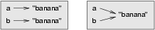

Array
=====

A **array** is an ordered collection of values. The values that make up an array
are called its **elements**, or its **items**.

We will use the term `element` or `item` to mean the same thing. Arrays are
similar to strings, which are ordered collections of characters, except that the
elements of an array can be of any type. Arrays and strings --- and other collections
that maintain the order of their items --- are called **sequences** or **lists**.

Array values
-----------

There are several ways to create a new array; the simplest is to enclose the
elements in square brackets (``[`` and ``]``):

~~~~~~~~~~~~~~~~~~~~~~~{.javascript .numberLines}
let ps = [10, 20, 30, 40];
let qs = ["spam", "bungee", "swallow"];
let empty = [];
~~~~~~~~~~~~~~~~~~~~~~~

The first array contains four numbers. The second contains a list of three
strings. The third is an **empty array** --- it's waiting for us to add
elements. The elements of an array don't have to be the same type. The following
array contains a string, a number, and (amazingly) another array:

~~~~~~~~~~~~~~~~~~~~~~~{.javascript .numberLines}
let zs = ["hello", 5, [10, 20]];
~~~~~~~~~~~~~~~~~~~~~~~

An array within another array is said to be **nested**.

We have already seen that we can assign array values to variables or pass arrays
as parameters to functions:

~~~~~~~~~~~~~~~~~~~~~~~{.javascript}
⠕ let vocabulary = ["apple", "cheese", "dog"];
⠕ let numbers = [17, 123];
⠕ let anEmptyList = [];
⠕ console.log(vocabulary, numbers, an_empty_list)
[ 'apple', 'cheese', 'dog' ] [ 17, 123 ] []
~~~~~~~~~~~~~~~~~~~~~~~

Accessing elements
------------------

The syntax for accessing the elements of a list is the same as the syntax for
accessing the characters of a string --- the index operator: ``[]`` (not to
be confused with an empty array). The expression inside the brackets specifies
the index. Remember that the indices start at 0 and can be integers up to
`length - 1`:

~~~~~~~~~~~~~~~~~~~~~~~{.javascript}
⠕ numbers[0];
=> 17
~~~~~~~~~~~~~~~~~~~~~~~

Any expression evaluating to an integer can be used as an index:

~~~~~~~~~~~~~~~~~~~~~~~{.javascript}
⠕ numbers[9-8];
=> 123
⠕ numbers["1"]
=> undefined
~~~~~~~~~~~~~~~~~~~~~~~

If you try to access an element that does not exist, Javascript
returns `undefined`:

~~~~~~~~~~~~~~~~~~~~~~~{.javascript}
⠕ numbers[5];
=> undefined
~~~~~~~~~~~~~~~~~~~~~~~

If you assign a value to an element that does not exist, Javascript will add
the value to the array at that index, and create empty elements in the
intervening indices.

~~~~~~~~~~~~~~~~~~~~~~~{.javascript}
⠕ numbers[5] = 22;
=> 22
⠕ numbers;
=> [ 17, 123, <3 empty items>, 22 ]
⠕ numbers[5];
=> 22
~~~~~~~~~~~~~~~~~~~~~~~

It is common to use a loop variable as a list index.

~~~~~~~~~~~~~~~~~~~~~~~{.javascript .numberLines}
let horsemen = ["war", "famine", "pestilence", "death"];

for (let i = 0; i < horsemen.length; i++) {
  console.log(horsemen[i]);
}
~~~~~~~~~~~~~~~~~~~~~~~

Each time through the loop, the variable ``i`` is used as an index into the
list, printing the ``i``'th element. This pattern of computation is called a
**list traversal**.

Like strings, Javascript arrays have a `length` property that tells us how
many items are in the array. When we use `i < horsemen.length` as the loop
condition, our `for` loop stops when it accesses the last element of the array.

List membership
---------------

Javascript arrays have an `includes` method which returns a Boolean
`true` or `false` to indicate membership of an item in a list.

~~~~~~~~~~~~~~~~~~~~~~~{.javascript}
⠕ let horsemen = ["war", "famine", "pestilence", "death"];
⠕ horsemen.includes("pestilence");
=> true
⠕ horsemen.includes("debauchery");
=> false
⠕ !horsemen.includes("debauchery");
true
~~~~~~~~~~~~~~~~~~~~~~~

Counting words
---------------

Using the`split` method of strings, we can write an elegant solution to
counting words in a text by looping through the array of words. In  the code
below we look at section [Martin Luther King Jr's 1963 "I have a dream ..." speech]
(https://www.archives.gov/files/press/exhibits/dream-speech.pdf)
in order to count the number of times the word _dream_ occurs.

~~~~~~~~~~~~~~~~~~~~~~~{.javascript .numberLines}
let text = `I say to you today, my friends, so even
though we face the difficulties of today and tomorrow,
I still have a dream. It is a dream deeply rooted in
the American dream. I have a dream that one day this
nation will rise up and live out the true meaning of
its creed: “We hold these truths to be self-evident:
that all men are created equal.” I have a dream that
one day on the red hills of Georgia the sons of former
and the sons of former slave owners will be able to
sit down together at the table of brotherhood.`;

let words = text.split(/\s/);

let counter = 0;
for (let i = 0; i < words.length; i++) {
  if (words[i].includes("dream")) {
    counter++;
  }
}

console.log(`The speech has ${words.length} words.
We found "dream" ${counter} times.`);
~~~~~~~~~~~~~~~~~~~~~~~

**code walk through**

<iframe class="embed-responsive-item" src="https://www.youtube.com/embed/CySJma9dBJU?rel=0" allowfullscreen></iframe>

Play with the code live at <https://repl.it/@mcuringa/DreamWordCount>

Array operations
---------------

The array `concat` method combines two arrays into a new array by
concatenating an array to the end of another array:

~~~~~~~~~~~~~~~~~~~~~~~{.javascript}
⠕ let a = [1, 2, 3];
⠕ let b = [4, 5, 6];
⠕ let c = a.concat(b);
⠕ c
=> [ 1, 2, 3, 4, 5, 6 ]
~~~~~~~~~~~~~~~~~~~~~~~

Notice that `a` and `b` remain unchanged;

~~~~~~~~~~~~~~~~~~~~~~~{.javascript}
⠕ a
=> [ 1, 2, 3 ]
⠕ b
=> [ 4, 5, 6 ]
~~~~~~~~~~~~~~~~~~~~~~~

Array slices
-----------

The `slice()` method of an array returns a new sub-array. `slice` is similar to the
`substring()` method of strings.

~~~~~~~~~~~~~~~~~~~~~~~{.javascript}
⠕ let t = ["a", "b", "c", "d", "e", "f"];
⠕ t.slice(1, 3);
=> [ 'b', 'c' ]
⠕ t.slice(3);
=> [ 'd', 'e', 'f' ]
⠕ t.slice();
[ 'a', 'b', 'c', 'd', 'e', 'f' ]
~~~~~~~~~~~~~~~~~~~~~~~

Lists are mutable
-----------------

Unlike strings, lists are **mutable**, which means we can change their
elements. Using the index operator on the left side of an assignment, we can
update one of the elements:

~~~~~~~~~~~~~~~~~~~~~~~{.javascript}
⠕ fruit = ["banana", "apple", "quince"]
⠕ fruit[0] = "pear"
⠕ fruit[2] = "orange"
⠕ fruit
['pear', 'apple', 'orange']
~~~~~~~~~~~~~~~~~~~~~~~

The bracket operator applied to a list can appear anywhere in an expression.
When it appears on the left side of an assignment, it changes one of the
elements in the list, so the first element of ``fruit`` has been changed from
``"banana"`` to ``"pear"``, and the last from ``"quince"`` to ``"orange"``. An
assignment to an element of a list is called **item assignment**. Item
assignment does not work for strings:

~~~~~~~~~~~~~~~~~~~~~~~{.javascript}
⠕ my_string = "TEST"
⠕ my_string[2] = "X"
Traceback (most recent call last):
  File "<interactive input>", line 1, in <module>
TypeError: 'str' object does not support item assignment
~~~~~~~~~~~~~~~~~~~~~~~

but it does for lists:

~~~~~~~~~~~~~~~~~~~~~~~{.javascript}
⠕ my_list = ["T", "E", "S", "T"]
⠕ my_list[2] = "X"
⠕ my_list
['T', 'E', 'X', 'T']
~~~~~~~~~~~~~~~~~~~~~~~

With the slice operator we can update a whole sublist at once:

~~~~~~~~~~~~~~~~~~~~~~~{.javascript}
⠕ a_list = ["a", "b", "c", "d", "e", "f"]
⠕ a_list[1:3] = ["x", "y"]
⠕ a_list
['a', 'x', 'y', 'd', 'e', 'f']
~~~~~~~~~~~~~~~~~~~~~~~

We can also remove elements from a list by assigning an empty list to them:

~~~~~~~~~~~~~~~~~~~~~~~{.javascript}
⠕ a_list = ["a", "b", "c", "d", "e", "f"]
⠕ a_list[1:3] = []
⠕ a_list
['a', 'd', 'e', 'f']
~~~~~~~~~~~~~~~~~~~~~~~

And we can add elements to a list by squeezing them into an empty slice at the
desired location:

~~~~~~~~~~~~~~~~~~~~~~~{.javascript}
⠕ a_list = ["a", "d", "f"]
⠕ a_list[1:1] = ["b", "c"]
⠕ a_list
['a', 'b', 'c', 'd', 'f']
⠕ a_list[4:4] = ["e"]
⠕ a_list
['a', 'b', 'c', 'd', 'e', 'f']
~~~~~~~~~~~~~~~~~~~~~~~

List deletion
-------------

Using slices to delete list elements can be error-prone.
Python provides an alternative that is more readable.
The ``del`` statement removes an element from a list:

~~~~~~~~~~~~~~~~~~~~~~~{.javascript}
⠕ a = ["one", "two", "three"]
⠕ del a[1]
⠕ a
['one', 'three']
~~~~~~~~~~~~~~~~~~~~~~~

As you might expect, ``del`` causes a runtime
error if the index is out of range.

You can also use ``del`` with a slice to delete a sublist:

~~~~~~~~~~~~~~~~~~~~~~~{.javascript}
⠕ a_list = ["a", "b", "c", "d", "e", "f"]
⠕ del a_list[1:5]
⠕ a_list
['a', 'f']
~~~~~~~~~~~~~~~~~~~~~~~

As usual, the sublist selected by slice contains all the elements up to, but not including, the second
index.

Objects and references
----------------------

After we execute these assignment statements

~~~~~~~~~~~~~~~~~~~~~~~{.javascript}
a = "banana"
b = "banana"
~~~~~~~~~~~~~~~~~~~~~~~

we know that ``a`` and ``b`` will refer to a string object with the letters
``"banana"``. But we don't know yet whether they point to the *same* string object.

There are two possible ways the Python interpreter could arrange its memory:

In one case, ``a`` and ``b`` refer to two different objects that have the same
value. In the second case, they refer to the same object.

We can test whether two names refer to the same object using the ``is``
operator:

~~~~~~~~~~~~~~~~~~~~~~~{.javascript}
⠕ a is b
True
~~~~~~~~~~~~~~~~~~~~~~~

This tells us that both ``a`` and ``b`` refer to the same object, and that it
is the second of the two state snapshots that accurately describes the relationship.

Since strings are *immutable*, Python optimizes resources by making two names
that refer to the same string value refer to the same object.

This is not the case with lists:

~~~~~~~~~~~~~~~~~~~~~~~{.javascript}
⠕ a = [1, 2, 3]
⠕ b = [1, 2, 3]
⠕ a == b
True
⠕ a is b
False
~~~~~~~~~~~~~~~~~~~~~~~

The state snapshot here looks like this:

``a`` and ``b`` have the same value but do not refer to the same object.

Aliasing
--------

Since variables refer to objects, if we assign one variable to another, both
variables refer to the same object:

~~~~~~~~~~~~~~~~~~~~~~~{.javascript}
⠕ a = [1, 2, 3]
⠕ b = a
⠕ a is b
True
~~~~~~~~~~~~~~~~~~~~~~~

In this case, the state snapshot looks like this:

 to a list ")

Because the same list has two different names, ``a`` and ``b``, we say that it
is **aliased**. Changes made with one alias affect the other:

~~~~~~~~~~~~~~~~~~~~~~~{.javascript}
⠕ b[0] = 5
⠕ a
[5, 2, 3]
~~~~~~~~~~~~~~~~~~~~~~~

Although this behavior can be useful, it is sometimes unexpected or
undesirable. In general, it is safer to avoid aliasing when you are working
with mutable objects (i.e. lists at this point in our textbook,
but we'll meet more mutable objects
as we cover classes and objects, dictionaries and sets).
Of course, for immutable objects (i.e. strings, tuples), there's no problem --- it is
just not possible to change something and get a surprise when you access an alias name.
That's why Python is free to alias strings (and any other immutable kinds of data)
when it sees an opportunity to economize.

Cloning lists
-------------

If we want to modify a list and also keep a copy of the original, we need to be
able to make a copy of the list itself, not just the reference. This process is
sometimes called **cloning**, to avoid the ambiguity of the word copy.

The easiest way to clone a list is to use the slice operator:

~~~~~~~~~~~~~~~~~~~~~~~{.javascript}
⠕ a = [1, 2, 3]
⠕ b = a[:]
⠕ b
[1, 2, 3]
~~~~~~~~~~~~~~~~~~~~~~~

Taking any slice of ``a`` creates a new list. In this case the slice happens to
consist of the whole list.  So now the relationship is like this:

Now we are free to make changes to ``b`` without worrying that we'll inadvertently be
changing ``a``:

~~~~~~~~~~~~~~~~~~~~~~~{.javascript}
⠕ b[0] = 5
⠕ a
[1, 2, 3]
~~~~~~~~~~~~~~~~~~~~~~~~~~~~~~~~~~~~~~~~~~~~~~

Lists and ``for`` loops
-----------------------

The ``for`` loop also works with lists, as we've already seen. The generalized syntax of a ``for``
loop is:

~~~~~~~~~~~~~~~~~~~~~~~{.javascript}
for VARIABLE in LIST:
  BODY
~~~~~~~~~~~~~~~~~~~~~~~

So, as we've seen

~~~~~~~~~~~~~~~~~~~~~~~{.javascript .numberLines}
friends = ["Joe", "Zoe", "Brad", "Angelina", "Zuki", "Thandi", "Paris"]
for friend in friends:
  console.log(friend)
~~~~~~~~~~~~~~~~~~~~~~~

It almost reads like English: For (every) friend in (the list of) friends,
print (the name of the) friend.

Any list expression can be used in a ``for`` loop:

~~~~~~~~~~~~~~~~~~~~~~~{.javascript .numberLines}
for number in range(20):
  if number % 3 == 0:
    console.log(number)

for fruit in ["banana", "apple", "quince"]:
  console.log("I like to eat " + fruit + "s!")
~~~~~~~~~~~~~~~~~~~~~~~

The first example prints all the multiples of 3 between 0 and 19. The second
example expresses enthusiasm for various fruits.

Since lists are mutable, we often want to traverse a list, changing
each of its elements. The following squares all the numbers in the list ``xs``:

~~~~~~~~~~~~~~~~~~~~~~~{.javascript .numberLines}
xs = [1, 2, 3, 4, 5]

for i in range(len(xs)):
  xs[i] = xs[i]**2
~~~~~~~~~~~~~~~~~~~~~~~

Take a moment to think about ``range(len(xs))`` until you understand how
it works.

In this example we are interested in both the *value* of an item, (we want to
square that value), and its *index* (so that we can assign the new value to that position).
This pattern is common enough that Python provides a nicer way to implement it:

~~~~~~~~~~~~~~~~~~~~~~~{.javascript .numberLines}
xs = [1, 2, 3, 4, 5]

for (i, val) in enumerate(xs):
  xs[i] = val**2
~~~~~~~~~~~~~~~~~~~~~~~

``enumerate`` generates pairs of both (index, value) during
the list traversal. Try this next example to see more clearly how ``enumerate``
works:

~~~~~~~~~~~~~~~~~~~~~~~{.javascript .numberLines}
for (i, v) in enumerate(["banana", "apple", "pear", "lemon"]):
   console.log(i, v)

0 banana
1 apple
2 pear
3 lemon
~~~~~~~~~~~~~~~~~~~~~~~

List parameters
---------------

Passing a list as an argument actually passes a _reference_ to the list, not a
copy or clone of the list. So parameter passing creates an alias for you: the caller
has one variable referencing the list, and the called function has an alias, but there
is only one underlying list object.

For example, the function below takes a list as an
argument and multiplies each element in the list by 2:

~~~~~~~~~~~~~~~~~~~~~~~{.javascript .numberLines}
def double_stuff(a_list):
  """ Overwrite each element in a_list with double its value. """
  for (idx, val) in enumerate(a_list):
    a_list[idx] = 2 * val
~~~~~~~~~~~~~~~~~~~~~~~

If we add the following onto our script:

~~~~~~~~~~~~~~~~~~~~~~~{.javascript .numberLines}
things = [2, 5, 9]
double_stuff(things)
console.log(things)
~~~~~~~~~~~~~~~~~~~~~~~

When we run it we'll get:

~~~~~~~~~~~~~~~~~~~~~~~{.javascript}
[4, 10, 18]
~~~~~~~~~~~~~~~~~~~~~~~

In the function above, the parameter
``a_list`` and the variable ``things`` are aliases for the
same object.  So before any changes to the elements in the list, the state snapshot
looks like this:

Since the list object is shared by two frames, we drew it between them.

If a function modifies the items of a list parameter, the caller sees the change.

<aside id="visualizer">

**Use the Python visualizer!**

We've already mentioned the Python visualizer at <http://netserv.ict.ru.ac.za/python3_viz>.
It is a very useful tool for building a good understanding of references, aliases, assignments,
and passing arguments to functions.  Pay special attention to cases where you clone
a list or have two separate lists, and cases where there is only one underlying list,
but more than one variable is aliased to reference the list.

</aside>

List methods
------------

The dot operator can also be used to access built-in methods of list objects.  We'll
start with the most useful method for adding something onto the end of an existing list:

~~~~~~~~~~~~~~~~~~~~~~~{.javascript}
⠕ mylist = []
⠕ mylist.append(5)
⠕ mylist.append(27)
⠕ mylist.append(3)
⠕ mylist.append(12)
⠕ mylist
[5, 27, 3, 12]
~~~~~~~~~~~~~~~~~~~~~~~

``append`` is a list method which adds the argument passed to it to the end of
the list. We'll use it heavily when we're creating new lists.
Continuing with this example, we show several other list methods:

~~~~~~~~~~~~~~~~~~~~~~~{.javascript}
⠕ mylist.insert(1, 12)  # Insert 12 at pos 1, shift other items up
⠕ mylist
[5, 12, 27, 3, 12]
⠕ mylist.count(12)     # How many times is 12 in mylist?
2
⠕ mylist.extend([5, 9, 5, 11])   # Put whole list onto end of mylist
⠕ mylist
[5, 12, 27, 3, 12, 5, 9, 5, 11])
⠕ mylist.index(9)        # Find index of first 9 in mylist
6
⠕ mylist.reverse()
⠕ mylist
[11, 5, 9, 5, 12, 3, 27, 12, 5]
⠕ mylist.sort()
⠕ mylist
[3, 5, 5, 5, 9, 11, 12, 12, 27]
⠕ mylist.remove(12)       # Remove the first 12 in the list
⠕ mylist
[3, 5, 5, 5, 9, 11, 12, 27]
~~~~~~~~~~~~~~~~~~~~~~~~~~~~~~~~~~~~~~~~~~~~~~

Experiment and play with the list methods shown here, and read their documentation until
you feel confident that you understand how they work.

Pure functions and modifiers
----------------------------

Functions which take lists as arguments and change them during execution are
called **modifiers** and the changes they make are called **side effects**.

A **pure function** does not produce side effects. It communicates with the
calling program only through parameters, which it does not modify, and a return
value. Here is ``double_stuff`` written as a pure function:

~~~~~~~~~~~~~~~~~~~~~~~{.javascript .numberLines}
def double_stuff(a_list):
  """ Return a new list which contains
    doubles of the elements in a_list.
  """
  new_list = []
  for value in a_list:
    new_elem = 2 * value
    new_list.append(new_elem)

  return new_list
~~~~~~~~~~~~~~~~~~~~~~~

This version of ``double_stuff`` does not change its arguments:

~~~~~~~~~~~~~~~~~~~~~~~{.javascript}
⠕ things = [2, 5, 9]
⠕ xs = double_stuff(things)
⠕ things
[2, 5, 9]
⠕ xs
[4, 10, 18]
~~~~~~~~~~~~~~~~~~~~~~~

An early rule we saw for assignment said "first evaluate the right hand side, then
assign the resulting value to the variable".  So it is quite safe to assign the function
result to the same variable that was passed to the function:

~~~~~~~~~~~~~~~~~~~~~~~{.javascript}
⠕ things = [2, 5, 9]
⠕ things = double_stuff(things)
⠕ things
[4, 10, 18]
~~~~~~~~~~~~~~~~~~~~~~~

<aside id="pure-functions">

**Which style is better?**

Anything that can be done with modifiers can also be done with pure functions.
In fact, some programming languages only allow pure functions. There is some
evidence that programs that use pure functions are faster to develop and less
error-prone than programs that use modifiers. Nevertheless, modifiers are
convenient at times, and in some cases, functional programs are less efficient.

In general, we recommend that you write pure functions whenever it is
reasonable to do so and resort to modifiers only if there is a compelling
advantage. This approach might be called a *functional programming style*.

</aside>

Functions that produce lists
----------------------------

The pure version of ``double_stuff`` above made use of an
important **pattern** for your toolbox. Whenever you need to
write a function that creates and returns a list, the pattern is
usually:

~~~~~~~~~~~~~~~~~~~~~~~{.javascript}
initialize a result variable to be an empty list
loop
   create a new element
   append it to result
return the result
~~~~~~~~~~~~~~~~~~~~~~~~~~~~~~~~

Let us show another use of this pattern.  Assume you already have a function
``is_prime(x)`` that can test if x is prime.  Write a function
to return a list of all prime numbers less than n:

~~~~~~~~~~~~~~~~~~~~~~~{.javascript .numberLines}
def primes_lessthan(n):
   """ Return a list of all prime numbers less than n. """
   result = []
   for i in range(2, n):
     if is_prime(i):
      result.append(i)
   return result
~~~~~~~~~~~~~~~~~~~~~~~~~~~~~~~~~~~~~~~~~~~~~~~
<aside id="list_comp">

List Comprehensions
----------------------
As we start to work with lists more, we start to see some common patterns.
In particular, we often want to _filter_ a list to create a new list
of

</aside>

Strings and lists
-----------------

Two of the most useful methods on strings involve conversion to
and from lists of substrings.  
The ``split`` method (which we've already seen)
breaks a string into a list of words.  By
default, any number of whitespace characters is considered a word boundary:

~~~~~~~~~~~~~~~~~~~~~~~{.javascript}
⠕ song = "The rain in Spain..."
⠕ wds = song.split()
⠕ wds
['The', 'rain', 'in', 'Spain...']
~~~~~~~~~~~~~~~~~~~~~~~~~~~~~~~~~~~~~~~~~~~~~~~

An optional argument called a **delimiter** can be used to specify which
string to use as the boundary marker between substrings.
The following example uses the string ``ai`` as the delimiter:

~~~~~~~~~~~~~~~~~~~~~~~{.javascript}
⠕ song.split("ai")
['The r', 'n in Sp', 'n...']
~~~~~~~~~~~~~~~~~~~~~~~~~~~~~~~~~~~~~~~~~~~~~~~

Notice that the delimiter doesn't appear in the result.

The inverse of the ``split`` method is ``join``.  You choose a
desired **separator** string, (often called the *glue*)
and join the list with the glue between each of the elements:

~~~~~~~~~~~~~~~~~~~~~~~{.javascript}
⠕ glue = ";"
⠕ s = glue.join(wds)
⠕ s
'The;rain;in;Spain...'
~~~~~~~~~~~~~~~~~~~~~~~~~~~~~~~~~~~~~~~~~~~~~~~

The list that you glue together (``wds`` in this example) is not modified.  Also, as these
next examples show, you can use empty glue or multi-character strings as glue:

~~~~~~~~~~~~~~~~~~~~~~~{.javascript}
⠕ " --- ".join(wds)
'The --- rain --- in --- Spain...'
⠕ "".join(wds)
'TheraininSpain...'
~~~~~~~~~~~~~~~~~~~~~~~~~~~~~~~~~~~~~~~~~~~~~~~

``list`` and ``range``
----------------------

Python has a built-in type conversion function called
``list`` that tries to turn whatever you give it
into a list.  

~~~~~~~~~~~~~~~~~~~~~~~{.javascript}
⠕ xs = list("Crunchy Frog")
⠕ xs
["C", "r", "u", "n", "c", "h", "y", " ", "F", "r", "o", "g"]
⠕ "".join(xs)
'Crunchy Frog'
~~~~~~~~~~~~~~~~~~~~~~~

One particular feature of ``range`` is that it doesn't instantly
compute all its values: it "puts off" the computation, and does it
on demand, or "lazily". We'll say that it gives a **promise** to
produce the values when they are needed.  This is very convenient
if your computation short-circuits a search and returns early, as in
this case:

~~~~~~~~~~~~~~~~~~~~~~~{.javascript .numberLines}
def f(n):
  """ Find the first positive integer between 101 and less
    than n that is divisible by 21
  """
  for i in range(101, n):
     if (i % 21 == 0):
       return i

test(f(110) == 105)
test(f(1000000000) == 105)
~~~~~~~~~~~~~~~~~~~~~~~

In the second test, if range were to eagerly go about building a list
with all those elements, you would soon exhaust your computer's available
memory and crash the program.  But it is cleverer than that!  This computation works
just fine, because the ``range`` object is just a promise to produce the elements
if and when they are needed.  Once the condition in the ``if`` becomes true, no
further elements are generated, and the function returns.  (Note: Before Python 3,
``range`` was not lazy. If you use an earlier versions of Python, YMMV!)

<aside id="ymmv">

**YMMV: Your Mileage May Vary**

The acronym YMMV stands for *your mileage may vary*. American car advertisements
often quoted fuel consumption figures for cars, e.g. that they would get 28 miles per
gallon.  But this always had to be accompanied by legal small-print
warning the reader that they might not get the same. The term YMMV is now used
idiomatically to mean "your results may differ",
e.g. *The battery life on this phone is 3 days, but YMMV.*

</aside>

You'll sometimes find the lazy ``range`` wrapped in a call to ``list``.  This forces
Python to turn the lazy promise into an actual list:

~~~~~~~~~~~~~~~~~~~~~~~{.javascript}
⠕ range(10)       # Create a lazy promise
range(0, 10)
⠕ list(range(10))   # Call in the promise, to produce a list.
[0, 1, 2, 3, 4, 5, 6, 7, 8, 9]
~~~~~~~~~~~~~~~~~~~~~~~

Nested lists
------------

A nested list is a list that appears as an element in another list. In this
list, the element with index 3 is a nested list:

~~~~~~~~~~~~~~~~~~~~~~~{.javascript .numberLines}
⠕ nested = ["hello", 2.0, 5, [10, 20]]
~~~~~~~~~~~~~~~~~~~~~~~

If we output the element at index 3, we get:

~~~~~~~~~~~~~~~~~~~~~~~{.javascript}
⠕ console.log(nested[3])
[10, 20]
~~~~~~~~~~~~~~~~~~~~~~~

To extract an element from the nested list, we can proceed in two steps:

~~~~~~~~~~~~~~~~~~~~~~~{.javascript}
⠕ elem = nested[3]
⠕ elem[0]
10
~~~~~~~~~~~~~~~~~~~~~~~

Or we can combine them:

~~~~~~~~~~~~~~~~~~~~~~~{.javascript}
⠕ nested[3][1]
20
~~~~~~~~~~~~~~~~~~~~~~~

Bracket operators evaluate from left to right, so this expression gets the
3'th element of ``nested`` and extracts the 1'th element from it.

Matrices
--------

Nested lists are often used to represent matrices. For example, the matrix:

might be represented as:

~~~~~~~~~~~~~~~~~~~~~~~{.javascript}
⠕ mx = [[1, 2, 3], [4, 5, 6], [7, 8, 9]]
~~~~~~~~~~~~~~~~~~~~~~~

``mx`` is a list with three elements, where each element is a row of the
matrix. We can select an entire row from the matrix in the usual way:

~~~~~~~~~~~~~~~~~~~~~~~{.javascript}
⠕ mx[1]
[4, 5, 6]
~~~~~~~~~~~~~~~~~~~~~~~

Or we can extract a single element from the matrix using the double-index form:

~~~~~~~~~~~~~~~~~~~~~~~{.javascript}
⠕ mx[1][2]
6
~~~~~~~~~~~~~~~~~~~~~~~

The first index selects the row, and the second index selects the column.
Although this way of representing matrices is common, it is not the only
possibility. A small variation is to use a list of columns instead of a list of
rows. Later we will see a more radical alternative using a dictionary.

Glossary
--------

aliases
  ~ Multiple variables that contain references to the same object.

clone
  ~ To create a new object that has the same value as an existing object.
  Copying a reference to an object creates an alias but doesn't clone the
  object.

delimiter
  ~ A character or string used to indicate where a string should be split.

element
  ~ One of the values in a list (or other sequence). The bracket operator
  selects elements of a list.  Also called *item*.

immutable data value
  ~ A data value which cannot be modified.  Assignments to elements or
  slices (sub-parts) of immutable values cause a runtime error.

index
  ~ An integer value that indicates the position of an item in a list.
  Indexes start from 0.

item
  ~ See *element*.

list
  ~ A collection of values, each in a fixed position within the list.
  Like other types ``str``, ``int``, ``float``, etc. there is also a
  ``list`` type-converter function that tries to turn whatever argument
  you give it into a list.

list traversal
  ~ The sequential accessing of each element in a list.

modifier
  ~ A function which changes its arguments inside the function body. Only
  mutable types can be changed by modifiers.

mutable data value
  ~ A data value which can be modified. The types of all mutable values
  are compound types.  Lists and dictionaries are mutable; strings
  and tuples are not.

nested list
  ~ A list that is an element of another list.

object
  ~ A thing to which a variable can refer.

pattern
  ~ A sequence of statements, or a style of coding something that has
  general applicability in a number of different situations.  Part of
  becoming a mature Computer Scientist is to learn and establish the
  patterns and algorithms that form your toolkit.  Patterns often
  correspond to your "mental chunking".

promise
  ~ An object that promises to do some work or deliver some values if
  they're eventually needed, but it lazily puts off doing the work immediately.
  Calling ``range`` produces a promise.

pure function
  ~ A function which has no side effects. Pure functions only make changes
  to the calling program through their return values.

sequence
  ~ Any of the data types that consist of an ordered collection of elements, with
  each element identified by an index.

side effect
  ~ A change in the state of a program made by calling a function. Side
  effects can only be produced by modifiers.

step size
  ~ The interval between successive elements of a linear sequence. The
  third (and optional argument) to the ``range`` function is called the
  step size.  If not specified, it defaults to 1.

Exercises
---------

### Basic Questions

1.  Write a function to count how many odd numbers are in a list.
2.  Sum up all the even numbers in a list.
3.  Sum up all the negative numbers in a list.
4.  Count how many words in a list have length 5.
5.  Sum all the elements in a list up to but not including the first
  even number. (Write your unit tests. What if there is no even
  number?)
1. Write a loop that prints out the even numbers from 1-100 (including 100)
2. Re-write your function from question 1 to solve the problem using
   a ``range()`` where you pass 3 arguments to ``range``: **start**,
   **stop**, and **step**. _Hint:_ see the [list and range](#list-and-range)
   section above to see how to convert a range to a list.
3. Write a function that returns a list with all of multiples of 5 between
   5 and 100 (i.e. count by fives). [5,10,15,20 ..., 100]
4. Write a function that finds and returns the average of a list of numbers.
5. Write a function called ``filter_word`` which takes a list of strings
   and a ``word`` to filter as arguments and returns a new list with
   all instances of ``word`` removed. This function should not modify
   the original list.
6. Re-write question 5 as a modifier function without a return statement.
   It should usethe list method ``remove()`` to remove all intances of
   ``word`` from the list.

### Advanced Questions

7. Write a function called ``remove_duplicates`` that takes a list and returns a new
   list with only the unique elements from the original. _Hint:_ they don’t have to
   be in the same order.

8. Write a function called ``combine`` that takes 2 lists of strings
   as parameters and returns a new list of strings which concatenates
   the items from the first list with the item from the second.
   If the lists are not equal in length, the new list will end
   with the item from the longer list. For example:

  ~~~~~~~~~~~~~~~~~~~~~~~~~~~~~~~~~{.javascript}
  a = ["cat", "dog", "bird"]
  b = ["lion", "wolf", "eagle"]
  c = combine(a,b)
  console.log(c)
  ⠕ ["catlion", "dogwolf", "birdeagle"]
  ~~~~~~~~~~~~~~~~~~~~~~~~~~~~~~~~~

9. Write a function called ``is_sorted`` which takes a list (of number or strings)
   as a parameter. It should return ``True`` if the list is already
   sorted (ascending order) or ``False`` if the list is not sorted.

  You can use this function to test your code:

  ~~~~~~~~~~~~~~~~~~~~~~~~~~~~~~~~~{.javascript .numberLines}
  def test_sort():
     console.log("-----------------")
     console.log("testing unsorted")
     n1 = [4,77,2,4567,12]
     console.log(is_sorted(n1))
     console.log("-----------------")
     console.log("testing sorted")
     n2 = [1,2,3,4,5]
     console.log(is_sorted(n2))
     n3 = ["aardvark", "koala", "zebra", "dog","cat", "alligator",
       "elephant", "albatross", "coyote"]
     console.log(is_sorted(n3))
     console.log(is_sorted(sorted(n3)))
  ~~~~~~~~~~~~~~~~~~~~~~~~~~~~~~~~~~~~~~~~~~~~~~~~~~~~~~~~~~~

10. What is the Python interpreter's response to the following?

  ~~~~~~~~~~~~~~~~~~~~~~~{.javascript}
  ⠕ list(range(10, 0, -2))
  ~~~~~~~~~~~~~~~~~~~~~~~

  The three arguments to the *range* function are *start*, *stop*, and *step*,
  respectively. In this example, ``start`` is greater than ``stop``.  What
  happens if ``start < stop`` and ``step < 0``? Write a rule for the
  relationships among ``start``, ``stop``, and ``step``.

11. Write a function ``replace(s, old, new)`` that replaces all occurrences of
   ``old`` with ``new`` in a string ``s``:

  ~~~~~~~~~~~~~~~~~~~~~~~{.javascript}
  test(replace("Mississippi", "i", "I") == "MIssIssIppI")

  s = "I love spom! Spom is my favorite food. Spom, spom, yum!"
  test(replace(s, "om", "am") ==
    "I love spam! Spam is my favorite food. Spam, spam, yum!")

  test(replace(s, "o", "a") ==
    "I lave spam! Spam is my favarite faad. Spam, spam, yum!")
  ~~~~~~~~~~~~~~~~~~~~~~~~~~~~~~~~~~~~~~~~~~~~~~~~~~~~~

  *Hint*: use the ``split`` and ``join`` methods.

12. Suppose you want to swap around the values in two variables. You decide
   to factor this out into a reusable function, and write this code:

  ~~~~~~~~~~~~~~~~~~~~~~~{.javascript .numberLines}
   def swap(x, y):    # Incorrect version
      console.log("before swap statement: x:", x, "y:", y)
      (x, y) = (y, x)
      console.log("after swap statement: x:", x, "y:", y)

   a = ["This", "is", "fun"]
   b = [2,3,4]
   console.log("before swap function call: a:", a, "b:", b)
   swap(a, b)
   console.log("after swap function call: a:", a, "b:", b)
  ~~~~~~~~~~~~~~~~~~~~~~~

  Run this program and describe the results.  Oops!  So it didn't do what you intended!
  Explain why not.

  Using a Python visualizer like the one at <http://netserv.ict.ru.ac.za/python3_viz>
  may help you build a good conceptual model of what is going on.  
  What will be the values of ``a`` and ``b`` after the call to ``swap``?
