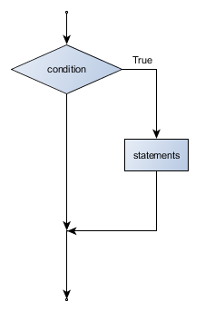
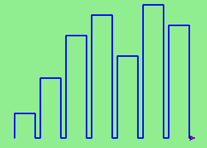

Conditionals
============

> A successful attempt to express logical propositions by symbols, the laws of
> whose combinations should be founded upon the laws of the mental processes
> which they represent, would, so far, be a step towards a philosophical
> language.
> 
> --- George Boole, _The Mathematical Analysis of Logic_ 1847

Boolean values and expressions
------------------------------

A *Boolean* value is either true or false. It is named
after the British mathematician, George Boole, who first formulated *Boolean
algebra* --- some rules for reasoning about and combining these values.
This is the basis of all modern computer logic.

In Javascript, the two Boolean values are ``true`` and ``false`` (the
capitalization must be exactly as shown), and the Javascript type is **'boolean'**.

~~~~~~~~~~~~~~~~~~~~~~~~~~~~{.javascript}
⠕ tyepof true;
=> 'boolean'
⠕ tyepof True;
=> 'undefined'
~~~~~~~~~~~~~~~~~~~~~~~~~~~~

A **Boolean expression** is an expression that evaluates to produce a result which is
a Boolean value. For example, the operator ``===`` tests if two values are equal.
It produces (or *yields*) a Boolean value:

~~~~~~~~~~~~~~~~~~~~~~~~~~~~{.javascript}
⠕ 5 === (3 + 2);   // Is five equal 5 to the result of 3 + 2? 
=> true
⠕ 5 === 6;
=> false
⠕ let j = "hel";
⠕ j + "lo" === "hello";
true
~~~~~~~~~~~~~~~~~~~~~~~~~~~~

In the first statement, the two operands evaluate to equal values, so the expression evaluates
to ``true``; in the second statement, 5 is not equal to 6, so we get ``false``.

The ``===`` operator is one of six common **comparison operators** which all produce 
a ``boolean`` result; here are all six:

~~~~~~~~~~~~~~~~~~~~~~~~~~~~{.javascript}
x === y   // Produce true if ... x is equal to y
x !== y   // Produce true if ... x is not equal to y
x > y     // Produce true if ... x is greater than y
x < y     // Produce true if ... x is less than y
x >= y    // Produce true if ... x is greater than or equal to y
x <= y    // Produce true if ... x is less than or equal to y

~~~~~~~~~~~~~~~~~~~~~~~~~~~~

Although these operations are probably familiar, the Javascript symbols are
different from the mathematical symbols. A common error is to use a single
equal sign (``=``) instead of a triple equal sign (``===``). Remember that ``=``
is an assignment operator and ``===`` is a comparison operator. Also, there is
no such thing as ``=<`` or ``=>``.

Like any other types we've seen so far, Boolean values can be assigned to 
variables, printed, etc.

~~~~~~~~~~~~~~~~~~~~~~~~~~~~{.javascript}     
⠕ let age = 18;
⠕ let oldEnoughToGetADrivingLicence = age >= 16;
⠕ console.log(oldEnoughToGetADrivingLicence);
true
⠕ typeof oldEnoughToGetADrivingLicence;
'boolean'
~~~~~~~~~~~~~~~~~~~~~~~~~~~~

<aside id="strict-equality">
**Equality and "sameness" in Javascript**

Javascript, as a programming language, is a little bit quirky when it
comes to testing equality. The double equal sign ``==`` is a
"loose" equality operator, while the triple equal sign ``===``
used in the examples above is the "strict" equality operator.

When we looked at variables and data types in chapter 2, we saw how
Javascript does automatic type conversion. For example, it converts numbers to
strings when you use the ``+`` token for string concatenation and
strings to numbers (if it can) when we use other mathematical operators.

The ``==`` compares values for equality _after_ type conversion, whereas 
the ``===`` compares values _before_ conversion. Only values of the same
type are equal with the strict operator.

~~~~~~~~~~~~~~~~~~~~~~~~~~~~{.javascript}     
⠕ 5 == "5"; // true because of type conversion
=> true
⠕ 5 === "5"; // false using strict equality
=> false
⠕ 5 === 5.0; // true because integers and floats are all type `number`
=> true
~~~~~~~~~~~~~~~~~~~~~~~~~~~~

In addition to the loose equality with ``==`` there is a loose inequality operator
using ``!=``. Because loose equality (and inequality) is difficult to predict,
**we will only use strict equality** in the examples in this book. However, you
are likely to encounter both styles when reading other code, documentation, and
tutorials.

For further reading on this topic you can read
[Equality comparison and sameness](https://developer.mozilla.org/en-US/docs/Web/JavaScript/Equality_comparisons_and_sameness) on the Mozilla Developer Network.

</aside>

Logical operators
-----------------

There are three **logical operators**,  _and_ ``&&``,  _or_ ``||``, and _not_ ``!``,
that allow us to build more complex
Boolean expressions from simpler Boolean expressions. The
semantics (meaning) of these operators is similar to their meaning in English.
For example, ``x > 0 && x < 10`` produces ``true`` only if ``x`` is greater than 0 _and_
at the same time, x is less than 10.

``n % 2 == 0 || n % 3 == 0`` is ``true`` if *either* of the conditions are ``true``,
that is, if the number ``n`` is divisible by 2 *or* it is divisible by 3. (What do
you think happens if ``n`` is divisible by both 2 and by 3 at the same time?
Will the expression yield ``true`` or ``false``?  Try it in your Javascript interpreter.)

Finally, the ``not`` operator negates a Boolean value, so ``! (x > y)``
is ``true`` if ``(x > y)`` is ``false``, that is, if ``x`` is less than or equal to
``y``.

The expression on the left of the ``||`` operator is evaluated first: if the result is ``true``, 
Javascript does not (and need not) evaluate the expression on the right --- this is called *short-circuit evaluation*.
Similarly, for the ``&&`` operator, if the expression on the left yields ``false``, Javascript does not
evaluate the expression on the right.

So there are no unnecessary evaluations.

Truth Tables
------------

A truth table is a small table that allows us to list all the possible inputs,
and to give the results for the logical operators. Because the ``&&`` and ``||``
operators each have two operands, there are only four rows in a truth table that
describes the semantics of ``&&``.

a       b        a && b
------- -------  --------
False   False    False
False   True     False
True    False    False
True    True     True

In a Truth Table, we sometimes use T and F as shorthand for the two 
Boolean values: here is the truth table describing ``||``:

a    b    a || b
---  ---  -------
F    F    F
F    T    T
T    F    T
T    T    T

The third logical operator, ``!``, only takes a single operand, so its truth table
only has two rows:

a    !a
---  ------
F    T
T    F

Simplifying Boolean Expressions
-------------------------------

A set of rules for simplifying and rearranging expressions is called an *algebra*. 
For example, we are all familiar with school algebra rules, such as:

~~~~~~~~~~~~~~~~~~~~~~~~~~~~{.javascript}    
n * 0 === 0
~~~~~~~~~~~~~~~~~~~~~~~~~~~~
which provides rules for working with Boolean values. 

First, the ``&&`` operator:

~~~~~~~~~~~~~~~~~~~~~~~~~~~~{.javascript}
x && false === false
false && x === false
y && x === x && y
x && true === x
true && x === x
x && x === x
~~~~~~~~~~~~~~~~~~~~~~~~~~~~

Here are some corresponding rules for the ``||`` operator:

~~~~~~~~~~~~~~~~~~~~~~~~~~~~{.javascript}
x || false === x
false || x === x
y || x === x || y
x || true === true
true || x === true
x || x === x
~~~~~~~~~~~~~~~~~~~~~~~~~~~~
        
Two ``!`` operators cancel each other:

~~~~~~~~~~~~~~~~~~~~~~~~~~~~{.javascript}
!(!x) == x
~~~~~~~~~~~~~~~~~~~~~~~~~~~~

Conditional execution
---------------------

In order to write useful programs, we almost always need the ability to check
conditions and change the behavior of the program accordingly. **Conditional
statements** give us this ability. The simplest form is the **if**
statement:

~~~~~~~~~~~~~~~~~~~~~~~~~~~~{.javascript .numberLines}
if (x % 2 == 0) {
  console.log(x, " is even.");
  console.log("Did you know that 2 is the only even number that is prime?");
}
else {
  console.log(x, " is odd.") ;
  console.log("Did you know that multiplying two odd numbers always gives an odd result?");
}
~~~~~~~~~~~~~~~~~~~~~~~~~~~~

If it is true, then all the indented statements get executed. If not, then all
the statements indented under the ``else`` clause get executed. 

The syntax for an ``if`` statement looks like this:

~~~~~~~~~~~~~~~~~~~~~~~~~~~~{.javascript .numberLines}
if BOOLEAN EXPRESSION {
  STATEMENTS_1   // Executed if condition evaluates to true
}
else {
  STATEMENTS_2   // Executed if condition evaluates to false
}
~~~~~~~~~~~~~~~~~~~~~~~~~~~~

As with the function definition from the last chapter and other compound
statements like ``for``, the ``if`` statement consists of a header line and a body. The header
line begins with the keyword ``if`` followed by a *Boolean expression* and ends with
a left curly brace ( { ).

The indented statements that follow are called a **block**. The block ends with the
right curly brace ( } ).

Each of the statements inside the first block of statements are executed in order if the Boolean
expression evaluates to ``true``. The entire first block of statements 
is skipped if the Boolean expression evaluates to ``false``, and instead
all the statements indented under the ``else`` clause are executed. 

There is no limit on the number of statements that can appear under the two clauses of an ``if`` statement, but there has to be at least one statement in each block.

Omitting the ``else`` clause
----------------------------

Another form of the ``if`` statement is one in which the ``else`` clause is omitted entirely. 
In this case, when the condition evaluates to ``true``, the statements are
executed, otherwise the flow of execution continues to the statement after the ``if``.

~~~~~~~~~~~~~~~~~~~~~~~~~~~~{.javascript .numberLines}
if (x < 0) {
  console.log("The negative number ",  x, " is not valid here.");
  x = 42;
  console.log("I've decided to use the number 42 instead.");
}

console.log("The square root of ", x, "is", Math.sqrt(x)) ;
~~~~~~~~~~~~~~~~~~~~~~~~~~~~

In this case, the print function that outputs the square root is the one after the ``if`` --- it comes
after our curly braces ended the conditional block.

Notice that ``else`` is not a statement. The ``if`` statement has 
two *clauses*, one of which is the (optional) ``else`` clause. However you can
never use the ``else`` keyword outside of an ``if`` statement.
        

Chained conditionals
--------------------

Sometimes there are more than two possibilities and we need more than two
branches. One way to express a computation like that is a **chained
conditional**:

~~~~~~~~~~~~~~~~~~~~~~~~~~~~{.javascript .numberLines}
if (x < y) {
  STATEMENTS_A
}
else if (x > y) {
  STATEMENTS_B
}
else {
  STATEMENTS_C
}
~~~~~~~~~~~~~~~~~~~~~~~~~~~~
 
        

Again, exactly one branch will be executed. There is no limit of the number of
``else if`` statements but only a single (and optional) final ``else`` statement
is allowed and it must be the last branch in the statement:

~~~~~~~~~~~~~~~~~~~~~~~~~~~~{.javascript .numberLines}
if (choice === "a") {
  functionOne();
}
else if (choice == "b") {
  functionTwo();
}
else if (choice === "c") {
  functionThree();
}
else {
  console.log("Invalid choice.");
}
~~~~~~~~~~~~~~~~~~~~~~~~~~~~

Each condition is checked in order. If the first is false, the next is checked,
and so on. If one of them is true, the corresponding branch executes, and the
statement ends. Even if more than one condition is true, only the first true
branch executes.

Nested conditionals
-------------------

One conditional can also be **nested** within another. (It is the same theme of
composability, again!)  We could have written
the previous example as follows:

 

~~~~~~~~~~~~~~~~~~~~~~~~~~~~{.javascript .numberLines}
if (x < y) {
  STATEMENTS_A
}
else {
  if(x > y) {
    STATEMENTS_B
  }
  else {
    STATEMENTS_C
  }
}
~~~~~~~~~~~~~~~~~~~~~~~~~~~~

The outer conditional contains two branches. 
The second branch contains another ``if`` statement, which
has two branches of its own. Those two branches could contain
conditional statements as well.

Although the indentation of the statements makes the structure apparent, nested
conditionals very quickly become difficult to read. In general, it is a good
idea to avoid them when we can.

Logical operators often provide a way to simplify nested conditional
statements. For example, we can rewrite the following code using a single
conditional:

~~~~~~~~~~~~~~~~~~~~~~~~~~~~{.javascript .numberLines}
if (0 < x) {    // Assume x is a number here
  if (x < 10) {
    console.log("x is a positive single digit.");
  }
}
~~~~~~~~~~~~~~~~~~~~~~~~~~~~
The ``log`` function is called only if we make it past both the
conditionals, so instead of the above which uses two ``if`` statements each with
a simple condition, we could make a more complex condition using the ``&&`` operator. Now we only
need a single ``if`` statement:

~~~~~~~~~~~~~~~~~~~~~~~~~~~~{.javascript .numberLines}
if (0 < x && x < 10) {
  console.log("x is a positive single digit.");
}
~~~~~~~~~~~~~~~~~~~~~~~~~~~~

The ``return`` statement
------------------------

The ``return`` statement, with or without a value, depending on whether the 
function is fruitful or void, allows us to terminate the execution of a function
before (or when) we reach the end. One reason to use an *early return* is if we detect an error
condition:

~~~~~~~~~~~~~~~~~~~~~~~~~~~~{.javascript .numberLines}
function printSquareRoot(x) {
  if (x <= 0) {
    console.log("Positive numbers only, please.");
    return;
  }
  console.log("The square root of", x, "is", result)
}
~~~~~~~~~~~~~~~~~~~~~~~~~~~~

The function ``printSquareRoot`` has a parameter named ``x``. The first thing
it does is check whether ``x`` is less than or equal to 0, in which case it
displays an error message and then uses ``return`` to exit the function. The
flow of execution immediately returns to the caller, and the remaining lines of
the function are not executed.

Logical opposites
-----------------

Each of the six relational operators has a logical opposite: for example,
suppose we can get a driving license when our age is greater or equal to 16,
we can *not* get the driving license when we are less than 16.

Notice that the opposite of ``>=`` is ``<``. 

operator  logical opposite     
--------  ----------------
===       !==
!==       ===
<         >=
<=        >
>         <=
>=        <

Understanding these logical opposites allows us to sometimes get rid of ``!``
operators. ``!`` operators are often quite difficult to read in computer code, and
our intentions will usually be clearer if we can eliminate them. 

For example, if we wrote this Javascript:

~~~~~~~~~~~~~~~~~~~~~~~~~~~~{.javascript .numberLines}
if (!(age >= 16)) {
  console.log("Hey, you're too young to get a driving license!");
}
  
~~~~~~~~~~~~~~~~~~~~~~~~~~~~
it would probably be clearer to use the simplification laws, and to 
write instead:

~~~~~~~~~~~~~~~~~~~~~~~~~~~~{.javascript .numberLines}
if (age < 16) {
  console.log("Hey, you're too young to get a driving license!")
}
~~~~~~~~~~~~~~~~~~~~~~~~~~~~
Two powerful simplification laws (called de Morgan's laws) that are often
helpful when dealing with complicated Boolean expressions are:

~~~~~~~~~~~~~~~~~~~~~~~~~~~~
!(x && y)  ===  (!x) || (!y) 
!(x || y)   ===  (!x) && (!y)
~~~~~~~~~~~~~~~~~~~~~~~~~~~~

For example, suppose we can slay the dragon only if our magic 
lightsabre sword is charged to 90% or higher, 
and we have 100 or more energy units in our protective shield. 
We find this fragment of Javascript code in the game:

~~~~~~~~~~~~~~~~~~~~~~~~~~~~{.javascript .numberLines}
if !((swordCharge >= 0.90) && (shieldEnergy >= 100)) {
  console.log("Your attack has no effect, the dragon fries you to a crisp!");
}
else {
  console.log("The dragon crumples in a heap. You rescue the gorgeous prince!");
}
~~~~~~~~~~~~~~~~~~~~~~~~~~~~
de Morgan's laws together with the logical opposites would let us
rework the condition in a (perhaps) easier to understand way like this:

~~~~~~~~~~~~~~~~~~~~~~~~~~~~{.javascript .numberLines}
if (swordCharge < 0.90) || (shieldEnergy < 100) {
  console.log("Your attack has no effect, the dragon fries you to a crisp!");
}
else {
  console.log("The dragon crumples in a heap. You rescue the gorgeous prince!");
}
~~~~~~~~~~~~~~~~~~~~~~~~~~~~
We could also get rid of the ``!`` by swapping around the ``then`` and
``else`` parts of the conditional. So here is a third version, also equivalent:

~~~~~~~~~~~~~~~~~~~~~~~~~~~~{.javascript .numberLines}
if (swordCharge >= 0.90) and (shieldEnergy >= 100) {
  console.log("The dragon crumples in a heap. You rescue the gorgeous prince!");
}
else {
  console.log("Your attack has no effect, the dragon fries you to a crisp!");
}
~~~~~~~~~~~~~~~~~~~~~~~~~~~~

This last version is probably the best of the three, because it very closely matches  
the initial English statement. Clarity of our code (for other humans), 
and making it easy to see that the code does what we expect should always
be a high priority. 

As our programming skills develop we'll find we have 
more than one way to solve any problem. So good programs are *designed*. 
We make choices that favor clarity, simplicity, and elegance. The job 
title *software architect* says a lot about what we do --- we are *architects*
who engineer our products to balance beauty, functionality, simplicity and 
clarity in our creations. 

<aside id="polish-code-tip">
**Tip:** Once our program works, we should play around a bit trying to polish it up.
Write good comments. Think about whether the code would be clearer with 
different variable names. Could we have done it more elegantly?  Should
we rather use a function?  Can we simplify the conditionals? 

We think of our code as our creation, our work of art! We make it great.
</aside>

Type conversion
---------------

We've had a first look at this in an earlier chapter. Seeing it again won't hurt! 

Many Javascript types come with a built-in function that attempts to convert values
of another type into its own type. The ``int`` function, for example,
takes any value and converts it to an integer, if possible, or complains
otherwise:

~~~~~~~~~~~~~~~~~~~~~~~~~~~~{.javascript}
⠕ int("32")
32
⠕ int("Hello")
ValueError: invalid literal for int() with base 10: 'Hello'
~~~~~~~~~~~~~~~~~~~~~~~~~~~~

that it truncates the fractional part:

~~~~~~~~~~~~~~~~~~~~~~~~~~~~{.javascript}
⠕ int(-2.3)
-2
⠕ int(3.99999)
3
⠕ int("42")
42
⠕ int(1.0)
1
~~~~~~~~~~~~~~~~~~~~~~~~~~~~

numbers:

~~~~~~~~~~~~~~~~~~~~~~~~~~~~{.javascript}
⠕ float(32)
32.0
⠕ float("3.14159")
3.14159
⠕ float(1)
1.0
~~~~~~~~~~~~~~~~~~~~~~~~~~~~

floating-point value ``1.0``. They may represent the same number, but they
belong to different types. The reason is that they are represented differently
inside the computer.

The ``str`` function converts any argument given to it to type
``string``:

~~~~~~~~~~~~~~~~~~~~~~~~~~~~{.javascript}
⠕ str(32)
'32'
⠕ str(3.14149)
'3.14149'
⠕ str(True)
'True'
⠕ str(true)
Traceback (most recent call last):
  File "<interactive input>", line 1, in <module>
NameError: name 'true' is not defined
~~~~~~~~~~~~~~~~~~~~~~~~~~~~

``str`` will work with any value and convert it into a string.  As
mentioned earlier, ``true`` is Boolean value; ``true`` is just an ordinary variable name,
and is not defined here, so we get an error.

A Turtle Bar Chart
------------------

The turtle has a lot more power than we've seen so far. The full
documentation can be found at
http://docs.python.org/py3k/library/turtle.html
or within PyScripter, use *Help* and search for the turtle module.

Here are a couple of new tricks for our turtles: 

* We can get a turtle to display text on the canvas at the turtle's current position. The method to do that is
  ``alex.write("Hello")``.
* We can fill a shape (circle, semicircle, triangle, etc.) with a color. It is a two-step process.
  First we call the method ``alex.begin_fill()``, then we draw the shape, then we call ``alex.end_fill()``. 
* We've previously set the color of our turtle --- we can now also set its fill color, which need not
  be the same as the turtle and the pen color. We use ``alex.color("blue","red")`` to set the turtle
  to draw in blue, and fill in red. 
  
  
Ok, so can we get tess to draw a bar chart?  Let us start with some data to be charted,

``xs = [48, 117, 200, 240, 160, 260, 220]``

Corresponding to each data measurement, we'll draw a simple rectangle of that height, with a fixed width.

~~~~~~~~~~~~~~~~~~~~~~~~~~~~{.javascript .numberLines}
def draw_bar(t, height):
    """ Get turtle t to draw one bar, of height. """
    t.left(90)   
    t.forward(height)     # Draw up the left side
    t.right(90)
    t.forward(40) # Width of bar, along the top
    t.right(90)
    t.forward(height)     # And down again!
    t.left(90)    # Put the turtle facing the way we found it.
    t.forward(10) # Leave small gap after each bar
     
... 
for v in xs:      # Assume xs and tess are ready 
    draw_bar(tess, v)    
~~~~~~~~~~~~~~~~~~~~~~~~~~~~
        

Ok, not fantastically impressive, but it is a nice start!  The important thing here
was the mental chunking, or how we broke the problem into smaller pieces. Our chunk
is to draw one bar, and we wrote a function to do that. Then, for the whole
chart, we repeatedly called our function.

Next, at the top of each bar, we'll print the value of the data.
We'll do this in the body of ``draw_bar``, by adding   ``t.write('  ' + str(height))`` 
as the new third line of the body.

We've put a little space in front of the number, and turned the 
number into a string. Without this extra space we tend
to cramp our text awkwardly against the bar to the left. 
The result looks a lot better now:

And now we'll add two lines to fill each bar. Our final program now looks like this:

~~~~~~~~~~~~~~~~~~~~~~~~~~~~{.javascript .numberLines}       
def draw_bar(t, height):
    """ Get turtle t to draw one bar, of height. """
    t.begin_fill()   # Added this line
    t.left(90)
    t.forward(height)
    t.write("  "+ str(height))   
    t.right(90)
    t.forward(40)
    t.right(90)
    t.forward(height)
    t.left(90)
    t.end_fill()     # Added this line
    t.forward(10) 

wn = turtle.Screen() # Set up the window and its attributes
wn.bgcolor("lightgreen")

tess = turtle.Turtle()       # Create tess and set some attributes
tess.color("blue", "red")
tess.pensize(3)

xs = [48,117,200,240,160,260,220]

for a in xs:
    draw_bar(tess, a)

wn.mainloop()
~~~~~~~~~~~~~~~~~~~~~~~~~~~~

Mmm. Perhaps the bars should not be joined to each other at the bottom. We'll need to pick up the pen while making the gap between the bars. We'll leave that as an exercise for you!

Glossary
--------

block

:   A group of consecutive statements with the same indentation.

body

:   The block of statements in a compound statement that follows the
    header.
          
Boolean algebra

:   Some rules for rearranging and reasoning about Boolean expressions.

Boolean expression

:   An expression that is either true or false.

Boolean value

:   There are exactly two Boolean values: ``true`` and ``false``. Boolean
    values result when a Boolean expression is evaluated by the Javascript
    interpreter. They have type ``'boolean'``.

branch

:   One of the possible paths of the flow of execution determined by
    conditional execution.

chained conditional

:   A conditional branch with more than two possible flows of execution. In
    Javascript chained conditionals are written with ``if ... else if ... else``
    statements.

comparison operator

:   Javascript operators that compare two values: ``===``, ``!==``, ``>``,
    ``<``, ``>=``, and ``<=``. 

condition

:   The Boolean expression in a conditional statement that determines which
    branch is executed.

conditional statement

:   A statement that controls the flow of execution depending on some
    condition. In Javascript the keywords ``if``, ``else if``, and ``else`` are
    used for conditional statements.

logical operator

:   One of the operators that combines Boolean expressions: (and) ``&&``,
    (or) ``||``, and (not) ``!``.

nesting

:   One program structure within another, such as a conditional statement
    inside a branch of another conditional statement.

prompt

:   A visual cue that tells the user that the system is ready to accept input data.
    
truth table

:   A concise table of Boolean values that can describe the semantics
    of an operator. 

type conversion

:   An explicit function call that takes a value of one type and computes a
    corresponding value of another type.

wrapping code in a function

:   The process of adding a function header and parameters to a sequence
    of program statements is often referred to as "wrapping the code in
    a function". This process is very useful whenever the program
    statements in question are going to be used multiple times. It is
    even more useful when it allows the programmer to express their mental
    chunking, and how they've broken a complex problem into pieces.

Conditional Exercises
---------------------
   
#. Assume the days of the week are numbered 0,1,2,3,4,5,6 from Sunday to Saturday. Write a function which is given the day number, and it returns the day name (a string).
 
#. You go on a wonderful vacation leaving on day number 3 (a Wednesday). You return home after 137 sleeps. Write a general version of the program which asks for the starting day number, and the length of your stay, and it will tell you the name of day of the week you will return on. You might want to use the ``%`` mod operator. You can compose this function from the one you wrote in exercise 1.
   
#. Give the logical opposites of these conditions
  #. ``a > b`` 
  #. ``a >= b``
  #. ``a >= 18  and  day == 3``
  #. ``a >= 18  and  day != 3``
    
#. What do these expressions evaluate to?
  #. ``3 == 3``
  #. ``3 != 3``
  #. ``3 >= 4``
  #. ``not (3 < 4)``
    
#. Complete this truth table:

p   q   r       (! (p && q)) || r
--- --- ------  --------------------
F   F   F        ?
F   F   T        ?
F   T   F        ?
F   T   T        ?
T   F   F        ?
T   F   T        ?
T   T   F        ?
T   T   T        ?
   
#. Write a function which is given an exam score, and it returns a string --- the letter grade for that mark --- according to this scheme:   
    
Score     Grade
-------   --------------
90-100    A
80-89     B
70-79     C
65-69     D
<65       F
    
#. Modify the turtle bar chart program so that the pen is up for the small gaps between each bar.

#. Modify the turtle bar chart program so that the bar for any value of 200 or more is filled with red, values between [100 and 200) are filled with yellow, and bars representing values less than 100 are filled with green.
  
#. In the turtle bar chart program, what do you expect to happen if one or more of the data values in the list is negative? Try it out. Change the program so that when it prints the text value for the negative bars, it puts the text below the bottom of the bar.
   
#. Write a function ``isRightAngled`` which, given the length of three sides
of a triangle, will determine whether the triangle is right-angled. Assume
that the third argument to the function is always the longest side. It will
return ``true`` if the triangle  is right-angled, or ``false`` otherwise. 
Hint: Floating point arithmetic is not always exactly accurate,
so it is not safe to test floating point numbers for equality. 
If a good programmer wants to know whether
``x`` is equal or close enough to ``y``, they would probably code it up as: 

~~~~~~~~~~~~~~~~~~~~~~~~~~~~{.javascript}    
if (Math.abs(x-y) < 0.000001) {
  // x is approximately equal to y
}     
~~~~~~~~~~~~~~~~~~~~~~~~~~~~

12. If you're intrigued by why floating point arithmetic is sometimes inaccurate, on a piece
    of paper, divide 10 by 3 and write down the decimal result. You'll find it does not terminate,
    so you'll need an infinitely long sheet of paper. The *representation* of numbers in computer 
    memory or on your calculator has similar problems: memory is finite, and some digits may have to be discarded. So small
    inaccuracies creep in. Try this script:
    

~~~~~~~~~~~~~~~~~~~~~~~~~~~~{.javascript .numberLines}   

let a = Math.sqrt(2.0);
console.log(a, a*a);
console.log(a*a === 2.0);
~~~~~~~~~~~~~~~~~~~~~~~~~~~~
