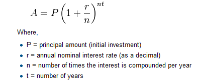

Functions
=========================

Functions
-------------------------

In Python, a **function** is a named sequence of statements
that belong together.  Their primary purpose is to help us
organize programs into chunks that match how we think about
the problem. 
 
The syntax for a **function definition** is:

~~~~~~~~~~~~~~~~~~~~~~~~~~~~~~~~~~~~~{.python}        
def NAME( PARAMETERS ):
    STATEMENTS
~~~~~~~~~~~~~~~~~~~~~~~~~~~~~~~~~~~~~

We can make up any names we want for the functions we create, except that
we can't use a name that is a Python keyword, and the names must follow the rules
for legal identifiers. 

There can be any number of statements inside the function, but they have to be
indented from the ``def``. In the examples in this book, we will use the
standard indentation of four spaces. Function definitions are the second of
several **compound statements** we will see, all of which have the same
pattern:

1. A header line which begins with a keyword and ends with a colon.
2. A **body** consisting of one or more Python statements, each
   indented the same amount — *the Python style guide recommends 4 spaces* — from
   the header line.

We've already seen the ``for`` loop which follows this pattern.
   
So looking again at the function definition, the keyword in the header is ``def``, which is
followed by the name of the function and some *parameters* enclosed in
parentheses. The parameter list may be empty, or it may contain any number of
parameters separated from one another by commas. In either case, the parentheses are required.
The parameters specifies what information, if any, we have to provide in order to use the new function.

Suppose we're working with turtles, and a common operation we need is to draw
squares.   "Draw a square" is an *abstraction*, or a mental
chunk, of a number of smaller steps.  So let's write a function to capture the pattern
of this "building block": 

Suppose we are writing a program to calculate the amount of tip due on a
bill. We might write a function to "calculate tip". "calculate tip" is
an *abstraction*, or a mental chunk, of a number of smaller steps.  So
let's write a function to capture the pattern of this "building block": 

~~~~~~~~~~~~~~~~~~~~~~~~~~~~~~~~~~~~~{.python .numberLines}
def calculate_tip(bill, pct):
    """
        Calculate the tip on a bill, given the pct of the tip.
    """
    
    tip = bill * (pct * .01) # convert pct to a decimal and calculate
    tip = round(tip, 2) # round the tip to 2 decimal places
    total = tip + bill

    # now show the results to the user
    print("Bill total: $" + str(bill))
    print("Tip percentage: " + str(pct) + "%")
    print("Tip amount due: $" + str(total))

# find the amount of an 18% tip on a $100 bill
calculate_tip(100,18)

~~~~~~~~~~~~~~~~~~~~~~~~~~~~~~~~~~~~~

<aside id="docstrings">
**Docstrings for documentation**

If the first thing after the function header is a string, it is
treated as a **docstring** and gets special treatment in Python and
in some programming tools. For example, when we type a built-in
function name with an unclosed parenthesis in PyScripter, a tooltip
pops up, telling us what arguments the function takes, and it shows 
us any other text contained in the docstring.

Docstrings are the key way to document our functions in Python and
the documentation part is important. Because whoever calls our
function shouldn't have to need to know what is going on in the
function or how it works; they just need to know what arguments our
function takes, what it does, and what the expected result is.
Enough to be able to use the function without having to look
underneath. This goes back to the concept of abstraction of which
we'll talk more about.

Docstrings are usually formed using triple-quoted strings as they
allow us to easily expand the docstring later on should we want to
write more than a one-liner.

Just to differentiate from comments, a string at the start of a
function (a docstring) is retrievable by Python tools *at runtime*.
By contrast, comments are completely eliminated when the program is 
parsed.
 </aside>

This function is named ``calculate_tip``.  It has two parameters: one to tell 
the function the amount of the bill, and the other to tell it the percent
tip to calculate. Make sure you know where the body of the function
ends — it depends on the indentation, and the blank lines don't count for
this purpose!

Defining a new function does not make the function run. To do that we
need a **function call**. We've already seen how to call some built-in
functions like **print**, **range**, **round**, and **int**. Function
calls contain the name of the function being executed followed by a list
of values, called *arguments*, which are assigned to the parameters in
the function definition.  So in the last line of the example program
above, we call the function, and pass ``100`` as the amount of the bill
and ``18`` as the percentage of the tip. While the function is
executing, then, the variable ``bill`` refers to the value 100, and the
variable ``pct`` refers to 18. 

Once we've defined a function, we can call it as often as we like, and its 
statements will be executed each time we call it.  And we could use it to get
any of our turtles to draw a square.   In the next example, we calculate 3 different
tip amounts for the same bill.

~~~~~~~~~~~~~~~~~~~~~~~~~~~~~~~~~~~~~{.python .numberLines}
def calculate_tip(bill, pct):
    """
        Calculate the tip on a bill, given the pct of the tip.
    """
    
    tip = bill * (pct * .01) # convert pct to a decimal and calculate
    tip = round(tip, 2) # round the tip to 2 decimal places
    total = tip + bill

    # now show the results to the user
    print("Bill total: $" + str(bill))
    print("Tip percentage: " + str(pct) + "%")
    print("Tip amount due: $" + str(total))

myBill = 100
calculate_tip(myBill, 15)
calculate_tip(myBill, 18)
calculate_tip(myBill, 20)
~~~~~~~~~~~~~~~~~~~~~~~~~~~~~~~~~~~~~~~~~~~~~~~~~~~~~~~~~~~~~~~~~~~~~~~~

<aside id="coding-style">

**Coding Style**

Now that you are about to write longer, more complex pieces of Python,
it is a good time to talk about coding style. Most languages can be
written (or more concise, formatted) in different styles; some are more
readable than others. Making it easy for others to read your code is
always a good idea, and adopting a nice coding style helps tremendously
for that.

For Python, [PEP 8 has emerged as the style
guide](http://www.python.org/dev/peps/pep-0008/) that most projects
adhere to; it promotes a very readable and eye-pleasing coding
style. Every Python developer should read it at some point; here are
the most important points extracted for you:

- Use 4-space indentation, and no tabs.
- 4 spaces are a good compromise between small indentation (allows
  greater nesting depth) and large indentation (easier to read). Tabs
  introduce confusion, and are best left out.
- Wrap lines so that they don’t exceed 79 characters.
- This helps users with small displays and makes it possible to have
  several code files side-by-side on larger displays.
- Use blank lines to separate functions and classes, and larger blocks
  of code inside functions.
- When possible, put comments on a line of their own.
- Use docstrings.
- Use spaces around operators and after commas, but not directly inside
  bracketing constructs: a = f(1, 2) + g(3, 4).
- Name your classes and functions consistently; the convention is to use
  CamelCase for classes and lower_case_with_underscores for functions and
  methods. Always use self as the name for the first method argument (see
  A First Look at Classes for more on classes and methods).
- Don’t use fancy encodings if your code is meant to be used in
  international environments. Python’s default, UTF-8, or even plain ASCII
  work best in any case.
- Likewise, don’t use non-ASCII characters in identifiers if there is
  only the slightest chance people speaking a different language will read
  or maintain the code.

</aside>

Composition: Functions can call other functions
--------------------------------------------------

So far, we have looked at the elements of a program—``variables``,
``expressions``, and ``statements``—in isolation, without talking about how to
combine them.

One of the most useful features of programming languages is their
ability to take small building blocks and **compose** them. In our calculate_tip
example, we call several Python built-in functions: ``round`` to keep our amounts
to 2 decimal places and ``str`` to convert numeric data (ints and floats) to strings
when we print them. As we will see, we can compose our programs of many functions
that we define ourselves.

There are some points worth noting here:

* Functions can call other functions. 
* A caller of this function might say ``calculate_tip(myBill, 15)``.  The parameters
  of this function, ``bill`` and ``tip``, are assigned the values of the myBill variable, and
  the int literal 15, respectively.
* In the body of the function they are just like any other variable. 

So far, it may not be clear why it is worth the trouble to create all of these
new functions. Actually, there are a lot of reasons, but this example
demonstrates two:

1. Creating a new function gives us an opportunity to name a group of
   statements. Functions can simplify a program by hiding a complex computation 
   behind a single command. The function (including its name) can capture our 
   mental chunking, or *abstraction*, of the problem.  
2. Creating a new function can make a program smaller by eliminating repetitive 
   code.  

As we might expect, we have to create a function before we can execute it.
In other words, the function definition has to be executed before the
function is called.

Flow of execution
----------------------------------

In order to ensure that a function is defined before its first use, we have to
know the order in which statements are executed, which is called the **flow of
execution**.

Execution always begins at the first statement of the program.  Statements are
executed one at a time, in order from top to bottom.

Function definitions do not alter the flow of execution of the program, but
remember that statements inside the function are not executed until the
function is called. Although it is not common, we can define one function
inside another. In this case, the inner definition isn't executed until the
outer function is called.

Function calls are like a detour in the flow of execution. Instead of going to
the next statement, the flow jumps to the first line of the called function,
executes all the statements there, and then comes back to pick up where it left
off.

That sounds simple enough, until we remember that one function can call
another. While in the middle of one function, the program might have to execute
the statements in another function. But while executing that new function, the
program might have to execute yet another function!

Fortunately, Python is adept at keeping track of where it is, so each time a
function completes, the program picks up where it left off in the function that
called it. When it gets to the end of the program, it terminates.

What's the moral of this sordid tale? When we read a program, don't read from
top to bottom. Instead, follow the flow of execution.

Functions that require arguments
---------------------------------------------

Most functions require arguments: the arguments provide for generalization. 
For example, if we want to find the absolute value of a number, we have 
to indicate what the number is. Python has a built-in function for 
computing the absolute value:

~~~~~~~~~~~~~~~~~~~~~~~~~~~~~~~~~~~~~{.python}        
>>> abs(5)
5
>>> abs(-5)
5
~~~~~~~~~~~~~~~~~~~~~~~~~~~~~~~~~~~~~~~~~~~~~

In this example, the arguments to the ``abs`` function are 5 and -5.

Some functions take more than one argument. For example the built-in function ``round``
takes two arguments, the number to round and the (optional) number of
decimal digits of precision. Inside the function, the values that are
passed get assigned to variables called **parameters**.

~~~~~~~~~~~~~~~~~~~~~~~~~~~~~~~~~~~~~{.python}
>>> round(3.14159)
3
>>> round(3.14159,3)
3.142
~~~~~~~~~~~~~~~~~~~~~~~~~~~~~~~~~~~~~~~~~~~~~~~

Another built-in function that takes more than one argument is ``max``.

~~~~~~~~~~~~~~~~~~~~~~~~~~~~~~~~~~~~~{.python}        
>>> max(7, 11)
11
>>> max(4, 1, 17, 2, 12)
17
>>> max(3 * 11, 5**3, 512 - 9, 1024**0)
503
~~~~~~~~~~~~~~~~~~~~~~~~~~~~~~~~~~~~~~~~~~~~~~~

``max`` can be passed any number of arguments, separated by commas, and will
return the largest value passed. The arguments can be either simple values or
expressions. In the last example, 503 is returned, since it is larger than 33,
125, and 1.

Functions that return values
------------------------------------------------------------------------------

All the functions in the previous section return values. 
Furthermore, functions like ``range``, ``int``, ``abs`` all return values that
can be used to build more complex expressions.  

So an important difference between these functions and one like ``calculate_tip`` is that
``calculate_tip`` does not return a useful value — it computes a value and displays
the results on the screen. 

A function that returns a value is called a **fruitful function** in this book.
The opposite of a fruitful function is **void function** — one that is not executed
for its resulting value, but is executed because it does something useful. (Languages
like Java, C#, C and C++ use the term "void function", other languages like Pascal 
call it a **procedure**.) Even though void functions are not executed
for their resulting value, Python always wants to return something. So if the programmer
doesn't arrange to return a value, Python will automatically return the value ``None``.

How do we write our own fruitful function? Let's look at the standard
formula for compound interest as an example fo a fruitful function:   

~~~~~~~~~~~~~~~~~~~~~~~~~~~~~~~~~~~~~{.python .numberLines}
def final_amt(p, r, n, t):
   """
     Apply the compound interest formula to p
      to produce the final amount.
   """
   
   a = p * (1 + r/n) ** (n*t)
   return a         # This is new, and makes the function fruitful.
             
# now that we have the function above, let us call it.  
toInvest = float(input("How much do you want to invest?"))
fnl = final_amt(toInvest, 0.08, 12, 5)
print("At the end of the period you'll have", fnl)
~~~~~~~~~~~~~~~~~~~~~~~~~~~~~~~~~~~~~~~~~~~~~~~~~~~~~~~~~~

* The **return** statement is followed an expression (``a`` in this case). This expression will be
  evaluated and returned to the caller as the "fruit" of calling this function.
* We prompted the user for the principal amount.  The type of ``toInvest`` is a string, but
  we need a number before we can work with it.  Because it is money, and could have decimal places,
  we've used the ``float`` type converter function to parse the string and return a float.
* Notice how we entered the arguments for 8% interest, compounded 12 times per year, for 5 years.
* When we run this, we get the output 

      *At the end of the period you'll have 14898.457083*
 
  This is a bit messy with all these decimal places, but remember that
  Python doesn't understand that we're working with money: it just does the calculation to
  the best of its ability, without rounding.  Later we'll see how to format the string that
  is printed in such a way that it does get nicely rounded to two decimal places before printing. 
* The line ``toInvest = float(input("How much do you want to invest?"))``
  also shows yet another example
  of *composition* — we can call a function like ``float``, and its arguments 
  can be the results of other function calls (like ``input``) that we've called along the way.
  
Notice something else very important here. The name of the variable we pass as an
argument — ``toInvest`` — has nothing to do with the name of the parameter
— ``p``.  It is as if  ``p = toInvest`` is executed when ``final_amt`` is called. 
It doesn't matter what the value was named in 
the caller, in ``final_amt`` its name is ``p``.  
         
These short variable names are getting quite tricky, so perhaps we'd prefer one of these
versions instead:       

~~~~~~~~~~~~~~~~~~~~~~~~~~~~~~~~~~~~~{.python .numberLines}
def final_amt_v2(principalAmount, nominalPercentageRate, 
                                   numTimesPerYear, years):
   a = principalAmount * (1 + nominalPercentageRate / 
                        numTimesPerYear) ** (numTimesPerYear*years)
   return a
   
def final_amt_v3(amt, rate, compounded, years):
   a = amt * (1 + rate/compounded) ** (componded*years)
   return a
~~~~~~~~~~~~~~~~~~~~~~~~~~~~~~~~~~~~~~~~~~~~~~~~~~

They all do the same thing. Use your judgement to write code that can be best 
understood by other humans!  
Short variable names are more economical and sometimes make 
code easier to read: 
E = mc2 would not be nearly so memorable if Einstein had
used longer variable names! If you do prefer short names, 
make sure you also have some comments to enlighten the reader 
about what the variables are used for.

-----------------------------------------------

When we create a **local variable** inside a function, it only exists inside
the function, and we cannot use it outside. For example, consider again this function:

~~~~~~~~~~~~~~~~~~~~~~~~~~~~~~~~~~~~~{.python .numberLines}
def final_amt(p, r, n, t):
   a = p * (1 + r/n) ** (n*t)
   return a           
~~~~~~~~~~~~~~~~~~~~~~~~~~~~~~~~~~~~~~~~~~~~
 
If we try to use ``a``, outside the function, we'll get an error:

~~~~~~~~~~~~~~~~~~~~~~~~~~~~~~~~~~~~~{.python}        
>>> a
NameError: name 'a' is not defined
~~~~~~~~~~~~~~~~~~~~~~~~~~~~~~~~~~~~~~~~~~~~    
 
The variable ``a`` is local to ``final_amt``, and is not visible
outside the function.

Additionally, ``a`` only exists while the function is being executed — 
we call this its **lifetime**. 
When the execution of the function terminates, 
the local variables  are destroyed. 

Parameters are also local, and act like local variables. 
For example, the lifetimes of ``p``, ``r``, ``n``, ``t`` begin when ``final_amt`` is called, 
and the lifetime ends when the function completes its execution.   

So it is not possible for a function to set some local variable to a 
value, complete its execution, and then when it is called again next
time, recover the local variable.  Each call of the function creates
new local variables, and their lifetimes expire when the function returns
to the caller. 

Tips Revisited
---------------------------------

Now that we have fruitful functions, we can focus our attention on 
reorganizing our code so that it fits more nicely into our mental chunks.  
This process of rearrangement is called **refactoring** the code.  
 
Two things we want to do in our tip calculator is to find the amount 
of the tip and show the results to the user. In the example below, 
we separate the various functions of the program to make a more 
complete tip calculator. As you'll see, we're starting to build code 
that is useful. Using functions allows us to make changes to one 
part of a program without affecting other parts of the program. For 
example, we can change the welcome message without worrying about 
breaking our calculations.

The trick about refactoring code is to anticipate which things we 
are likely to want to change each time we call the function: these 
should become the parameters, or changeable parts, of the functions 
we write.

[Download and run the source code: tip2.py](examples/tip2.py)

### Case Study: Tip Calculator

<aside id="tip_header" style="top: 110px">

Brief header **comments** at the top of the **source file** 
identify basic information about the program and the file.
Comments are messages for programmers who read the **source
code** --- they do not affect the execution of the program.

</aside>

<aside id="tip_welcome" style="top: 173px">

**weclcome** is a very simple **function** --- it does not accept
any data in the form of **function paramters** and it does not
**return** any data using a **return statement**. It simply prints out a
message to the console.

</aside>

<aside id="tip_calc" style="top: 354px">

The **calc_tip** function has 2 **parameters**:
`bill` and `pct`. These parameters become
variables within the **function body**. Line 22 uses
**arithmetic operators** (multiplication here) to
calculate a new value and store it in the `tip` **variable**.
`tip` is rounded to 2 decimal places using the **built-in function**
`round()`. Finally, the rounded tip amount is returned.

</aside>

<aside id="tip_get_pct" style="top: 545px">

**get_bill_amt** is a **fruitful function** because
it has a **return statement**. It uses the
**built-in function** `input()` to ask for data from the
user of the program.  --- when it is called
it returns the bill 

</aside>

<aside id="tip_get_amt" style="top: 710px">

**get_tip_pct** is similar to **get_bill_amt**. It 
requests user data by calling the ``input`` function
and then returns a result. Notice that the
**multi-line string** inside of 3 quotation marks (""")
makes it easy to read and write formatted data.

This function uses a series of **if statements** to
interpret the user's choice from a menu. While we
could use ``elif`` to change the conditions together, it
is not needed here. Once a ``return`` statement is reached,
no further conditions can be tested or executed. If none of 
the ``if`` conditions are met, this function returns -1
to indicate that an invalid choice was entered.

</aside>

<aside id="tip_get_amt" style="top: 1125px">

**show_results** defines **parameters** which are used
to pass in all of the data needed to show the results
of the tip calculation. Notice that the `print` statements
use the **+ operator** to <abbr title="join together">concatenate</abbr>
strings. Because we are joining **string literals** with variables of
type `int` and `float`, we need to use the `str()` function to convert
the numeric data to strings.

</aside>

<aside id="tip_main" style="top: 1430px">
The **main** function is the first function called for
this program. It maintains the executive control of the
program, calling other functions in sequence and passing
data between functions.

We encounter Python's special syntax
for running a program from the **command line**:

``if __name__ == "__main__":``

This **conditional statement** allows the program to execute code if 
it is being run as a standalone Python program. In our case, we 
choose to call the ``main`` function which we defined. main() has no 
special meaning in Python --- we could execute any 
statements we choose under that block.

</aside>

~~~~~~~~~~~~~~~~~~~~~~~~~~~~~~~~~~~~~{.python .numberLines}
# tip2.py
# example of an interactive tip calculator
# by: mxc

def welcome():
    """
        Give the user a welcome message.
    """
    print("""

-----------------------------------
   Welcome to the Tip Calculator   
-----------------------------------
""")

def calc_tip(bill, pct):
    """
        Calculate the tip on a bill, given the pct of the tip.
        Return the amount of the tip
    """
    # convert pct to a decimal and calculate
    tip = bill * (pct * .01)
    
    # round the tip to 2 decimal places
    tip = round(tip, 2) # round the tip to 2 decimal places
    return tip

def get_bill_amt():
    """
        Ask the user to enter the amount of the bill
        and return this amount as a <float>
    """
    amt = input("How much was your total bill: ")
    amt = float(amt)

    return amt

def get_tip_pct():
    """
        Allow the user to choose a tip amount
        from a menu.
    """
    
    print("""
What percent tip do you want to leave?
  1 - 10%, lousy service
  2 - 15%, good service, but I'm cheap
  3 - 20%, the server is hard working and deserves a decent tip
  4 - 25%, outstanding service""")

    menu = input("enter your choice (1-4):")
    
    if menu == "1":
        return 10
    if menu == "2":
        return 15
    if menu == "3":
        return 20
    if menu == "4":
        return 25
    
    return -1 # return -1 for any invalid choice

def show_results(bill, tip, pct):
    """
        Prints a message to the user showing
        the result of the calculations.
    """
    
    total = tip + bill

    print("Bill amount: $" + str(bill))
    print("Tip percentage: " + str(pct) + "%")
    print("Tip amount due: $" + str(tip))
    print("Total with tip: $" + str(total))

    print("""
-----------------------------------
             GOOD BYE      
-----------------------------------
""")

def main():
    """
        Read in the basic information, calcualte the tip
        and the share, then dispaly the results to the user.
    """
    
    welcome()
    myBill = get_bill_amt()
    pct = get_tip_pct()
    tip = calc_tip(myBill, pct)
    show_results(myBill, tip, pct)

if __name__ == "__main__":
    main()
~~~~~~~~~~~~~~~~~~~~~~~~~~~~~~~~~~~~~~~~~~~

Glossary
-------------------------------

argument

:    A value provided to a function when the function is called. This value
    is assigned to the corresponding parameter in the function.  The argument
    can be the result of an expression which may involve operators, 
    operands and calls to other fruitful functions.

body

:    The second part of a compound statement. The body consists of a
    sequence of statements all indented the same amount from the beginning
    of the header.  The standard amount of indentation used within the
    Python community is 4 spaces.

compound statement

:    A statement that consists of two parts:

    1. header - which begins with a keyword determining the statement
       type, and ends with a colon.
    2. body - containing one or more statements indented the same amount
       from the header.

    The syntax of a compound statement looks like this:

    ~~~~~~~~~~~~~~~~~~~~~~~~~~~~~~~~~~~~~{.python}
    keyword ... :
        statement
        statement ...
    ~~~~~~~~~~~~~~~~~~~~~~~~~~~~~~~~~~~~~~~~~~~~
                                           
docstring

:   A special string that is attached to a function as its ``__doc__`` attribute.
    Tools like PyScripter can use docstrings to provide documentation or hints for the programmer.
    When we get to modules, classes, and methods, we'll see that docstrings can also be used there. 

flow of execution

:   The order in which statements are executed during a program run.

frame

:   A box in a stack diagram that represents a function call. It contains
    the local variables and parameters of the function.

function

:   A named sequence of statements that performs some useful operation.
    Functions may or may not take parameters and may or may not produce a
    result.

function call

:   A statement that executes a function. It consists of the name of the
    function followed by a list of arguments enclosed in parentheses.

function composition

:   Using the output from one function call as the input to another.

function definition

:   A statement that creates a new function, specifying its name,
    parameters, and the statements it executes.
    
fruitful function

:   A function that returns a value when it is called.

header line

:   The first part of a compound statement. A header line begins with a keyword and
    ends with a colon (:)

import statement

:   A statement which permits functions and variables defined in another Python
    module to be brought into the environment of another script.  To use the 
    features of the turtle, we need to first import the turtle module.
    
lifetime

:   Variables and objects have lifetimes — they are created at some point during
    program execution, and will be destroyed at some time. 
    
local variable

:   A variable defined inside a function. A local variable can only be used
    inside its function.  Parameters of a function are also a special kind
    of local variable.

parameter

:   A name used inside a function to refer to the value which was passed 
    to it as an argument.
       
refactor

:   A fancy word to describe reorganizing our program code, usually to make 
    it more understandable.  Typically, we have a program that is already working,
    then we go back to "tidy it up".  It often involves choosing better variable
    names, or spotting repeated patterns and moving that code into a function.    
    
stack diagram

:   A graphical representation of a stack of functions, their variables,
    and the values to which they refer.

traceback

:   A list of the functions that are executing, printed when a runtime
    error occurs. A traceback is also commonly refered to as a
    *stack trace*, since it lists the functions in the order in which they
    are stored in the
    `runtime stack <http://en.wikipedia.org/wiki/Runtime_stack>`__.
    
void function

:    The opposite of a fruitful function: one that does not return a value.  It is
    executed for the work it does, rather than for the value it returns.

Exercises
------------------------------

1.  Write a void (non-fruitful) function to that prints out centered text to the console.
    Your function should have two parameters, ``text``—the string to center,
    and ``maxLen``—the width of the document (in spaces).\
    (Hint: you will want to use the built-in ``len`` function and might want to 
    use the * operator with spaces.)
    
2.  Write a function ``area_of_circle(r)`` which returns the area of a circle of radius ``r``.\
    (Hint: if you can't remember how to find the area of a circle, look it up or ask a friend.)

3. _Lemonade Stand_. Diego has a lemonade stand and he needs a program to estimate costs. Write
   a Python program called lemonade.py that allows him to see potential profits
   for his stand. Use the following skeleton to start your program:

    ~~~~~~~~~~~~~~~~~~~~~~~~~~~~~~~~~~~~~{.python .numberLines}
    def estimate_profit(lemonCost, cupCost, estPeople, price):
        # write a doc string
        # write the code
        # return the estimate
    
    def main():
        l = .3
        c = .15
        n = 100
        p = 2.50
        profit = estimate_profit(l, c, n, p)
        show_results(l, c, n, p, price) # you need to define this one yourself
    
    if __name__ == "__main__":
        main()
    ~~~~~~~~~~~~~~~~~~~~~~~~~~~~~~~~~~~~~~~~~~~~
