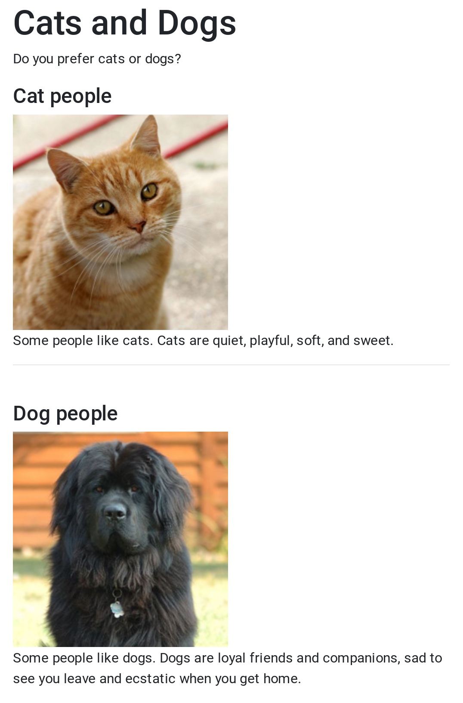
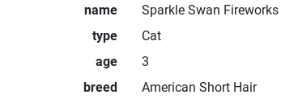
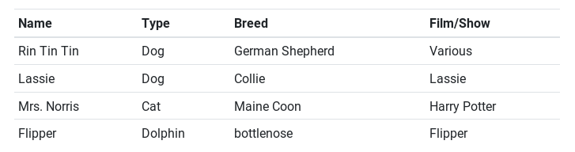

Web GUIs
========

GUI: Graphical User Interface
-----------------------------

A GUI or _graphical user interface_ is the main way that most of us
interact with computers most of the time. The standards for graphical
computing are well known: clicking buttons and icons, scrolling windows,
reading images and text, etc. When we created our Turtle programs, we
were programming GUIs.

Most of the examples in this text, however have used _text interfaces_
or Command Line Interfaces (CLI). With a CLI, the user receives computer
output through text on the screen, and sends input to the program by
entering text. In this chapter, we introduce a Javascript-based library
for creating GUIs web applications.

How the web works (the super brief version)
-------------------------------------------

There are three computer languages that form the base for any web page.
They are HTML, CSS, and Javascript. Hypertext markup language (HTML)
describes the type of content on a web page. HTML describes many different types of content. You are familiar with most of them:
- text: titles, paragraphs, lists, etc
- media: images, videos, audio, animation graphics
- links: that allow navigation to different areas of the web
- form elements: buttons, input boxes, checkboxes, and other elements that users to input information
- tables: that display grids of information

Other HTML elements are more structural, they divide web pages into sections (like headers and footers).

Cascading style sheets (CSS), control the layout of the content described by the
HTML. CSS can be used to change the font or text size, add background images to
elements, space and size different containers, and, generally create useful and
aesthetic interfaces. A single HTML document can work with different CSS styles,
allowing it to adapt to different use cases. One set of styles can control
layout for mobile phones, another for laptops, and yet another for print.

Javascript is the only **programming language** of the three languages discussed
here. It's the only of the group that uses variables and controls the flow of
execution with loops and Boolean conditions. At this point in the book, we are
familiar with many of the programming aspects of Javascript. For the web,
Javascript can interact with user input, and dynamically change the content and
HTML structure on a page. While some, small websites are **static** --- meaning
that all of the content and HTML is written by hand in a text editor like the
one in repl.it --- most website pull the content from databases or other data
files. We have begun to see how Javascript can interact with larger sets of
data, now we will see how Javascript can be used to display this data on the
web, to create **dynamic** websites that change when the data is changed.

JS GUI
------

JS GUI is a Javascript library or module that is being written to accompany
the examples in this book. There are many powerful Javascript frameworks,
like React (developed by Facebook) and Angular (developed by Google), used
by professional software developers to create complex, interactive web
applications. However, these professional frameworks aren't necessarily
the best or easiest to start with.

To use JS GUI, you need the following:

- a website [like this demo repl](https://repl.it/@mcuringa/JSGuiDemo)
- an html page that runs your Javascript file (e.g. `index.html`)
- a local version of the `jsgui.js` library

The following code examples assume such a set-up.

Basic Elements
--------------

JS GUI provides a series of functions for creating and adding
graphical elements to a web page. After importing the library,
you can easily start adding elements. The following code creates
a web site with the text, _Hello, world_.

~~~~~~~~~~~~~~~~~~~~~~~~~~~~{.javascript .numberLines}
import jsgui from "./lib/jsgui.js";

jsgui.add("Hello, world");
~~~~~~~~~~~~~~~~~~~~~~~~~~~~

JS GUI provides functions to create titles, (level 1-6), images,
and paragraphs of text. New lines can be created with `br()` and
horizontal rules with `hr()`. This code uses titles, text, images,
breaks, and rules.

~~~~~~~~~~~~~~~~~~~~~~~~~~~~{.javascript .numberLines}
import jsgui from "./lib/jsgui.js";

let catPic = jsgui.img("cat.jpg", "a black cat");
let dogPic = jsgui.img("dog.jpg", "a shaggy Newfoundland dog");

jsgui.add(jsgui.h1("Cats and Dogs"));
jsgui.add(jsgui.p("Do you prefer cats or dogs?"));

jsgui.add(jsgui.h4("Cat people"));
jsgui.add(catPic);
jsgui.add(jsgui.br());
jsgui.add("Some people like cats. Cats are quiet, playful, soft, and sweet.");

jsgui.add(jsgui.br());
jsgui.add(jsgui.hr());
jsgui.add(jsgui.br());

jsgui.add(jsgui.h4("Dog people"));
jsgui.add(dogPic);
jsgui.add(jsgui.br());
jsgui.add(`Some people like dogs. Dogs are loyal friends and
companions, sad to see you leave and ecstatic when you get home.``);

~~~~~~~~~~~~~~~~~~~~~~~~~~~~

<figure class="figure border">

<figcaption class="figure-caption">
The web page produced by this code example.

[See the repl with this code in `cats1.js`](https://repl.it/@mcuringa/JSGuiDemo)
</figcaption>
</figure>

The `img(url, alt)` function has two parameters, the first is the URL of the
image. In this case, it's in the same location as our code, so we only need the
file name: `cat.jpg`. If it was on another server, we could put the full URL,
something like `https://www.example.com/img/cat.jpg`. THe `alt` parameter is a
short text description of the image that makes the web more useful for users
with disabilities, such as visual impairment. For the `catPic` and `dogPic` we
save the image into a variable before calling `add()` to place it on the
web page.

Th rest of the **html elements** in this code example are composed directly with
the `add()` function. `h1()` and `h4()` create a level 1 header and level 4
header respectively. `p()` creates a paragraph of text. `br()` is a line break
that forces a new line. Vertical whitespace in HTML is (usually) ignored when
the web browser lays out a page. `hr()` creates a horizontal rule (line) across
the page.

JS GUI, Arrays, and Objects
---------------------------

JS GUI has some helper functions that makes it easy to display
mapped data and arrays of data. For the key-value pairs in a
map, JS GUI uses the HTML definition list element. A definition
list (`<dl>`) describes contents that have a _term_ and a _definition_.
The `dl()` function maps the _keys_ to terms and the _values_ to definitions.

~~~~~~~~~~~~~~~~~~~~~~~~~~~~{.javascript .numberLines}
// ...

let pet = {
  name: "Sparkle Swan Fireworks",
  type: "Cat",
  age: "3",
  breed: "American Short Hair"
}
jsgui.add(jsgui.dl(pet));

~~~~~~~~~~~~~~~~~~~~~~~~~~~~

<figure class="figure border">

<figcaption class="figure-caption">
The keys are in a column on the left, right aligned and bold. The values are
on the right.
</figcaption>
</figure>

Arrays of data can be quickly laid out as tables. The example below uses
an array of arrays, where each element of `animalsOnScreen` is an array.
`jsgui.table(data, header)` takes the data as the first argument. If
an array is passed for the `header` argument, `table()` will use
that data to make bold column headers. Although not used here,
`data` can also be an array of data maps. If this is the case, only
the `values` from the map are displayed in the table rows.

~~~~~~~~~~~~~~~~~~~~~~~~~~~~{.javascript .numberLines}
// ...

let animalsOnScreen = [
  ["Name", "Type", "Breed", "Film/Show"],
  ["Rin Tin Tin", "Dog", "German Shepherd", "Various"],
  ["Lassie", "Dog", "Collie", "Lassie"],
  ["Mrs. Norris", "Cat", "Maine Coon", "Harry Potter"],
  ["Flipper", "Dolphin", "bottlenose", "Flipper"]
];
let table = jsgui.table(animalsOnScreen.slice(1), animalsOnScreen[0]);
jsgui.add(table);

~~~~~~~~~~~~~~~~~~~~~~~~~~~~

This example creates an array with 4 columns and 5 elements. Since the
0-th element contains the header data, `slice(1)` is used to exclude
that row when `table()` is called, and the array at `animalsOnScreen[0]`
is passed as the `header` argument.

<figure class="figure border">

<figcaption class="figure-caption">
The **double scripted** array gets presented as a table, where each array
element becomes a row, and each element of the sub-array becomes a column.
</figcaption>
</figure>
