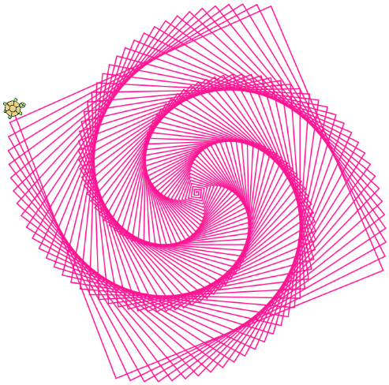

Iteration with `for` loops
==========================

Running loops
-------------
Computers are often used to automate repetitive tasks. Repeating
identical or similar tasks without making errors is something that
computers do well and people do poorly.

Repeated execution of a set of statements is called **iteration**.
Because iteration is so common, Javascript provides several language
features to make it easier. The `for` loop is the form of iteration
you'll likely be using most often, and we will look at that first.
In the next chapter we've going to look at the `while` statement —
another way to have your program repeat code. After you understand
both `for` and `while` loops, you will be able to use them both
to solve problems.

The `for` loop
----------------

A basic building block of all programs is to be able to repeat some
code, over and over again. Javascript's **for** loop solves this for
us. The syntax for the `for` loop is:

~~~~~~~~~~~~~~~~~~~~~~~~~~~~~~~~~~{.bash}
for ([initialization]; [loop condition]; [final-expression]) {
  loop body
}
~~~~~~~~~~~~~~~~~~~~~~~~~~~~~~~~~~

We can see that `for` follows the familiar pattern for **block statements** that
we have already seen for _functions_ and _if_/_else_ statements,
with a header and then body between opening and closing curly braces ({});
In the case of `for`, the header contains 3 statements inside the 
parenthesis. 

1. The **initialization** statement is called exactly once: the
first time the program reaches the for statement. 
2. The **loop condition**
is tested before each iteration of the loop. If `true`, the **loop body**
executes. The loop body may contain any number of Javascript statements.
3. After the loop body statements are executed, the **final expression** is
called. Typically this expression _increments_ (adds to) or _decrements_ (subtracts from)
the loop variable. After the final expression is called, the loop condition is checked
again to see if the loop should continue or _terminate_.

We have already played around with the `for` loop with our
turtle graphics when we were looking at the variables in a spiral. Let's take
a closer look at this function which contains a for loop.

<figure class="figure">

<figcaption class="figure-caption">
Our `spiral` function (below) uses a `for` loop to draw this design. [Try it and remix it here.](https://repl.it/@mcuringa/turtle-spiral)
</figcaption>
</figure>

~~~~~~~~~~~~~~~~~~~~~~~~~~~~~~~~~~{.javascript .numberLines}
function spiral () {
  setColor("deeppink")
  let distance = 2;
  let angle = 91;
  for (let i=0; i<500; i++) {
    fd(distance);
    distance += 2;
    rt(angle);
  }
}
~~~~~~~~~~~~~~~~~~~~~~~~~~~~~~~~~~

* The variable `i` in the `for` statement at line 5 is the **loop variable**.
  We could have chosen any other variable name instead, but `i` is a common convention,
  being short for the loop _index_.
* The **loop initialization** assigns the loop variable its starting value: `let i = 0;`
* The indented lines between the curly braces form the **loop body**. `spiral`'s loop body
  contains 3 statements which (line 5) move the turtle forward, (line 6) increment the `distance` variable,
  and (line 7) rotate the turtle.
* At the _beginning_ of each _iteration_ or _pass_ of the loop, the Javascript interpreter
  checks the **loop condition**. If `true` the loop
  runs for another iteration. If `false`, the loop terminates.
* At the _end_ of each execution of the body of the loop, Javascript returns 
  to the `for` header to run the **final expression**. The final expression
  here increments `i` by one, using the special `++` operator.
* Finally, when the loop condition is false, the program continues beyond the closing
  curly brace. In `spiral`, since there are no other statements in the function body,
  the function returns `undefined` since it is a _void function_.

Assignment
---------- 
As we have mentioned previously, it is legal to make more than one assignment to the
same variable. A new assignment makes an existing variable refer to a new value
(and stop referring to the old value).

~~~~~~~~~~~~~~~~~~~~~~~~~{.javascript .numberLines}        
let airTimeRemaining = 15;
console.log(airTimeRemaining);
airTimeRemaining = 7;
console.log(airTimeRemaining);
~~~~~~~~~~~~~~~~~~~~~~~~~

The output of this program is:

~~~~~~~~~~~~~~~~~~~~~~~~~{.bash}
15
7
~~~~~~~~~~~~~~~~~~~~~~~~~

because the first time `airTimeRemaining` is printed, its value is 15, and
the second time, its value is 7.

It is especially important to distinguish between an assignment statement and
a Boolean expression that tests for equality. Because Javascript uses the
equal token (`=`) for assignment, it is tempting to interpret a statement
like `a = b` as a Boolean test. Unlike mathematics, it is not! Remember that
the Javascript token for the equality operator is `===`.

Note too that an equality test is symmetric, but assignment is not. For
example, if `a === 7` then `7 === a`. But in Javascript, the statement `a = 7`
is legal and `7 = a` is not.

In Javascript, an assignment statement can make two variables equal, but
because further assignments can change either of them,  they don't have to
stay that way:

~~~~~~~~~~~~~~~~~~~~~~~~~{.javascript .numberLines}        
let a = 5;
let b = a;    // After executing this line, a and b are now equal
a = 3;    // After executing this line, a and b are no longer equal

~~~~~~~~~~~~~~~~~~~~~~~~~

The third line changes the value of `a` but does not change the 
value of `b`, so they are no longer equal. (In some programming 
languages, a different symbol is used for assignment, such as `<-` 
or `:=`, to avoid confusion.  Some people also think that 
*variable* was an unfortunate word to choose, and instead we should 
have called them *assignables*. Javascript chooses to follow common 
terminology and token usage, also found in languages like C, C++, 
Java, and C#, so we use the tokens `=` for assignment, `==`
(or `===` which we prefer in Javascript) for equality, and we talk of *variables*.

Updating variables
------------------

When an assignment statement is executed, the right-hand side 
expression (i.e. the expression that comes after the assignment 
token) is evaluated first. This produces a value. Then the 
assignment is made, so that the variable on the left-hand side now 
refers to the new value.

One of the most common forms of assignment is an update, where the new
value of the variable depends on its old value. Deduct 40 cents from
my airtime balance, or add one run to the scoreboard. 

~~~~~~~~~~~~~~~~~~~~~~~~~{.javascript .numberLines}        
let n = 5;
n = 3 * n + 1;

~~~~~~~~~~~~~~~~~~~~~~~~~

Line 2 means `get the current value of n, multiply it by three and add
one, and assign the answer to n, thus making n refer to the value`.  
So after executing the two lines above, `n` will point/refer to the
integer 16.

If you try to get the value of a variable that has never been assigned to, you'll get an error:

~~~~~~~~~~~~~~~~~~~~~~~~~{.javascript}        
⠕ let w = x + 1;
ReferenceError: x is not defined
~~~~~~~~~~~~~~~~~~~~~~~~~

Before you can update a variable, you have to **initialize** it to some starting value, 
usually with a simple assignment:

~~~~~~~~~~~~~~~~~~~~~~~~~{.javascript .numberLines}
let runsScored = 0;
...
runsScored = runsScored + 1;
~~~~~~~~~~~~~~~~~~~~~~~~~

Line 3 — updating a variable by adding 1 to it — is very common.  
It is called an **increment** of the variable; subtracting 1 is called a **decrement**.  
Sometimes programmers also talk about *bumping* a variable, which means the same 
as incrementing it by 1.
  
Abbreviated assignment
----------------------

Incrementing a variable is so common that Javascript provides an abbreviated syntax
for it:

~~~~~~~~~~~~~~~~~~~~{.javascript}        
⠕ count = 0;
⠕ count++;
⠕ count;
1
~~~~~~~~~~~~~~~~~~~~

`count++` is an abreviation for `count = count + 1`. We pronounce the operator
as *"plus-plus"*. Javascript offers a different operator
(`+=` pronounced _"plus-equals"_) for increment values other than 1:

~~~~~~~~~~~~~~~~~~~~{.javascript}        
⠕ n = 2;
⠕ n += 5;
⠕ n;
7
~~~~~~~~~~~~~~~~~~~~
There are similar abbreviations for `--`, `-=`, `*=`, `/=`, and `%=`:

~~~~~~~~~~~~~~~~~~~~{.javascript}        
⠕ n = 3;
⠕ n--;
⠕ n;
2
⠕ n *= 5;
⠕ n;
10
⠕ n -= 4;
⠕ n;
6
⠕ n %= 5;
⠕ n;
1
~~~~~~~~~~~~~~~~~~~~

Tables
------

One of the things loops are good for is generating tables.  Before 
computers were readily available, people had to calculate 
logarithms, sines and cosines, and other mathematical functions by 
hand. To make that easier, mathematics books contained long tables 
listing the values of these functions. Creating the tables was slow 
and boring, and they tended to be full of errors.

When computers appeared on the scene, one of the initial reactions 
was, _"This is great! We can use the computers to generate the 
tables, so there will be no errors."_ That turned out to be true 
(mostly) but shortsighted. Soon thereafter, computers and 
calculators were so pervasive that the tables became obsolete.

Well, almost. For some operations, computers use tables of values to 
get an approximate answer and then perform computations to improve 
the approximation. In some cases, there have been errors in the 
underlying tables, most famously in the table the Intel Pentium 
processor chip used to perform floating-point division.

Although a log table is not as useful as it once was, it still makes 
a good example of iteration. The following program outputs a 
sequence of values in the left column and 2 raised to the power of 
that value in the right column:

~~~~~~~~~~~~~~~~~~~~~~~~~{.javascript .numberLines}        
for (let i=0; i<13; i++) {  // Generate numbers 0 to 12
  console.log(i + "\t" + 2**i);
}

~~~~~~~~~~~~~~~~~~~~~~~~~

The string `"\t"` represents a **tab character**. The backslash character in
`"\t"` indicates the beginning of an **escape sequence**. Escape sequences
are used to represent invisible characters like tabs and newlines. The sequence
`\n` represents a **newline**, breaking a string onto the next line.

An escape sequence can appear anywhere in a string; in this example, the tab
escape sequence is the only thing in the string. How do you think you represent
a backslash in a string?

As characters and strings are displayed on the screen, an invisible marker
called the **cursor** keeps track of where the next character will go. After calling
`console.log`, the cursor normally goes to the beginning of the next
line.

The tab character shifts the cursor to the right until it reaches one of the
tab stops. Tabs are useful for making columns of text line up, as in the output
of the previous program:

~~~~~~~~~~~~~~~~~~~~~~~~~{.bash}
0     1
1     2
2     4
3     8
4     16
5     32
6     64
7     128
8     256
9     512
10    1024
11    2048
12    4096

~~~~~~~~~~~~~~~~~~~~~~~~~

Because of the tab characters between the columns, the position of the second
column does not depend on the number of digits in the first column.

Two-dimensional tables
----------------------

A two-dimensional table is a table where you read the value at the intersection
of a row and a column. A multiplication table is a good example. Let's say you
want to print a multiplication table for the values from 1 to 6.

A good way to start is to write a loop that prints the multiples of 2, all on
one line. Because `console.log` moves the cursor to the next line, we're
going to accumulate our data into a string variable, and then print
out the whole row with a call to `console.log`.

~~~~~~~~~~~~~~~~~~~~~~~~~{.javascript .numberLines}
let row = "";     
for (let i=1; i<7; i++) {
  row += (2 * i) + "\t";
}
console.log(row);

~~~~~~~~~~~~~~~~~~~~~~~~~

Here we initialized our loop variable `i` to 1 rather than 0
because we want to start counting from 1.
As the loop executes, the value of `i` changes from 1 to
6. When `i` is incremented to 7, the loop terminates. 
Each time through the loop, it
displays the value of `2 * i`, followed by the tab escape character.

We use the `+=` operator to **concatenate** each value of `i * 2`
to the string `row`. After our `for` statement terminates,
we print the results with `console.log`.

The output of the program is:

~~~~~~~~~~~~~~~~~~~~~~~~~{.bash}
2   4   6  8    10    12

~~~~~~~~~~~~~~~~~~~~~~~~~

So far, so good. The next step is to **encapsulate** and **generalize**.

Encapsulation and generalization
--------------------------------

**Encapsulation** is the process of wrapping a piece of code in a 
function, allowing you to take advantage of all the things functions 
are good for. You have already seen some examples of encapsulation, 
including including the `square` function for our turtle graphics.

**Generalization** means taking something specific, such as printing the 
multiples of 2, and making it more general or **abstract**, such as printing the 
multiples of any integer. We can use function parameters to accomplish generalization
and abstraction.

This function encapsulates the previous loop and generalizes it to print
multiples of `n`:

~~~~~~~~~~~~~~~~~~~~~~~~~{.javascript .numberLines}        
function printMultiples (n) {
  let row = "";     
  for (let i=1; i<7; i++) {
    row += (n * i) + "\t";
  }
  console.log(row);
}

~~~~~~~~~~~~~~~~~~~~~~~~~

To encapsulate, all we had to do was add the first line, which declares the
name of the function and the parameter list. To generalize, all we had to do
was replace the value 2 with the parameter `n`.

If we call this function with the argument 2, we get the same output as before.
With the argument 3, the output is:

~~~~~~~~~~~~~~~~~~~~~~~~~{.bash}
3   6   9  12   15  18

~~~~~~~~~~~~~~~~~~~~~~~~~

With the argument 4, the output is:

~~~~~~~~~~~~~~~~~~~~~~~~~{.bash}
4   8   12   16   20   24

~~~~~~~~~~~~~~~~~~~~~~~~~

By now you can probably guess how to print a multiplication table — by
calling `printMultiples` repeatedly with different arguments. In fact, we
can use another loop:

~~~~~~~~~~~~~~~~~~~~~~~~~{.javascript .numberLines}        
for (let i=1; i<7; i++) {
  printMultiples(i);
}

~~~~~~~~~~~~~~~~~~~~~~~~~
Notice how similar this loop is to the one inside `printMultiples`.  All we
did was replace the `print` function with a function call.

The output of this program is a multiplication table:

~~~~~~~~~~~~~~~~~~~~~~~~~{.bash}
1    2     3     4     5     6
2    4     6     8     10    12
3    6     9     12    15    18
4    8     12    16    20    24
5    10    15    20    25    30
6    12    18    24    30    36

~~~~~~~~~~~~~~~~~~~~~~~~~

More encapsulation and generalization
-------------------------------------

To demonstrate encapsulation again, let's take the code from the last section
and wrap it up in a function:

~~~~~~~~~~~~~~~~~~~~~~~~~{.javascript .numberLines}        
function printMultTable () {
  for (let i=1; i<7; i++) {
    printMultiples(i);
  }
}

~~~~~~~~~~~~~~~~~~~~~~~~~

With our `printMultTable` we encapsulate the code for printing the multiplication table.

This process is a common **development plan**. We develop code by writing lines
of code outside any function, or typing them in to the interpreter. When we get
the code working, we extract it and wrap it up in a function.

This development plan is particularly useful if you don't know how to divide
the program into functions when you start writing. This approach lets you
design as you go along.

Local variables
---------------

You might be wondering how we can use the same variable, `i`, in both
`printMultiples` and `printMultTable`. Doesn't it cause problems when
one of the functions changes the value of the variable?

The answer is no, because the `i` in `printMultiples` and the `i` in
`printMultTable` are *not* the same variable.

Variables declared with `let` inside a function definition are local; you can't access a
local variable from outside its home function. That means you are free to have
multiple variables with the same name as long as they are not in the same
function.

It is common and perfectly legal to have different local variables with the
same name. In particular, names like `i` and `j` are used frequently as
loop variables. If you avoid using them in one function just because you used
them somewhere else, you will probably make the program harder to read.

More generalization
-------------------

As another example of generalization, imagine you wanted a program that would
print a multiplication table of any size, not just the six-by-six table. You
could add a parameter to `printMultTable`:

~~~~~~~~~~~~~~~~~~~~~~~~~{.javascript .numberLines}        
function printMultTable (high) {
  for (let i=1; i <= high; i++) {
    printMultiples(i);
  }
}

~~~~~~~~~~~~~~~~~~~~~~~~~

We replaced the loop condition `i<7` to use the parameter `high`. Because we
want to print upt to and including `high`, we changed the Boolean operator
from `<` to `<=`. If we call `printMultTable` with the argument 7, it
displays:

~~~~~~~~~~~~~~~~~~~~~~~~~{.bash}
1   2     3     4     5     6
2   4     6     8     10    12
3   6     9     12    15    18
4   8     12    16    20    24
5   10    15    20    25    30
6   12    18    24    30    36
7   14    21    28    35    42

~~~~~~~~~~~~~~~~~~~~~~~~~

This is fine, except that we probably want the table to be square — with the
same number of rows and columns. We have `high` number of rows, but our
old version of `printMultiples` stops at the literal value `<7`.
To do improve our code, we add another parameter to
`printMultiples` to specify how many columns the table should have.

Just to be annoying, we call this parameter `high`, demonstrating that
different functions can have parameters with the same name (just like local
variables). Here's the whole program:

~~~~~~~~~~~~~~~~~~~~~~~~~{.javascript .numberLines}        
function printMultiples (n, high) {
  let row = "";     
  for (let i=1; i <= high; i++) {
    row += (n * i) + "\t";
  }
  console.log(row);
}

function printMultTable (high) {
  for (let i=1; i <= high; i++) {
    printMultiples(i, high);
  }
}

~~~~~~~~~~~~~~~~~~~~~~~~~

Notice that when we added a new parameter, we had to change the first line of
the function (the function heading), and we also had to change the place where
the function is called in `printMultTable`.

Now, when we call `printMultTable(7)`: 

~~~~~~~~~~~~~~~~~~~~~~~~~{.bash}
1    2     3     4     5     6     7
2    4     6     8     10    12    14
3    6     9     12    15    18    21
4    8     12    16    20    24    28
5    10    15    20    25    30    35
6    12    18    24    30    36    42
7    14    21    28    35    42    49

~~~~~~~~~~~~~~~~~~~~~~~~~

Functions
---------

A few times now, we have mentioned all the things functions are good for. By
now, you might be wondering what exactly those things are. Here are some of
them:

#. Capturing your mental chunking. Breaking your complex tasks into sub-tasks, and
   giving the sub-tasks a meaningful name is a powerful mental technique.
#. Dividing a long program into functions allows you to separate parts of the
   program, debug them in isolation, and then compose them into a whole.
#. Functions facilitate the use of iteration.
#. Well-designed functions are often useful for many programs. Once you write
   and debug one, you can reuse it in many different programs and contexts.

Glossary
--------
   
control flow
:  The execution and sequencing of statements in a computer program. Statements flow
   in the order they are written. _Selection_ of certain statements -- and exclusion
   of others -- can be accomplished with `if` and `else` statements. Repetition
   of statements is accomplished by _iteration_, such as with a `for` loop.

encapsulation 
:  Encapsulation in computer programming involves writing functionality in code
   that is isolated from other parts of the program. We can wrap parts of our
   code in a function to encapsulate it. This allows us to test and validate
   the encapsulated function independently from other parts of the program.

`for` loop
:  The `for` loop is a _finite loop_ that repeats the loop body a known number
  of times.  `for` loops are useful for repeating things a set number of times
  (e.g. do this 100 times, print all of the odd numbers to 5,000), and iterating
  through items on a list (e.g. send an email to the whole class roster).
   
loop body
:  Any number of statements that are executed during iterations of the loop. The
   loop body follows the loop header and is indicated by curly braces and 
   (in well formatted code) one level of indentation.

loop initialization
:  The first statement in the loop header parenthesis, typically initializes
   a loop variable that will be used to test the loop condition.

loop variable
:  The loop variable determines when the loop terminates in a Booleaen expression
   in the _loop condition_. Often it counts the number of iterations in a loop, but
   it is modified by the _final expression_ and may be modified in the _loop body_. 

reassignment
:  The ability of _variables_ to be assigned a new value after they have been declared.

For Loop Exercises
-------------------

1. Write a program that prints `We like Javascript!` 1000 times. 

2. Print out all of the odd numbers between 0 and 100.

3. Count to 10,000 by 10s (print the sequence 10, 20, 30, ..10,000).
      
4. Write a function named `poly` that uses a `for` loop to make a turtle draw
   any regular polygon (regular means all sides the same lengths, all angles
   the same, to find the angle, divide 360 by the number of sides). The function
   must have `size` and `numSides` as parameters. So, `poly(40, 4)` would
   draw a square where the sides are 40 pixels long.
  
5. **Center text.** The `.length` attributes of a string tells us how
   many characters are in the string, `"cat".length === 3`. Using this property
   and a `for` loop, write a function that centers text in the console. Your function
   must have two parameters -- the text that needs to be centered, and the number
   of characters in the console. The function returns a new string, padded with
   enough blank spaces on the left side so that it will be centered.
   _The function does not print to the console_.

For Loop Lab
------------

For the `for` loop lab we're going to return to our turtle graphics
programming. We've already seen many interesting shapes and patterns
that can be made with loops. For this lab, you are going to use turtle
to draw a picture, with these simple guidelines:

- all of your code is encapsulated in functions, except for a call to `main()`
  which starts your program
- (at least) 3 different things in your picture are created by _generalized_ functions.
  Generalized functions use function parameters to allow one function to handle different
  cases. In turtle, these parameters may control things like size, color, placement on
  the screen, etc.
- you use `for` loops to place more than one
