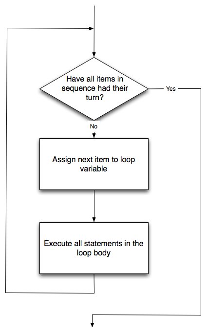
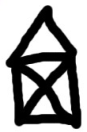

Iteration
=========

Computers are often used to automate repetitive tasks. Repeating
identical or similar tasks without making errors is something that
computers do well and people do poorly.

Repeated execution of a set of statements is called **iteration**.
Because iteration is so common, Python provides several language
features to make it easier. The `for` loop is the form of iteration
you'll likely be using most often, and we will look at that first.
But in this chapter we've going to look at the `while` statement —
another way to have your program do iteration, useful in slightly
different circumstances.

The `for` loop
----------------

A basic building block of all programs is to be able to repeat some
code, over and over again. Python's **for** loop solves this for
us. Let's say we have some friends, and we'd like to send them each
an email inviting them to our party. We don't quite know how to
send email yet, so for the moment we'll just print a message for
each friend:

~~~~~~~~~~~~~~~~~~~~~~~~~~~~~~~~~~{.python .numberLines}
for f in ["Joe","Zoe","Brad","Angelina","Zuki","Thandi","Paris"]:
    invite = "Hi " + f + ".  Please come to my party on Saturday!"
    print(invite)
# more code can follow here …            
~~~~~~~~~~~~~~~~~~~~~~~~~~~~~~~~~~      

When we run this, the output looks like this:

~~~~~~~~~~~~~~~~~~~~~~~~~~~~~~~~~~
Hi Joe.  Please come to my party on Saturday!
Hi Zoe.  Please come to my party on Saturday!
Hi Brad.  Please come to my party on Saturday!
Hi Angelina.  Please come to my party on Saturday!
Hi Zuki.  Please come to my party on Saturday!
Hi Thandi.  Please come to my party on Saturday!
Hi Paris.  Please come to my party on Saturday! 
~~~~~~~~~~~~~~~~~~~~~~~~~~~~~~~~~~

* The variable ``f`` in the ``for`` statement at line 1 is called the **loop variable**.  
  We could have chosen any other variable name instead.
* Lines 2 and 3 are the **loop body**.  The loop body is always
  indented. The indentation determines exactly what statements are "in the body of the loop".
* On each *iteration* or *pass* of the loop, first a check is done to see if there are 
  still more items to be processed. If there are none left (this is called
  the **terminating condition** of the loop), the loop has finished.
  Program execution continues at the next statement after the loop body, (e.g. in this case
  the next statement below the comment in line 4).  
* If there are items still to be processed, the loop variable is updated to refer to the
  next item in the list. This means, in this case, that the loop body is executed 
  here 7 times, and each time ``f`` will refer to a different friend. 
* At the end of each execution of the body of the loop, Python returns 
  to the ``for`` statement, to see if there are more items to be handled, and to assign the
  next one to ``f``.

Flow of Execution of the for loop
---------------------------------
 
As a program executes, the interpreter always keeps track of which statement is
about to be executed. We call this the **control flow**, of the **flow of execution** 
of the program. When humans execute programs, they often use their finger to point 
to each statement in turn. So we could think of control flow as "Python's moving finger". 

Control flow until now has been strictly
top to bottom, one statement at a time. The ``for`` loop changes this. 

<aside id="for-loop-flow">
**Flowchart of a ``for`` loop**

Control flow is often easy to visualize and understand if we draw a flowchart.
This shows the exact steps and logic of how the ``for`` statement executes.

</aside>

Assignment
---------- 

As we have mentioned previously, it is legal to make more than one assignment to the
same variable. A new assignment makes an existing variable refer to a new value
(and stop referring to the old value).

~~~~~~~~~~~~~~~~~~~~{.python .numberLines}        
airtime_remaining = 15
print(airtime_remaining)
airtime_remaining = 7
print(airtime_remaining)
~~~~~~~~~~~~~~~~~~~~~~~~~~~~~~~~~~~~~~~~

The output of this program is:

~~~~~~~~~~~~~~~~~~~~
15
7
~~~~~~~~~~~~~~~~~~~~~~~~~~~~~~~~~~~~~~~~

because the first time ``airtime_remaining`` is
printed, its value is 15, and the second time, its value is 7.  

It is especially important to distinguish between an
assignment statement and a Boolean expression that tests for equality. 
Because Python uses the equal token (``=``) for assignment, 
it is tempting to interpret a statement like
``a = b`` as a Boolean test.  Unlike mathematics, it is not!  Remember that the Python token
for the equality operator is ``==``.

Note too that an equality test is symmetric, but assignment is not. For example, 
if ``a == 7`` then ``7 == a``. But in Python, the statement ``a = 7``
is legal and ``7 = a`` is not.

In Python, an assignment statement can make
two variables equal, but because further assignments can change either of them, 
they don't have to stay that way:

~~~~~~~~~~~~~~~~~~~~{.python .numberLines}        
a = 5
b = a    # After executing this line, a and b are now equal
a = 3    # After executing this line, a and b are no longer equal
~~~~~~~~~~~~~~~~~~~~~~~~~~~~~~~~~~~~~~~~

The third line changes the value of ``a`` but does not change the 
value of ``b``, so they are no longer equal. (In some programming 
languages, a different symbol is used for assignment, such as ``<-`` 
or ``:=``, to avoid confusion.  Some people also think that 
*variable* was an unfortunae word to choose, and instead we should 
have called them *assignables*.  Python chooses to follow common 
terminology and token usage, also found in languages like C, C++, 
Java, and C#, so we use the tokens ``=`` for assignment, ``==`` for 
equality, and we talk of *variables*.

Updating variables
------------------

When an assignment statement is executed, the right-hand side 
expression (i.e. the expression that comes after the assignment 
token) is evaluated first.  This produces a value. Then the 
assignment is made, so that the variable on the left-hand side now 
refers to the new value.

One of the most common forms of assignment is an update, where the new
value of the variable depends on its old value.   Deduct 40 cents from
my airtime balance, or add one run to the scoreboard. 

~~~~~~~~~~~~~~~~~~~~{.python .numberLines}        
n = 5
n = 3 * n + 1
~~~~~~~~~~~~~~~~~~~~~~~~~~~~~~~~~~~~~~~~
Line 2 means `get the current value of n, multiply it by three and add
one, and assign the answer to n, thus making n refer to the value`.  
So after executing the two lines above, ``n`` will point/refer to the
integer 16.

If you try to get the value of a variable that has never been assigned to, you'll get an error:

~~~~~~~~~~~~~~~{.python}        
>>> w = x + 1
Traceback (most recent call last):
  File "<interactive input>", line 1, in 
NameError: name 'x' is not defined
~~~~~~~~~~~~~~~~~~~~~~~~~~~~~~~~~~~~~~~~

Before you can update a variable, you have to **initialize** it to some starting value, 
usually with a simple assignment:

~~~~~~~~~~~~~~~~~~~~{.python .numberLines}
runs_scored = 0
...
runs_scored = runs_scored + 1
~~~~~~~~~~~~~~~~~~~~~~~~~~~~~~~~~~~~~~~~

Line 3 — updating a variable by adding 1 to it — is very common.  
It is called an **increment** of the variable; subtracting 1 is called a **decrement**.  
Sometimes programmers also talk about *bumping* a variable, which means the same 
as incrementing it by 1.

The ``for`` loop revisited
--------------------------

Recall that the ``for`` loop processes each item in a list.  Each item in
turn is (re-)assigned to the loop variable, and the body of the loop is executed.
We saw this example earlier:

~~~~~~~~~~~~~~~~~~~~{.python .numberLines}
for f in ["Joe", "Zoe", "Brad", "Angelina", "Zuki", "Thandi", "Paris"]:
    invitation = "Hi " + f + ".  Please come to my party on Saturday!"
    print(invitation) 
~~~~~~~~~~~~~~~~~~~~~~~~~~~~~~~~~~~~~~~~

Running through all the items in a list is called **traversing** the list,
or **traversal**.      

Let us write a function now to sum up all the elements in a list of numbers.
Do this by hand first, and try to isolate exactly what steps you take.  You'll
find you need to keep some "running total" of the sum so far, either on a piece 
of paper, in your head, or in your calculator. Remembering things from one step to the next is
precisely why we have variables in a program: so we'll need some variable
to remember the "running total".  It should be initialized with a value of zero,
and then we need to traverse the items in the list.  For each item, we'll want
to update the running total by adding the next number to it.

~~~~~~~~~~~~~~~~~~~~{.python .numberLines}
def mysum(xs):
    """ Sum all the numbers in the list xs, and return the total. """
    running_total = 0
    for x in xs:
        running_total = running_total + x
    return running_total

# Add tests like these to your test suite ...
test(mysum([1, 2, 3, 4]) == 10)
test(mysum([1.25, 2.5, 1.75]) == 5.5)
test(mysum([1, -2, 3]) == 2)
test(mysum([ ]) == 0)
test(mysum(range(11)) == 55)  # 11 is not included in the list.
~~~~~~~~~~~~~~~~~~~~~~~~~~~~~~~~~~~~~~~~~~~~~~~~~~~~~~~~~~~~~~~
    
Abbreviated assignment
----------------------

Incrementing a variable is so common that Python provides an abbreviated syntax
for it:

~~~~~~~~~~~~~~~{.python}        
>>> count = 0
>>> count += 1
>>> count
1
>>> count += 1
>>> count
2
~~~~~~~~~~~~~~~~~~~~

``count += 1`` is an abreviation for ``count = count + 1`` . We pronounce the operator
as *"plus-equals"*.  The increment value does not have to be 1:

~~~~~~~~~~~~~~~{.python}        
>>> n = 2
>>> n += 5
>>> n
7
~~~~~~~~~~~~~~~~~~~~
There are similar abbreviations for ``-=``, ``*=``, ``/=``, ``//=`` and ``%=``:

~~~~~~~~~~~~~~~{.python}        
>>> n = 2
>>> n *= 5
>>> n
10
>>> n -= 4
>>> n
6
>>> n //= 2
>>> n
3
>>> n %= 2
>>> n
1
~~~~~~~~~~~~~~~~~~~~
    
Help and meta-notation
----------------------

Python comes with extensive documentation for all its built-in 
functions, and its libraries. Different systems have different ways 
of accessing this help.  In PyScripter, click on the *Help* menu 
item, and select *Python Manuals*. Then search for help on the 
built-in function **range**. You'll get something like this:

  

Notice the square brackets in the description of the arguments. 
These are examples of **meta-notation** — notation that describes 
Python syntax, but is not part of it. The square brackets in this 
documentation mean that the argument is *optional* — the programmer 
can omit it.  So what this first line of help tells us is that 
``range`` must always have a ``stop`` argument, but it may have an 
optional ``start`` argument (which must be followed by a comma if it 
is present), and it can also have an optional ``step`` argument, 
preceded by a comma if it is present.

The examples from help show that ``range`` can have either 1, 2 or 3 
arguments. The list can start at any starting value, and go up or 
down in increments other than 1. The documentation here also says 
that the arguments must be integers.

Other meta-notation you'll frequently encounter is the use of bold 
and italics.  The bold means that these are tokens  — keywords or 
symbols — typed into your Python code exactly as they are, whereas 
the italic terms stand for "something of this type". So the syntax 
description

**for** *variable* **in** *list* **:** 
    
means you can substitute any legal variable and any legal list when 
you write your Python code.

This (simplified) description of the ``print`` function, shows another example
of meta-notation in which the ellipses (``...``) mean that you can have as many
objects as you like (even zero), separated by commas:
   
**print( [**\ *object,* ... **] )**
   
Meta-notation gives us a concise and powerful way to describe the *pattern* of some syntax
or feature.  

Tables
------

One of the things loops are good for is generating tables.  Before 
computers were readily available, people had to calculate 
logarithms, sines and cosines, and other mathematical functions by 
hand. To make that easier, mathematics books contained long tables 
listing the values of these functions. Creating the tables was slow 
and boring, and they tended to be full of errors.

When computers appeared on the scene, one of the initial reactions 
was, *"This is great! We can use the computers to generate the 
tables, so there will be no errors."* That turned out to be true 
(mostly) but shortsighted. Soon thereafter, computers and 
calculators were so pervasive that the tables became obsolete.

Well, almost. For some operations, computers use tables of values to 
get an approximate answer and then perform computations to improve 
the approximation. In some cases, there have been errors in the 
underlying tables, most famously in the table the Intel Pentium 
processor chip used to perform floating-point division.

Although a log table is not as useful as it once was, it still makes 
a good example of iteration. The following program outputs a 
sequence of values in the left column and 2 raised to the power of 
that value in the right column:

~~~~~~~~~~~~~~~~~~~~{.python .numberLines}        
for x in range(13):   # Generate numbers 0 to 12
    print(x, "\t", 2**x)
~~~~~~~~~~~~~~~~~~~~~~~~~~~~~~~~~~~~~~~~

The string ``"\t"`` represents a **tab character**. The backslash character in
``"\t"`` indicates the beginning of an **escape sequence**.  Escape sequences
are used to represent invisible characters like tabs and newlines. The sequence
``\n`` represents a **newline**.

An escape sequence can appear anywhere in a string; in this example, the tab
escape sequence is the only thing in the string. How do you think you represent
a backslash in a string?

As characters and strings are displayed on the screen, an invisible marker
called the **cursor** keeps track of where the next character will go. After a
``print`` function, the cursor normally goes to the beginning of the next
line.

The tab character shifts the cursor to the right until it reaches one of the
tab stops. Tabs are useful for making columns of text line up, as in the output
of the previous program:

~~~~~~~~~~~~~~~~~~~~        
0       1
1       2
2       4
3       8
4       16
5       32
6       64
7       128
8       256
9       512
10      1024
11      2048
12      4096
~~~~~~~~~~~~~~~~~~~~

Because of the tab characters between the columns, the position of the second
column does not depend on the number of digits in the first column.

Two-dimensional tables
----------------------

A two-dimensional table is a table where you read the value at the intersection
of a row and a column. A multiplication table is a good example. Let's say you
want to print a multiplication table for the values from 1 to 6.

A good way to start is to write a loop that prints the multiples of 2, all on
one line:

~~~~~~~~~~~~~~~~~~~~{.python .numberLines}        
for i in range(1, 7):
    print(2 * i, end="   ")
print()
~~~~~~~~~~~~~~~~~~~~~~~~~~~~~~~~~~~~~~~~

Here we've used the ``range`` function, but made it start its sequence at 1. 
As the loop executes, the value of ``i`` changes from 1 to
6. When all the elements of the range have been assigned to ``i``, the loop terminates. 
Each time through the loop, it
displays the value of ``2 * i``, followed by three spaces.

Again, the extra ``end="   "`` argument in the ``print`` function suppresses the newline, and
uses three spaces instead.  After the
loop completes, the call to ``print`` at line 3 finishes the current line, and starts a new line.

The output of the program is:

~~~~~~~~~~~~~~~~~~~~~~~~~~~~~~~~~~~~~~~~
2      4      6      8      10     12Z
~~~~~~~~~~~~~~~~~~~~~~~~~~~~~~~~~~~~~~~~

So far, so good. The next step is to **encapsulate** and **generalize**.

Encapsulation and generalization
--------------------------------

Encapsulation is the process of wrapping a piece of code in a 
function, allowing you to take advantage of all the things functions 
are good for. You have already seen some examples of encapsulation, 
including ``is_divisible`` in a previous chapter.

Generalization means taking something specific, such as printing the 
multiples of 2, and making it more general, such as printing the 
multiples of any integer.

This function encapsulates the previous loop and generalizes it to print
multiples of ``n``:

~~~~~~~~~~~~~~~~~~~~{.python .numberLines}        
def print_multiples(n):
    for i in range(1, 7):
        print(n * i, end="   ")
    print()
~~~~~~~~~~~~~~~~~~~~~~~~~~~~~~~~~~~~~~~~

To encapsulate, all we had to do was add the first line, which declares the
name of the function and the parameter list. To generalize, all we had to do
was replace the value 2 with the parameter ``n``.

If we call this function with the argument 2, we get the same output as before.
With the argument 3, the output is:

~~~~~~~~~~~~~~~~~~~~~~~~~~~~~~~~~~~~~~~~
3      6      9      12     15     18
~~~~~~~~~~~~~~~~~~~~~~~~~~~~~~~~~~~~~~~~

With the argument 4, the output is:

~~~~~~~~~~~~~~~~~~~~~~~~~~~~~~~~~~~~~~~~
4      8      12     16     20     24
~~~~~~~~~~~~~~~~~~~~~~~~~~~~~~~~~~~~~~~~

By now you can probably guess how to print a multiplication table — by
calling ``print_multiples`` repeatedly with different arguments. In fact, we
can use another loop:

~~~~~~~~~~~~~~~~~~~~{.python .numberLines}        
for i in range(1, 7):
    print_multiples(i)
~~~~~~~~~~~~~~~~~~~~~~~~~~~~~~~~~~~~~~~~
Notice how similar this loop is to the one inside ``print_multiples``.  All we
did was replace the ``print`` function with a function call.

The output of this program is a multiplication table:

~~~~~~~~~~~~~~~~~~~~~~~~~~~~~~~~~~~~~~~~
1      2      3      4      5      6
2      4      6      8      10     12
3      6      9      12     15     18
4      8      12     16     20     24
5      10     15     20     25     30
6      12     18     24     30     36
~~~~~~~~~~~~~~~~~~~~~~~~~~~~~~~~~~~~~~~~

More encapsulation
------------------

To demonstrate encapsulation again, let's take the code from the last section
and wrap it up in a function:

~~~~~~~~~~~~~~~~~~~~{.python .numberLines}        
def print_mult_table():
    for i in range(1, 7):
        print_multiples(i)
~~~~~~~~~~~~~~~~~~~~

This process is a common **development plan**. We develop code by writing lines
of code outside any function, or typing them in to the interpreter. When we get
the code working, we extract it and wrap it up in a function.

This development plan is particularly useful if you don't know how to divide
the program into functions when you start writing. This approach lets you
design as you go along.

Local variables
---------------

You might be wondering how we can use the same variable, ``i``, in both
``print_multiples`` and ``print_mult_table``. Doesn't it cause problems when
one of the functions changes the value of the variable?

The answer is no, because the ``i`` in ``print_multiples`` and the ``i`` in
``print_mult_table`` are *not* the same variable.

Variables created inside a function definition are local; you can't access a
local variable from outside its home function. That means you are free to have
multiple variables with the same name as long as they are not in the same
function.

Python examines all the statements in a function — if any of them assign a value
to a variable, that is the clue that Python uses to make the variable a local variable.

The stack diagram for this program shows that the two variables named ``i`` are
not the same variable. They can refer to different values, and changing one
does not affect the other.

The value of ``i`` in ``print_mult_table`` goes from 1 to 6. In the diagram it
happens to be 3. The next time through the loop it will be 4. Each time through
the loop, ``print_mult_table`` calls ``print_multiples`` with the current value
of ``i`` as an argument. That value gets assigned to the parameter ``n``.

Inside ``print_multiples``, the value of ``i`` goes from 1 to 6. In the
diagram, it happens to be 2. Changing this variable has no effect on the value
of ``i`` in ``print_mult_table``.

It is common and perfectly legal to have different local variables with the
same name. In particular, names like ``i`` and ``j`` are used frequently as
loop variables. If you avoid using them in one function just because you used
them somewhere else, you will probably make the program harder to read.

The visualizer at http://netserv.ict.ru.ac.za/python3_viz/ shows very clearly how the 
two variables ``i`` are distinct variables, and how they have independent values.

.. index:: break statement,  statement: break

The ``break`` statement 
-----------------------

The **break** statement is used to immediately leave the body of its loop.  The next
statement to be executed is the first one after the body: 

~~~~~~~~~~~~~~~~~~~~{.python .numberLines}        
for i in [12, 16, 17, 24, 29]: 
    if i % 2 == 1:  # If the number is odd
       break        #  ... immediately exit the loop
    print(i)
print("done")
~~~~~~~~~~~~~~~~~~~~~~~~~~~~~~~~~~~~~~~~
    
This prints: 

~~~~~~~~~~~~~~~~~~~~~~~~~~~~~~~~~~~~~~~~
12
16
done
~~~~~~~~~~~~~~~~~~~~~~~~~~~~~~~~~~~~~~~~

<aside id="loop-pretest">

**The pre-test loop — standard loop behaviour**

``for`` loops do their tests at the start, before executing
any part of the body. This is called a **pre-test** loops, because the test
happens before (pre) the body.

``break`` and ``return`` are our tools for adapting this standard 
behaviour by enabling us to test a condition in the body of the loop 
that allows us to exit the loop.

  

</aside>
    
The ``continue`` statement
--------------------------

This is a control flow statement that causes the program to immediately skip the
processing of the rest of the body of the loop, *for the current iteration*.  But
the loop still carries on running for its remaining iterations: 

~~~~~~~~~~~~~~~~~~~~{.python .numberLines}
for i in [12, 16, 17, 24, 29, 30]: 
    if i % 2 == 1:      # If the number is odd
       continue         # Don't process it
    print(i)
print("done")
~~~~~~~~~~~~~~~~~~~~~~~~~~~~~~~~~~~~~~~~

This prints:

~~~~~~~~~~~~~~~~~~~~
12
16
24
30
done
~~~~~~~~~~~~~~~~~~~~

More generalization
-------------------

As another example of generalization, imagine you wanted a program that would
print a multiplication table of any size, not just the six-by-six table. You
could add a parameter to ``print_mult_table``:

~~~~~~~~~~~~~~~~~~~~{.python .numberLines}        
def print_mult_table(high):
    for i in range(1, high+1):
        print_multiples(i)
~~~~~~~~~~~~~~~~~~~~~~~~~~~~~~~~~~~~~~~~
We replaced the value 7 with the expression ``high+1``. If we call
``print_mult_table`` with the argument 7, it displays: 

~~~~~~~~~~~~~~~~~~~~~~~~~~~~~~~~~~~~~~~~  
1      2      3      4      5      6
2      4      6      8      10     12
3      6      9      12     15     18
4      8      12     16     20     24
5      10     15     20     25     30
6      12     18     24     30     36
7      14     21     28     35     42
~~~~~~~~~~~~~~~~~~~~~~~~~~~~~~~~~~~~~~~~

This is fine, except that we probably want the table to be square — with the
same number of rows and columns. To do that, we add another parameter to
``print_multiples`` to specify how many columns the table should have.

Just to be annoying, we call this parameter ``high``, demonstrating that
different functions can have parameters with the same name (just like local
variables). Here's the whole program:

~~~~~~~~~~~~~~~~~~~~{.python .numberLines}        
def print_multiples(n, high):
    for i in range(1, high+1):
        print(n * i, end="   ")
    print()
   
def print_mult_table(high):
    for i in range(1, high+1):
        print_multiples(i, high)
~~~~~~~~~~~~~~~~~~~~~~~~~~~~~~~~~~~~~~~~

Notice that when we added a new parameter, we had to change the first line of
the function (the function heading), and we also had to change the place where
the function is called in ``print_mult_table``.

Now, when we call ``print_mult_table(7)``: 

~~~~~~~~~~~~~~~~~~~~~~~~~~~~~~~~~~~~~~~~
1      2      3      4      5      6      7
2      4      6      8      10     12     14
3      6      9      12     15     18     21
4      8      12     16     20     24     28
5      10     15     20     25     30     35
6      12     18     24     30     36     42
7      14     21     28     35     42     49
~~~~~~~~~~~~~~~~~~~~~~~~~~~~~~~~~~~~~~~~

When you generalize a function appropriately, you often get a program with
capabilities you didn't plan. For example, you might notice that, because ab =
ba, all the entries in the table appear twice. You could save ink by printing
only half the table. To do that, you only have to change one line of
``print_mult_table``. Change

~~~~~~~~~~~~~~~~~~~~{.python .numberLines}    
print_multiples(i, high+1)
~~~~~~~~~~~~~~~~~~~~~~~~~~~~~~~~~~~~~~~~
to

~~~~~~~~~~~~~~~~~~~~{.python .numberLines}    
print_multiples(i, i+1)
~~~~~~~~~~~~~~~~~~~~~~~~~~~~~~~~~~~~~~~~

and you get:

~~~~~~~~~~~~~~~~~~~~~~~~~~~~~~~~~~~~~~~~
1
2      4
3      6      9
4      8      12     16
5      10     15     20     25
6      12     18     24     30     36
7      14     21     28     35     42     49
~~~~~~~~~~~~~~~~~~~~~~~~~~~~~~~~~~~~~~~~

Functions
---------

A few times now, we have mentioned all the things functions are good for. By
now, you might be wondering what exactly those things are.  Here are some of
them:

#. Capturing your mental chunking. Breaking your complex tasks into sub-tasks, and
   giving the sub-tasks a meaningful name is a powerful mental technique.  Look back
   at the example that illustrated the post-test loop: we assumed that we had a function
   called ``play_the_game_once``.  This chunking allowed us to put aside the details
   of the particular game — is it a card game, or noughts and crosses, or a role playing
   game — and simply focus on one isolated part of our program logic — letting the player
   choose whether they want to play again.   
#. Dividing a long program into functions allows you to separate parts of the
   program, debug them in isolation, and then compose them into a whole.
#. Functions facilitate the use of iteration.
#. Well-designed functions are often useful for many programs. Once you write
   and debug one, you can reuse it.

Paired Data 
----------- 

We've already seen lists of names and lists of numbers in Python. We're going to peek ahead in
the textbook a little, and show a more advanced way of representing our data.
Making a pair of things in Python is as simple as putting them into parentheses,
like this:

~~~~~~~~~~~~~~~~~~~~{.python}
year_born = ("Paris Hilton", 1981) 
~~~~~~~~~~~~~~~~~~~~

We can put many pairs into a list of pairs:

~~~~~~~~~~~~~~~~~~~~{.python}
celebs = [("Brad Pitt", 1963), ("Jack Nicholson", 1937), 
                                ("Justin Bieber", 1994)] 
~~~~~~~~~~~~~~~~~~~~~~~~~~~~~~~~~~~~~~~~
 
Here is a quick sample of things we can do with structured data like this.  First,
print all the celebs: 

~~~~~~~~~~~~~~~~~~~~{.python}
print(celebs)
print(len(celebs))    
~~~~~~~~~~~~~~~~~~~~
              
        [("Brad Pitt", 1963), ("Jack Nicholson", 1937), ("Justin Bieber", 1994)]
        3
 
Notice that the ``celebs`` list has just 3 elements, each of them pairs.  
 
Now we print the names of those celebrities born before 1980:

~~~~~~~~~~~~~~~~~~~~{.python .numberLines}        
for (nm, yr) in celebs:
   if yr < 1980:
        print(nm)
~~~~~~~~~~~~~~~~~~~~

~~~~~~~~~~~~~~~~~~~~
Brad Pitt
Jack Nicholson
~~~~~~~~~~~~~~~~~~~~
    
This demonstrates something we have not seen yet in the ``for`` loop: instead of using a single 
loop control variable, we've used a pair of variable names, ``(nm, yr)``,  instead. 
The loop is executed three times — once for each pair in the list, and on each iteration both the 
variables are assigned values from the pair of data that is being handled. 
  
Nested Loops for Nested Data
---------------------------- 
  
Now we'll come up with an even more adventurous list of structured data.  In this case,
we have a list of students.  Each student has a name which is paired up with another list
of subjects that they are enrolled for: 

~~~~~~~~~~~~~~~~~~~~{.python .numberLines}        
students = [
    ("John", ["CompSci", "Physics"]),
    ("Vusi", ["Maths", "CompSci", "Stats"]),
    ("Jess", ["CompSci", "Accounting", "Economics", "Management"]),
    ("Sarah", ["InfSys", "Accounting", "Economics", "CommLaw"]),
    ("Zuki", ["Sociology", "Economics", "Law", "Stats", "Music"])]
~~~~~~~~~~~~~~~~~~~~~~~~~~~~~~~~~~~~~~~~~~~

Here we've assigned a list of five elements to the variable ``students``.  Let's print
out each student name, and the number of subjects they are enrolled for:
 
~~~~~~~~~~~~~~~~~~~~{.python .numberLines}
# Print all students with a count of their courses.
for (name, subjects) in students:
    print(name, "takes", len(subjects), "courses")
~~~~~~~~~~~~~~~~~~~~~~~~~~~~~~~~~~~~~~~~~~~
        
Python agreeably responds with the following output: 

~~~~~~~~~~~~~~~~~~~~~~~~~~~~~~~~~~~~~~~~~~~
John takes 2 courses
Vusi takes 3 courses
Jess takes 4 courses
Sarah takes 4 courses
Zuki takes 5 courses
~~~~~~~~~~~~~~~~~~~~~~~~~~~~~~~~~~~~~~~~~~~

Now we'd like to ask how many students are taking CompSci. This needs a counter,
and for each student we need a second loop that tests each of the subjects in turn:

~~~~~~~~~~~~~~~~~~~~{.python .numberLines}        
# Count how many students are taking CompSci
counter = 0
for (name, subjects) in students:
    for s in subjects:           # A nested loop!
        if s == "CompSci":
           counter += 1
           
print("The number of students taking CompSci is", counter)
~~~~~~~~~~~~~~~~~~~~~~~~~~~~~~~~~~~~~~~~~~~

~~~~~~~~~~~~~~~~~~~~~~~~~~~~~~~~~~~~~~~~~~~
The number of students taking CompSci is 3
~~~~~~~~~~~~~~~~~~~~~~~~~~~~~~~~~~~~~~~~~~~

You should set up a list of your own data that interests you  — 
perhaps a list of your CDs, each containing a list of song titles on the CD,
or a list of movie titles, each with a list of movie stars who acted in the movie. 
You could then ask questions like "Which movies starred Angelina Jolie?"    

Glossary
--------

attribute
:  attribute
   a color. 
   
canvas
:  canvas
   
control flow
:  control flow
   
for loop
:  for loop
   
loop body
:  loop body
   by the fact that the statements are indented under the for loop statement.

loop variable
:  loop variable
   each iteration of the loop.

instance
:  instance
   the class ``Turtle``.  

method
:  method
   causes the object to respond in some way, e.g. ``forward`` is the method
   when we say ``tess.forward(100)``.

invoke
:  invoke
   method*.  Invoking a method is done by putting parentheses after the method
   name, with some possible arguments. So  ``tess.forward()`` is an invocation
   of the ``forward`` method.  
    
module
:  module
   Python programs. The contents of a module are made available to the other 
   program by using the ``import`` statement.
   
object
:  object
   or one of the turtles we have created.        

range
:  range
   useful when we need to write a for loop that executes a fixed number of times.

terminating condition
:  terminating condition
   In the ``for`` loops we saw in this chapter, the terminating condition 
   has been when there are no more elements to assign to the loop variable.

Exercises
---------

#. Write a program that prints ``We like Python's turtles!`` 1000 times. 

#. Give three attributes of your cellphone object. Give three methods of your cellphone.  

#. Write a program that uses a for loop to print
     |  ``One of the months of the year is January``
     |  ``One of the months of the year is February``
     |  …
     
#. Suppose our turtle ``tess`` is at heading 0 — facing east. We execute the statement
   ``tess.left(3645)``.  What does ``tess`` do, and what is her final heading?
     
#. Assume you have the assignment ``xs = [12, 10, 32, 3, 66, 17, 42, 99, 20]``
    
   a. Write a loop that prints each of the numbers on a new line.
   b. Write a loop that prints each number and its square on a new line.
   c. Write a loop that adds all the numbers from the list into a variable called `total`.
      You should set the `total` variable to have the value 0 before you start adding them up,
      and print the value in ``total`` after the loop has completed.  
   d. Print the product of all the numbers in the list. 
      (product means all multiplied together)   
      
#. Use ``for`` loops to make a turtle draw these regular polygons 
   (regular means all sides the same lengths, all angles the same):  
  
   * An equilateral triangle    
   * A square    
   * A hexagon (six sides)    
   * An octagon (eight sides)
      

This chapter showed us how to sum a list of items, and how to count
items. The counting example also had an `if` statement that let us only
count some selected items. In the previous chapter we also showed a
function `find_first_2_letter_word` that allowed us an "early exit" from
inside a loop by using `return` when some condition occurred. We now
also have `break` to exit a loop (but not the enclosing function, and
`continue` to abandon the current iteration of the loop without ending
the loop.

Composition of list traversal, summing, counting, testing conditions and
early exit is a rich collection of building blocks that can be combined
in powerful ways to create many functions that are all slightly
different.

The first six questions are typical functions you should be able to
write using only these building blocks.

1.  Write a function to count how many odd numbers are in a list.
2.  Sum up all the even numbers in a list.
3.  Sum up all the negative numbers in a list.
4.  Count how many words in a list have length 5.
5.  Sum all the elements in a list up to but not including the first
    even number. (Write your unit tests. What if there is no even
    number?)

\#. Count how many words occur in a list up to and including the first occurrence of the word "sam".
:   (Write your unit tests for this case too. What if "sam" does not
    occur?)

>  

1.  Add a print function to Newton's `sqrt` function that prints out
    `better` each time it is calculated. Call your modified function
    with 25 as an argument and record the results.

2.  Trace the execution of the last version of `print_mult_table` and
    figure out how it works.

3.  Write a function `print_triangular_numbers(n)` that prints out the
    first n triangular numbers. A call to `print_triangular_numbers(5)`
    would produce the following output:

        1       1
        2       3
        3       6
        4       10
        5       15

    (*hint: use a web search to find out what a triangular number is.*)

4.  Write a function, `is_prime`, which takes a single integer argument
    and returns `True` when the argument is a *prime number* and `False`
    otherwise. Add tests for cases like this:

        test(is_prime(11))
        test(not is_prime(35))
        test(is_prime(19911121))

    The last case could represent your birth date. Were you born on a
    prime day? In a class of 100 students, how many do you think would
    have prime birth dates?

5.  Revisit the drunk pirate problem from the exercises in chapter 3.
    This time, the drunk pirate makes a turn, and then takes some steps
    forward, and repeats this. Our social science student now records
    pairs of data: the angle of each turn, and the number of steps taken
    after the turn. Her experimental data is [(160, 20), (-43, 10),
    (270, 8), (-43, 12)]. Use a turtle to draw the path taken by our
    drunk friend.

6.  Many interesting shapes can be drawn by the turtle by giving a list
    of pairs like we did above, where the first item of the pair is the
    angle to turn, and the second item is the distance to move forward.
    Set up a list of pairs so that the turtle draws a house with a cross
    through the centre, as show here. This should be done without going
    over any of the lines / edges more than once, and without lifting
    your pen.

    

7.  Not all shapes like the one above can be drawn without lifting your
    pen, or going over an edge more than once. Which of these can be
    drawn?

    

    Now read Wikipedia's
    article(<http://en.wikipedia.org/wiki/Eulerian_path>) about Eulerian
    paths. Learn how to tell immediately by inspection whether it is
    possible to find a solution or not. If the path is possible, you'll
    also know where to put your pen to start drawing, and where you
    should end up!

8.  What will `num_digits(0)` return? Modify it to return `1` for this
    case. Why does a call to `num_digits(-24)` result in an infinite
    loop? (*hint: -1//10 evaluates to -1*) Modify `num_digits` so that
    it works correctly with any integer value. Add these tests:

        test(num_digits(0) == 1)
        test(num_digits(-12345) == 5)

9.  Write a function `num_even_digits(n)` that counts the number of even
    digits in `n`. These tests should pass:

        test(num_even_digits(123456) == 3)
        test(num_even_digits(2468) == 4)
        test(num_even_digits(1357) == 0)
        test(num_even_digits(0) == 1)

10. Write a function `sum_of_squares(xs)` that computes the sum of the
    squares of the numbers in the list `xs`. For example,
    `sum_of_squares([2, 3, 4])` should return 4+9+16 which is 29:

        test(sum_of_squares([2, 3, 4]) == 29) 
        test(sum_of_squares([ ]) == 0)
        test(sum_of_squares([2, -3, 4]) == 29)

11. You and your friend are in a team to write a two-player game, human
    against computer, such as Tic-Tac-Toe / Noughts and Crosses. Your
    friend will write the logic to play one round of the game, while you
    will write the logic to allow many rounds of play, keep score,
    decide who plays, first, etc. The two of you negotiate on how the
    two parts of the program will fit together, and you come up with
    this simple scaffolding (which your friend will improve later):

    a.  Write the main program which repeatedly calls this function to
        play the game, and after each round it announces the outcome as
        "I win!", "You win!", or "Game drawn!". It then asks the player
        "Do you want to play again?" and either plays again, or says
        "Goodbye", and terminates.
    b.  Keep score of how many wins each player has had, and how many
        draws there have been. After each round of play, also announce
        the scores.
    c.  Add logic so that the players take turns to play first.
    d.  Compute the percentage of wins for the human, out of all games
        played. Also announce this at the end of each round.
    e.  Draw a flowchart of your logic.

