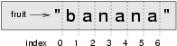

Strings
=======

A compound data type
--------------------

So far we have seen built-in types like ``number``, ``string``,
and ``boolean``. We've also started working with arrays, although we'll take a closer
look in the next chapter.

Strings and arrays are qualitatively different from the others because they
are made up of smaller pieces. In the case of strings, they're made up of smaller
strings each containing one **character**.

Types that comprise smaller pieces are called **compound data types**.
Depending on what we are doing, we may want to treat a compound data type as a
single thing, or we may want to access its parts. This ambiguity is useful.

Working with strings as single things
-------------------------------------

Strings are **objects**. Objects can provide functions that work
with the data of a string **instance**.

For example:

~~~~~~~~~~~~~~~~~~~~~~~~~~~~{.javascript}
⠕ let ss = "Hello, World!";
⠕ let tt = ss.toUpperCase();
⠕ tt
=> 'HELLO, WORLD!'    
~~~~~~~~~~~~~~~~~~~~~~~~~~~~

``toUpperCase`` is a method that can be invoked on any string object to
create a new string, in which all the  characters are in uppercase. (The
original string ``ss`` remains unchanged.)

There are also methods such as ``toLowerCase``, ``trim``, and
``repeat`` that do other interesting things.
[To learn what methods are available and what they do, you can consult the MDN Documentation](https://developer.mozilla.org/en-US/docs/Web/JavaScript/Reference/Global_Objects/String).
Or, simply type the following into a Repl.it script:

~~~~~~~~~~~~~~~~~~~~~~~~~~~~{.javascript .numberLines}
let ss = "Hello, World!";
let tt = ss.
~~~~~~~~~~~~~~~~~~~~~~~~~~~~

When you type the period to select one of the methods of ``ss``, Repl.it will pop up a
selection window showing all the methods that could be used on your string. There are lots
of methods. In this chapter we'll look at some of the most immediately useful ones.

Working with the parts of a string
----------------------------------

The **indexing operator** (Javascript uses square brackets to enclose the index)
selects a single character substring from a string:

~~~~~~~~~~~~~~~~~~~~~~~~~~~~{.javascript}
⠕ let fruit = "banana";
⠕ let m = fruit[1];
⠕ console.log(m);
~~~~~~~~~~~~~~~~~~~~~~~~~~~~

The expression ``fruit[1]`` selects character number 1 from ``fruit``, and creates a new
string containing just this one character. The variable ``m`` refers to the result.
When we display ``m``, we could get a surprise:

~~~~~~~~~~~~~~~~~~~~~~~~~~~~{.javascript}
a
~~~~~~~~~~~~~~~~~~~~~~~~~~~~

Computer scientists always start counting
from zero! The letter at subscript position zero of ``"banana"`` is ``b``. So at
position ``[1]`` we have the letter ``a``.

If we want to access the zero-eth letter of a string, we just place 0,
or any expression that evaluates to 0, inbetween the brackets:

~~~~~~~~~~~~~~~~~~~~~~~~~~~~{.javascript}
⠕ m = fruit[0];
⠕ console.log(m);
b
~~~~~~~~~~~~~~~~~~~~~~~~~~~~

The expression in brackets is called an **index**. An index specifies a member
of an ordered collection, in this case the collection of characters in the string. The index
*indicates* which one you want, hence the name. It can be any integer
expression.

We already mentioned that the common variable name `i` for loop variables
can be thought of as shorthand for _index_. Consider this `for` loop which iterates
through the characters in a string:

~~~~~~~~~~~~~~~~~~~~~~~~~~~~{.javascript .numberLines}
let fruit = "banana";
for (let i = 0; i < fruit.length; i++) {
  console.log(i, fruit[i]);
}
~~~~~~~~~~~~~~~~~~~~~~~~~~~~

produces:

~~~~~~~~~~~~~~~~~~~~~~~~~~~~{.javascript}
0 'b'
1 'a'
2 'n'
3 'a'
4 'n'
5 'a'
~~~~~~~~~~~~~~~~~~~~~~~~~~~~

If you take a close look at the loop condition from our example, you'll see that our `for`
loop ends when `i < fruit.length`. `length` is a **property** of a string that lets us
know how many characters are in the string. In later chapters we'll see that arrays and
other compound datatypes have a `length` property that makes it easy for us to **iterate**
over the items they contain.

Note that indexing string returns a _string_ --- Javascript has no special type for a single character.
It is just a string of length 1.

We've also seen arrays previously. The same indexing notation works to extract elements from
an array:

~~~~~~~~~~~~~~~~~~~~~~~~~~~~{.javascript}
⠕ let primeNumbers = [2, 3, 5, 7, 11, 13, 17, 19, 23, 29, 31];
⠕ primeNumbers[4];
=> 11
⠕ let friends = ["Joe", "Zoe", "Brad", "Angelina", "Zuki", "Thandi", "Paris"];
⠕ friends[3];
'Angelina'
~~~~~~~~~~~~~~~~~~~~~~~~~~~~

Length
------

We've seen that the `length` property of a string, returns the number of characters in the string:

~~~~~~~~~~~~~~~~~~~~~~~~~~~~{.javascript}
⠕ let fruit = "banana";
⠕ fruit.length;
6
~~~~~~~~~~~~~~~~~~~~~~~~~~~~

To get the last letter of a string, you might be tempted to try something like
this:

~~~~~~~~~~~~~~~~~~~~~~~~~~~~{.javascript}
⠕ let sz = fruit.length;
⠕ let last = fruit[sz];
⠕ last;
=> undefined
~~~~~~~~~~~~~~~~~~~~~~~~~~~~

We see that `last` is `undefined`. The reason is that there is no character at
index position 6 in ``"banana"``. Because we start counting at zero, the six
indexes are numbered 0 to 5. To get the last character, we have to subtract 1
from the length of ``fruit``:

~~~~~~~~~~~~~~~~~~~~~~~~~~~~{.javascript}    
⠕ let sz = fruit.length;
⠕ let last = fruit[sz - 1];
⠕ last;
=> 'a'
~~~~~~~~~~~~~~~~~~~~~~~~~~~~

Here we see that the last character is `fruit[fruit.length - 1]`, so the
second to last character would be `fruit[fruit.length - 2]` and so on.

Traversal and the ``for`` loop
------------------------------

A lot of computations involve processing a string one character at a time.
Often they start at the beginning, select each character in turn, do something
to it, and continue until the end. This pattern of processing is called a
**traversal**. One way to encode a traversal is with a ``while`` statement:

~~~~~~~~~~~~~~~~~~~~~~~~~~~~{.javascript .numberLines}     
let ix = 0;
while (ix < fruit.length) {
  let letter = fruit[ix];
  console.log(letter);
  ix++;
}
~~~~~~~~~~~~~~~~~~~~~~~~~~~~
The loop condition is ``ix < fruit.length``, so when ``ix`` is equal to the
length of the string, the condition is false, and the body of the loop is not
executed. The last character accessed is the one with the index
``fruit.length - 1``, which is the last character in the string.

But we've previously seen how the ``for`` loop can easily iterate over
the elements in a list and it can do so for strings as well:

~~~~~~~~~~~~~~~~~~~~~~~~~~~~{.javascript .numberLines}
for (let i = 0; i < fruit.length; i++) {
  console.log(fruit[i]);
}
~~~~~~~~~~~~~~~~~~~~~~~~~~~~

As we iterate through the characters in `fruit`, the loop variable, `i`
represents each index in the string. The loop continues until no characters
are left. Here we can see the expressive power the ``for`` loop gives us
compared to the while loop when traversing a string.

The following example shows how to use concatenation and a ``for`` loop to
generate an abecedarian series. Abecedarian refers to a series or list in which
the elements appear in alphabetical order. For example, in Robert McCloskey's
book _Make Way for Ducklings_, the names of the ducklings are Jack, Kack, Lack,
Mack, Nack, Ouack, Pack, and Quack. This loop outputs these names in order:

~~~~~~~~~~~~~~~~~~~~~~~~~~~~{.javascript .numberLines}
let prefixes = "JKLMNOPQ";
let suffix = "ack";

for (let i = 0; i < prefixes.length; i++) {
  console.log(prefixes[i] + suffix);
}
~~~~~~~~~~~~~~~~~~~~~~~~~~~~

~~~~~~~~~~~~~~~~~~~~~~~~~~~~{.javascript}
Jack
Kack
Lack
Mack
Nack
Oack
Pack
Qack
~~~~~~~~~~~~~~~~~~~~~~~~~~~~

Of course, that's not quite right because Ouack and Quack are misspelled.
You'll fix this as an exercise below.

Substrings
----------

A *substring* of a string is obtained by taking a smaller sequence of characters from an existing
string to create a new string.

~~~~~~~~~~~~~~~~~~~~~~~~~~~~{.javascript}
⠕ let s = "Pirates of the Caribbean";
⠕ console.log(s.substring(0,7));
Pirates
⠕ console.log(s.substring(11:14));
the
⠕ console.log(s.substring(15:24));
Caribbean
~~~~~~~~~~~~~~~~~~~~~~~~~~~~

The `substring(startIndex, endIndex)` method of a string,
returns a new string without modifying the original string. The
new string (i.e. the _substring_) starts at (and includes) the character
at `startIndex` and ends at (but _excludes_) the character at `endIndex`.
This
behavior makes sense if you imagine the indices
pointing *between* the characters, as in the following diagram:

If you imagine this as a piece of paper, `substring(m, n)` copies out
the part of the paper between the ``n`` and ``m`` positions. Provided ``m`` and ``n`` are
both within the bounds of the string, your result will be of length (m-n).

There are a few more tricks to `substring`. If you omit the second argument (`endIndex`),
the function returns a substring from `startIndex` up to and including the last character
in the string. If you provide an `endIndex` greater than `string.length`,

[From the MDN documentation](https://developer.mozilla.org/en-US/docs/Web/JavaScript/Reference/Global_Objects/String/substring),
we learn the following additional rules and behaviors for `substring`.

- If the `indexEnd` argument is omitted, `substring()` returns the substring
  from `startIndex` to the end of the string
- If `indexStart` is equal to `indexEnd`, `substring()` returns an empty string
- If `indexStart` is greater than `indexEnd`, the `substring()` swaps the two arguments
- Any argument value that is less than 0 is treated as 0
- Any argument than `string.length` is treated as if it were `string.length`
- Any argument value that is `NaN` is treated as if it were 0

String comparison
-----------------

The Boolean comparison operators work on strings. To see if two strings are equal:

~~~~~~~~~~~~~~~~~~~~~~~~~~~~{.javascript .numberLines}
if (word === "banana") {
  console.log("Yes, we are bananas!");
}
~~~~~~~~~~~~~~~~~~~~~~~~~~~~
Other comparison operations are useful for putting words in
`lexicographical` order:

~~~~~~~~~~~~~~~~~~~~~~~~~~~~{.javascript .numberLines}
if (word < "banana") {
  console.log("Your word, " + word + ", comes before banana.");
}
else if (word > "banana") {
  console.log("Your word, " + word + ", comes after banana.");
}
else {
  console.log("Yes, we have no bananas!");
}
~~~~~~~~~~~~~~~~~~~~~~~~~~~~

Keep in mind that Javascript string comparisons are _case sensitive_, so, for
exampe "Ape" does not equal "ape".
A common way to address the problem of case is to convert strings to a standard
format, such as all lowercase, before performing the comparison. So:

~~~~~~~~~~~~~~~~~~~~~~~~~~~~{.javascript}
⠕ let a = "Ape";
⠕ let b = "ape";
⠕ a === b;
=> false
⠕ a = a.toLowerCase();
⠕ a === b;
=> true
~~~~~~~~~~~~~~~~~~~~~~~~~~~~

Strings are immutable
---------------------

It is tempting to use the ``[]`` operator on the left side of an assignment,
with the intention of changing a character in a string. For example:

~~~~~~~~~~~~~~~~~~~~~~~~~~~~{.javascript .numberLines}
let greeting = "Hello, world!";
greeting[0] = 'J';
console.log(greeting);

~~~~~~~~~~~~~~~~~~~~~~~~~~~~

At best, the assignment on line 2 above will have no effect. If you run the
code in **strict mode**, you will get an error.

Strings are **immutable**, which means you can't change an existing string. The
best you can do is create a new string that is a variation on the original:

~~~~~~~~~~~~~~~~~~~~~~~~~~~~{.javascript .numberLines}
let greeting = "Hello, world!";
let newGreeting = "J" + greeting.substring(1);
console.log(newGreeting);
~~~~~~~~~~~~~~~~~~~~~~~~~~~~

The solution here is to concatenate a new first letter onto a slice of
``greeting``. This operation has no effect on the original string.

Testing inclusion
-----------------

Javascript provides string functions that let us find substrings
within a string. `includes` returns a Boolean `true` or `false`
to indicate if the substring exists in the string.

~~~~~~~~~~~~~~~~~~~~~~~~~~~~{.javascript}
⠕ let s = "apple";
⠕ s.includes("p");
=> true
⠕ s.includes("i");
=> false
⠕ s.includes("app");
=> true
⠕ s.includes("App"); // false because case doesn't match
=> false
~~~~~~~~~~~~~~~~~~

Note that a string is a substring of itself, and the empty string is a
substring of any other string. (Also note that computer scientists
like to think about these edge cases quite carefully!)

~~~~~~~~~~~~~~~~~~~~~~~~~~~~{.javascript}
⠕ s.includes("apple");
=> true
⠕ s.includes("");
=> true
~~~~~~~~~~~~~~~~~~~~~~~~~~~~

Combining `includes` with string concatenation using ``+=``, we can
remove the vowels from a string:

~~~~~~~~~~~~~~~~~~~~~~~~~~~~{.javascript .numberLines}
function removeVowels(s) {
  let vowels = "aeiou";
  let sansVowels = "";
  for (let i = 0; i < s.length; i++) {
    let c = s[i].toLowerCase();
    if(!vowels.includes(c)) {
      sansVowels += s[i];
    }
  }
  return sansVowels;
}

console.log(removeVowels("CompSci")); // CmpSc
console.log(removeVowels("A dark and stormy night.")); //  drk nd strmy nght.
~~~~~~~~~~~~~~~~~~~~~~~~~~~~
[Check out this function on repl.it](https://repl.it/@mcuringa/remove-vowels)

This short function uses several of the techniques and patterns we
have previously seen. We use a finite `for` loop to iterate up to `s.length`
to traverse the string. We convert `c` to lowercase for the comparison
where we test for inclusion in `vowels`. We create an empty string,
`sansVowels` that accumulates the non-vowel characters that we find.

A ``find`` function
-------------------

What does the following function do?

~~~~~~~~~~~~~~~~~~~~~~~~~~~~{.javascript .numberLines}
// Find and return the index of ch in strng.
// Return -1 if ch does not occur in strng.
function find(strng, ch) {

  for(let i = 0; i < strng.length; i++) {
    if(strng[i] === ch) {
      return i;
    }
  }
  return -1;
}
test(find("Compsci", "p") == 3)
test(find("Compsci", "C") == 0)
test(find("Compsci", "i") == 6)
test(find("Compsci", "x") == -1)

~~~~~~~~~~~~~~~~~~~~~~~~~~~~

In a sense, ``find`` is the opposite of the indexing operator. Instead of taking
an index and extracting the corresponding character, it takes a character and
finds the index where that character appears. If the character is not found,
the function returns ``-1``.

This is another example where we see a ``return`` statement inside a loop.
If `strng[i] === ch`, the function returns immediately, breaking out of
the loop prematurely.

If the character doesn't appear in the string, then the program exits the loop
normally and returns ``-1``.

This pattern of computation is sometimes called a **eureka traversal** or
**short-circuit evaluation**, because as soon as we find what we are looking
for, we can cry "Eureka!", take the short-circuit, and stop looking.

Looping and counting
--------------------

The following program counts the number of times the letter ``a`` appears in a
string, and is another example of the **counter pattern**.

~~~~~~~~~~~~~~~~~~~~~~~~~~~~{.javascript .numberLines}
function countA(text) {
  let count = 0;
  for (let i = 0; i < text.length; i++) {
    if (text[i] === "a") {
      count++;
    }
  }
  return count;
}
console.log(countA("banana") === 3);
~~~~~~~~~~~~~~~~~~~~~~~~~~~~

Default parameters
-------------------

To find the locations of the second or third occurrence of a character in a
string, we can modify the ``find`` function, adding a third parameter for the
starting position in the search string:

~~~~~~~~~~~~~~~~~~~~~~~~~~~~{.javascript .numberLines}
function find2(strng, ch, start) {
  let ix = start;
  while (ix < strng.length) {
    if (strng[ix] == ch) {
        return ix;
    }
    ix++;
  }
  return -1
}
console.log(find2("banana", "a", 2) == 3);

~~~~~~~~~~~~~~~~~~~~~~~~~~~~

The call ``find2("banana", "a", 2)`` now returns ``3``, the index of the first
occurrence of "a" in "banana" starting the search at index 2. What does
``find2("banana", "n", 3)`` return? If you said, 4, there is a good chance you
understand how ``find2`` works.

Better still, we can combine ``find`` and ``find2`` using a
**default parameter**:

~~~~~~~~~~~~~~~~~~~~~~~~~~~~{.javascript .numberLines}
function find(strng, ch, start = 0) {
  let ix = start;
  while (ix < strng.length) {
    if (strng[ix] == ch) {
        return ix;
    }
    ix++;
  }
  return -1
}
~~~~~~~~~~~~~~~~~~~~~~~~~~~~
When a function has an optional default parameter, the caller _may_ provide a 
matching argument. If the third argument is provided to ``find``, it gets assigned
to ``start``. But if the caller leaves the argument out, then start is given
a default value indicated by the assignment ``start = 0`` in the function header.

So the call ``find("banana", "a", 2)`` to this version of ``find`` behaves just
like ``find2``, while in the call ``find("banana", "a")``, ``start`` will be
set to the **default value** of ``0``.

Adding another optional parameter to ``find`` makes it search from a starting
position, up to but not including the end position:

~~~~~~~~~~~~~~~~~~~~~~~~~~~~{.javascript .numberLines}
function find(strng, ch, start = 0, end = null) {
  let ix = start;
  end = end || strng.length;

  while (ix < end) {
    if (strng[ix] == ch) {
        return ix;
    }
    ix++;
  }
  return -1
}

~~~~~~~~~~~~~~~~~~~~~~~~~~~~
The optional value for ``end`` is interesting: we give it a default value ``null`` if the
caller does not supply any argument. In the body of the function we test what ``end`` is,
and if the caller did not supply any argument, we reassign ``end`` to be the length of the string.
If the caller has supplied an argument for ``end``, however, the caller's value will be used in the loop.

On line 3 we see a new use of the logical `||` operator in the assignment
expression, `end = end || strng.length;`. We re-assign `end` the value of
`end` (i.e. it doesn't change) if `end` is  **truthy** value, **or** we assign
`end` a default value, of `strng.length`. Because of the way Javascripts
logical operators and truthiness work, they can be useful for assignment. As
you read more Javascript code online and in books, you will see many examples
of code that use the `||` operator to assign default values.

Here are some test cases that should print `true`:  

~~~~~~~~~~~~~~~~~~~~~~~~~~~~{.javascript .numberLines}
let ss = "Javascript strings have some interesting methods.";

console.log(find(ss, "s") === 4);
console.log(find(ss, "s", 11) === 11);
console.log(find(ss, "s", 12) === 17);
console.log(find(ss, "s", 12, 17) === -1);
console.log(find(ss, ".") === ss.length - 1);

~~~~~~~~~~~~~~~~~~~~~~~~~~~~

The built-in ``indexOf`` method
----------------------------

We wrote our own `find` function above, but Javascript's string object includes
its own version of `find` called `indexOf`.

[You can see how it works in the MDN docs](https://developer.mozilla.org/en-US/docs/Web/JavaScript/Reference/Global_Objects/String/indexOf).

~~~~~~~~~~~~~~~~~~~~~~~~~~~~{.javascript .numberLines}
let ss = "Javascript strings have some interesting methods.";

console.log(ss.indexOf("s") === 4);
console.log(ss.indexOf("s", 11) === 11);
console.log(ss.indexOf("s", 12) === 17);
console.log(ss.indexOf("s", 12, 17) === 17); // indexOf ignores the argument to end
console.log(ss.indexOf(".") === ss.length - 1);

~~~~~~~~~~~~~~~~~~~~~~~~~~~~

`indexOf` does not have the optional `end` paremeter. It always seachers until
the end of the string. In the case `ss.indexOf("s", 12, 17) === 17` it does
not create an error to pass in the third argument, however it is ignored entirely.

The built-in ``indexOf`` method is more general than our version. It can find
substrings, not just single characters:

~~~~~~~~~~~~~~~~~~~~~~~~~~~~{.javascript}
⠕ "banana".indexOf("nan")
=> 2
⠕ "banana".indexOf("na", 3)
=> 4
~~~~~~~~~~~~~~~~~~~~~~~~~~~~

Usually we'd prefer to use the methods that Javascript provides rather than reinvent
our own equivalents. But many of the built-in functions and methods make good
teaching exercises, and the underlying techniques you learn are your building blocks
to becoming a proficient programmer.

The ``split`` method
--------------------

One of the most useful methods on strings is the ``split`` method: it splits a
single multi-word string into an array of individual words ("substrings"). The
first parameter of `split` specifies the character or substring (or regular
expression, we'll see later) to be used to break the string into words. In
the example below, we split `ss` into words using a single space `' '`;

~~~~~~~~~~~~~~~~~~~~~~~~~~~~{.javascript}    
⠕ let ss = "Well I never did said Alice";
⠕ let words = ss.split(" ");
⠕ words
=> ['Well', 'I', 'never', 'did', 'said', 'Alice']

~~~~~~~~~~~~~~~~~~~~~~~~~~~~

Cleaning up your strings
------------------------

We'll often work with strings that contain punctuation, or tab and newline characters,
especially, as we'll see in a future chapter, when we read our text from files or from
the Internet. But if we're writing a program, say, to count word frequencies or check the
spelling of each word, we'd prefer to strip off these unwanted characters.

We'll show just one example of how to strip punctuation from a string.
Remember that strings are immutable, so we cannot change the string with the
punctuation --- we need to traverse the original string and create a new string,
omitting any punctuation:

~~~~~~~~~~~~~~~~~~~~~~~~~~~~{.javascript .numberLines}     
function removePunctuation(s) {
  let punctuation = "!\"#$%&'()*+,-./:;<=>?@[\\]^_`{|}~";
  let cleanString = "";
  for (let i = 0; i < s.length; i++) {
    if (punctuation.indexOf(s[i]) === -1) {
      cleanString += s[i];
    }
  }
  return cleanString;
}
~~~~~~~~~~~~~~~~~~~~~~~~~~~~

Composing together this function and the ``split`` method from the previous section
makes a useful combination --- we'll clean out the punctuation, and
``split`` will clean out the newlines and tabs while turning the string into
a list of words:

~~~~~~~~~~~~~~~~~~~~~~~~~~~~{.javascript .numberLines}    
let text = `
Born two centuries ago, Ada Lovelace was a pioneer of computer science. She
took part in writing the first published program and was a computing
visionary, recognizing for the first time that computers could do much more
than just calculations!
`;

let words = removePunctuation(text).toLowerCase().split("/\s/");
console.log(words);

~~~~~~~~~~~~~~~~~~~~~~~~~~~~

~~~~~~~~~~~~~~~~~~~~~~~~~~~~{.javascript .numberLines}

       ['Javascripts', 'are', 'constrictors', ... , 'it', 'snake', 'POOP']                            
~~~~~~~~~~~~~~~~~~~~~~~~~~~~

There are other useful string methods, but this book isn't intended to
be a reference manual. On the other hand, the *Javascript Library Reference*
is. Along with a wealth of other documentation, it is available at
the `Javascript website <http://www.python.org>`.

The string format method
------------------------

The easiest and most powerful way to format a string in Javascript 3 is to use the
``format`` method. To see how this works, let's start with a few examples:

~~~~~~~~~~~~~~~~~~~~~~~~~~~~{.javascript .numberLines}
s1 = "His name is {0}!".format("Arthur")
console.log(s1)

name = "Alice"
age = 10
s2 = "I am {1} and I am {0} years old.".format(age, name)
console.log(s2)

n1 = 4
n2 = 5
s3 = "2**10 = {0} and {1} * {2} = {3:f}".format(2**10, n1, n2, n1 * n2)
console.log(s3)

~~~~~~~~~~~~~~~~~~~~~~~~~~~~

    .. sourcecode:: pycon

        His name is Arthur!
        I am Alice and I am 10 years old.
        2**10 = 1024 and 4 * 5 = 20.000000

The template string contains *place holders*,  ``... {0} ... {1} ... {2} ...`` etc.  
The ``format`` method substitutes its arguments into the place holders.
The numbers in the place holders are indexes that determine which argument
gets substituted --- make sure you understand line 6 above!

But there's more!  Each of the replacement fields can also contain a **format specification** ---
it is always introduced by the ``:`` symbol  (Line 11 above uses one.)  
This modifies how the substitutions are made into the template, and can control things like:

* whether the field is aligned to the left ``<``, center ``^``, or right ``>``
* the width allocated to the field within the result string (a number like ``10``)
* the type of conversion (we'll initially only force conversion to float, ``f``, as we did in
  line 11 of the code above, or perhaps we'll ask integer numbers to be converted to hexadecimal using ``x``)
* if the type conversion is a float, you can also specify how many decimal places are wanted
  (typically, ``.2f`` is useful for working with currencies to two decimal places.)

Let's do a few simple and common examples that should be enough for most needs. If you need to
do anything more esoteric, use *help* and read all the powerful, gory details.

~~~~~~~~~~~~~~~~~~~~~~~~~~~~{.javascript .numberLines}
n1 = "Paris"
n2 = "Whitney"
n3 = "Hilton"

console.log("Pi to three decimal places is {0:.3f}".format(3.1415926))
console.log("123456789 123456789 123456789 123456789 123456789 123456789")
console.log("|||{0:<15}|||{1:^15}|||{2:>15}|||Born in {3}|||"
.format(n1,n2,n3,1981))
console.log("The decimal value {0} converts to hex value {0:x}"
.format(123456))

~~~~~~~~~~~~~~~~~~~~~~~~~~~~

    .. sourcecode:: pycon

        Pi to three decimal places is 3.142
        123456789 123456789 123456789 123456789 123456789 123456789
        |||Paris          |||    Whitney    |||         Hilton|||Born in 1981|||
        The decimal value 123456 converts to hex value 1e240

You can have multiple placeholders indexing the
same argument, or perhaps even have extra arguments that are not referenced
at all:

~~~~~~~~~~~~~~~~~~~~~~~~~~~~{.javascript .numberLines}
letter = """
Dear {0} {2}.
 {0}, I have an interesting money-making proposition for you!
 If you deposit $10 million into my bank account, I can
 double your money ...
"""

console.log(letter.format("Paris", "Whitney", "Hilton"))
console.log(letter.format("Bill", "Henry", "Gates"))

~~~~~~~~~~~~~~~~~~~~~~~~~~~~

    .. sourcecode:: pycon

        Dear Paris Hilton.
         Paris, I have an interesting money-making proposition for you!
         If you deposit $10 million into my bank account, I can
         double your money ...

        Dear Bill Gates.
         Bill, I have an interesting money-making proposition for you!
         If you deposit $10 million into my bank account I can
         double your money ...

As you might expect, you'll get an index error if
your placeholders refer to arguments that you do not provide:

~~~~~~~~~~~~~~~~~~~~~~~~~~~~{.javascript}    
⠕ "hello {3}".format("Dave")
Traceback (most recent call last):
  File "<interactive input>", line 1, in <module>
IndexError: tuple index out of range

~~~~~~~~~~~~~~~~~~~~~~~~~~~~
First, we'll try to print a table without using string formatting:

~~~~~~~~~~~~~~~~~~~~~~~~~~~~{.javascript .numberLines}
console.log("i\ti**2\ti**3\ti**5\ti**10\ti**20")
for i in range(1, 11):
    console.log(i, "\t", i**2, "\t", i**3, "\t", i**5, "\t",
    i**10, "\t", i**20)

~~~~~~~~~~~~~~~~~~~~~~~~~~~~
(This assumes that the tab width is 8. You might see
something even worse than this if you tab width is set to 4.)
In its current form it relies on the tab character ( ``\t``) to align the
columns of values, but this breaks down when the values in the table get larger
than the tab width:

    .. sourcecode:: pycon

        i       i**2    i**3    i**5    i**10   i**20
        1       1       1       1       1       1
        2       4       8       32      1024    1048576
        3       9       27      243     59049   3486784401
        4       16      64      1024    1048576         1099511627776
        5       25      125     3125    9765625         95367431640625
        6       36      216     7776    60466176        3656158440062976
        7       49      343     16807   282475249       79792266297612001
        8       64      512     32768   1073741824      1152921504606846976
        9       81      729     59049   3486784401      12157665459056928801
        10      100     1000    100000  10000000000     100000000000000000000

One possible solution would be to change the tab width, but the first column
already has more space than it needs. The best solution would be to set the
width of each column independently. As you may have guessed by now, string
formatting provides a much nicer solution. We can also right-justify each field:

~~~~~~~~~~~~~~~~~~~~~~~~~~~~{.javascript .numberLines}    
layout = "{0:>4}{1:>6}{2:>6}{3:>8}{4:>13}{5:>24}"

console.log(layout.format("i", "i**2", "i**3", "i**5", "i**10", "i**20"))
for i in range(1, 11):
    console.log(layout.format(i, i**2, i**3, i**5, i**10, i**20))

~~~~~~~~~~~~~~~~~~~~~~~~~~~~

    .. sourcecode:: pycon

       i  i**2  i**3    i**5        i**10                   i**20
       1     1     1       1            1                       1
       2     4     8      32         1024                 1048576
       3     9    27     243        59049              3486784401
       4    16    64    1024      1048576           1099511627776
       5    25   125    3125      9765625          95367431640625
       6    36   216    7776     60466176        3656158440062976
       7    49   343   16807    282475249       79792266297612001
       8    64   512   32768   1073741824     1152921504606846976
       9    81   729   59049   3486784401    12157665459056928801
      10   100  1000  100000  10000000000   100000000000000000000

Summary
-------

This chapter introduced a lot of new ideas. The following summary
may prove helpful in remembering what you learned.

.. glossary::

    indexing (``[]``)
        Access a single character in a string using its position (starting from
        0). Example: ``"This"[2]`` evaluates to ``"i"``.

    length function (``len``)
        Returns the number of characters in a string. Example:
        ``len("happy")`` evaluates to ``5``.

    for loop traversal (``for``)
        *Traversing* a string means accessing each character in the string, one
        at a time. For example, the following for loop:

~~~~~~~~~~~~~~~~~~~~~~~~~~~~{.javascript}
for ch in "Example":
    ...

executes the body of the loop 7 times with different values of ``ch`` each time.

    slicing (``[:]``)
A *slice* is a substring of a string. Example: ``'bananas and
cream'[3:6]`` evaluates to ``ana`` (so does ``'bananas and
cream'[1:4]``).

    string comparison (``>, <, >=, <=, ==, !=``)
The six common comparison operators work with strings, evaluating according to
`lexicographical` order. Examples:
``"apple" < "banana"`` evaluates to ``True``. ``"Zeta" < "Appricot"``
evaluates to ``False``. ``"Zebra" <= "aardvark"`` evaluates to
``True`` because all upper case letters precede lower case letters.

    in and not in operator (``in``, ``not in``)
The ``in`` operator tests for membership. In the case of
strings, it tests whether one string is contained inside another
string. Examples: ``"heck" in "I'll be checking for you."``
evaluates to ``True``. ``"cheese" in "I'll be checking for
you."`` evaluates to ``False``.

~~~~~~~~~~~~~~~~~~~~~~~~~~~~
--------

## Gloassary

    compound data type
        A data type in which the values are made up of components, or elements,
        that are themselves values.

    default value
        The value given to an optional parameter if no argument for it is
        provided in the function call.

    docstring
        A string constant on the first line of a function or module definition
        (and as we will see later, in class and method definitions as well).
        Docstrings provide a convenient way to associate documentation with
        code. Docstrings are also used by programming tools to provide interactive help.

    dot notation
        Use of the **dot operator**, ``.``, to access methods and attributes of an object.

    immutable data value
        A data value which cannot be modified. Assignments to elements or
        slices (sub-parts) of immutable values cause a runtime error.

    index
        A variable or value used to select a member of an ordered collection, such as
        a character from a string, or an element from a list.

    mutable data value
        A data value which can be modified. The types of all mutable values
        are compound types. Lists and dictionaries are mutable; strings
        and tuples are not.

    optional parameter
        A parameter written in a function header with an assignment to a
        default value which it will receive if no corresponding argument is
        given for it in the function call.

    short-circuit evaluation
        A style of programming that shortcuts extra work as soon as the
        outcome is know with certainty. In this chapter our ``find``
        function returned as soon as it found what it was looking for; it
        didn't traverse all the rest of the items in the string.

    substring
        A part of a string (substring) specified by a range of indices. More
        generally, a subsequence of any sequence type in Javascript can be created
        using the slice operator (``sequence[start:stop]``).

    traverse
        To iterate through the elements of a collection, performing a similar
        operation on each.

    whitespace
        Any of the characters that move the cursor without printing visible
        characters. The constant ``string.whitespace`` contains all the
        white-space characters.

Exercises
---------

We suggest you create a single file containing the test scaffolding from our previous chapters,
and put all functions that require tests into that file.

#. What is the result of each of the following:

~~~~~~~~~~~~~~~~~~~~~~~~~~~~{.javascript}    
⠕ "Javascript"[1]
⠕ "Strings are sequences of characters."[5]
⠕ len("wonderful")
⠕ "Mystery"[:4]
⠕ "p" in "Pineapple"
⠕ "apple" in "Pineapple"
⠕ "pear" not in "Pineapple"
⠕ "apple" > "pineapple"
⠕ "pineapple" < "Peach"

~~~~~~~~~~~~~~~~~~~~~~~~~~~~

~~~~~~~~~~~~~~~~~~~~~~~~~~~~{.javascript .numberLines}
   prefixes = "JKLMNOPQ"
   suffix = "ack"

   for letter in prefixes:
       console.log(letter + suffix)

   so that ``Ouack`` and ``Quack`` are spelled correctly.

~~~~~~~~~~~~~~~~~~~~~~~~~~~~

~~~~~~~~~~~~~~~~~~~~~~~~~~~~{.javascript .numberLines}
   fruit = "banana"
   count = 0
   for char in fruit:
       if char == "a":
   count += 1
   console.log(count)

   in a function named ``count_letters``, and generalize it so that it accepts
   the string and the letter as arguments. Make the function return the number
   of characters, rather than print the answer. The caller should do the printing.

~~~~~~~~~~~~~~~~~~~~~~~~~~~~
   string, it repeatedly calls the ``find`` method, with the optional third parameter
   to locate new occurrences of the letter being counted.

#. Assign to a variable in your program a triple-quoted string that contains
   your favourite paragraph of text --- perhaps a poem, a speech, instructions
   to bake a cake, some inspirational verses, etc.

   Write a function which removes all punctuation from the string, breaks the string
   into a list of words, and counts the number of words in your text that contain
   the letter "e". Your program should print an analysis of the text like this:

       .. sourcecode:: pycon

           Your text contains 243 words, of which 109 (44.8%) contain an "e".     

#. Print a neat looking multiplication table like this:

       .. sourcecode:: pycon

                  1   2   3   4   5   6   7   8   9  10  11  12
            :--------------------------------------------------
           1:     1   2   3   4   5   6   7   8   9  10  11  12
           2:     2   4   6   8  10  12  14  16  18  20  22  24
           3:     3   6   9  12  15  18  21  24  27  30  33  36
           4:     4   8  12  16  20  24  28  32  36  40  44  48
           5:     5  10  15  20  25  30  35  40  45  50  55  60
           6:     6  12  18  24  30  36  42  48  54  60  66  72
           7:     7  14  21  28  35  42  49  56  63  70  77  84
           8:     8  16  24  32  40  48  56  64  72  80  88  96
           9:     9  18  27  36  45  54  63  72  81  90  99 108
          10:    10  20  30  40  50  60  70  80  90 100 110 120
          11:    11  22  33  44  55  66  77  88  99 110 121 132
          12:    12  24  36  48  60  72  84  96 108 120 132 144

#. Write a function that reverses its string argument, and satisfies these tests:

~~~~~~~~~~~~~~~~~~~~~~~~~~~~{.javascript .numberLines}   
   test(reverse("happy") == "yppah")
   test(reverse("Javascript") == "nohtyP")
   test(reverse("") == "")
   test(reverse("a") == "a")

~~~~~~~~~~~~~~~~~~~~~~~~~~~~

~~~~~~~~~~~~~~~~~~~~~~~~~~~~{.javascript .numberLines}  
   test(mirror("good") == "gooddoog")
   test(mirror("Javascript") == "JavascriptnohtyP")
   test(mirror("") == "")
   test(mirror("a") == "aa")

~~~~~~~~~~~~~~~~~~~~~~~~~~~~

~~~~~~~~~~~~~~~~~~~~~~~~~~~~{.javascript .numberLines}    
    test(remove_letter("a", "apple") == "pple")
    test(remove_letter("a", "banana") == "bnn")
    test(remove_letter("z", "banana") == "banana")
    test(remove_letter("i", "Mississippi") == "Msssspp")
    test(remove_letter("b", "") = "")
    test(remove_letter("b", "c") = "c")

~~~~~~~~~~~~~~~~~~~~~~~~~~~~

~~~~~~~~~~~~~~~~~~~~~~~~~~~~{.javascript .numberLines}    
    test(is_palindrome("abba"))
    test(not is_palindrome("abab"))
    test(is_palindrome("tenet"))
    test(not is_palindrome("banana"))
    test(is_palindrome("straw warts"))
    test(is_palindrome("a"))
    # test(is_palindrome(""))    # Is an empty string a palindrome?

~~~~~~~~~~~~~~~~~~~~~~~~~~~~

~~~~~~~~~~~~~~~~~~~~~~~~~~~~{.javascript .numberLines}    
    test(count("is", "Mississippi") == 2)
    test(count("an", "banana") == 2)
    test(count("ana", "banana") == 2)
    test(count("nana", "banana") == 1)
    test(count("nanan", "banana") == 0)
    test(count("aaa", "aaaaaa") == 4)

~~~~~~~~~~~~~~~~~~~~~~~~~~~~

~~~~~~~~~~~~~~~~~~~~~~~~~~~~{.javascript .numberLines}    
    test(remove("an", "banana") == "bana")
    test(remove("cyc", "bicycle") == "bile")
    test(remove("iss", "Mississippi") == "Missippi")
    test(remove("eggs", "bicycle") == "bicycle")

~~~~~~~~~~~~~~~~~~~~~~~~~~~~
