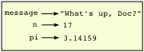

Variables, expressions and statements
=====================================

Values and data types
---------------------

A **value** is one of the fundamental things --- like a letter or a number ---
that a program manipulates. Programming `turtle` we have been using values
like `100` when we write `fd(100)` and `"blue"` in statements like
`setColor("blue")`.

These values are classified into different **classes**, or **data types**: ``100`` 
is an *number*, and ``"blue"`` is a *string*, 
so-called because it contains a string of
letters. You (and the interpreter) can identify strings because they are
enclosed in quotation marks.

If you are not sure what class a value falls into, the Javascript **typeof**  operator can tell you.

~~~~~~~~~~~~~~~~~~~~~~~~~~~~{.javascript}
typeof "blue";
=> 'string'
typeof 100;
=> 'number'
~~~~~~~~~~~~~~~~~~~~~~~~~~~~~~~~~~~~~~~~~~~~~~
Not surprisingly, strings are of type `string` and integers are of type `number`.
In Javascript, both whole numbers and fractions (numbers with decimal points)
are of type `number`. At this stage, you can treat the words *class* and *type*
interchangeably.  We'll come back to a deeper understanding of what a class 
is in later chapters. 

~~~~~~~~~~~~~~~~~~~~~~~~~~~~{.javascript}
=> typeof 3.2;
'number'
~~~~~~~~~~~~~~~~~~~~~~~~~~~~~~~~~~~~~~~~~~~~~~
What about values like ``"17"`` and ``"3.2"``? They look like numbers, but they
are in quotation marks like strings.

### Strings

~~~~~~~~~~~~~~~~~~~~~~~~~~~~{.javascript}
typeof "17";
=> 'string'
typeof "3.2";
=> 'string'
~~~~~~~~~~~~~~~~~~~~~~~~~~~~~~~~~~~~~~~~~~~~~~
They're strings!

Strings in Javascript can be enclosed in either single quotes (``'``) or double quotes
(``"``), or "backticks" (` ` `).

~~~~~~~~~~~~~~~~~~~~~~~~~~~~{.javascript}
        
typeof 'This is a string.';
=> 'string'
typeof "And so is this.";
=> 'string'
typeof `and this is a special type of string...`;
=> 'string'
~~~~~~~~~~~~~~~~~~~~~~~~~~~~~~~~~~~~~~~~~~~~~~

Double quoted strings can contain single quotes inside them, as in
``"Bruce's beard"``, and single quoted strings can have double quotes
inside them, as in ``'The knights who say "Ni!"'``. 

Strings enclosed with the backtick symbol are
called **template literals**.  Template literals can 
contain either single or double quotes: 

~~~~~~~~~~~~~~~~~~~~~~~~~~~~{.javascript}
console.log(`"Oh no", she exclaimed, "Ben's bike is broken!"`);
"Oh no", she exclaimed, "Ben's bike is broken!"
>>>
~~~~~~~~~~~~~~~~~~~~~~~~~~~~~~~~~~~~~~~~~~~~~~
Template literal strings can even span multiple lines:

~~~~~~~~~~~~~~~~~~~~~~~~~~~~{.javascript}
let message = `This message will
... span several
... lines`;
console.log(message);

This message will
span several
lines.
~~~~~~~~~~~~~~~~~~~~~~~~~~~~~~~~~~~~~~~~~~~~~~

Strings can also be joined use the `+` token which adds strings together
(also called concatenation).

~~~~~~~~~~~~~~~~~~~~~~~~~~~~{.javascript}
let message = "This long message will" +
"... will appear on one line" +
"... when it's logged to the console.";
console.log(message);

This long message will... will appear on one line... when it's logged to the console.
~~~~~~~~~~~~~~~~~~~~~~~~~~~~~~~~~~~~~~~~~~~~~~

Javascript doesn't care whether you use single or double quotes to surround your strings: 
once it has parsed the text of your program or command, the way it stores the
value is identical in all cases, and the surrounding quotes are not part of
the value. But when the interpreter wants to display a string, it has to 
decide which quotes to use to make it look like a string. It usually choose a single quote.

~~~~~~~~~~~~~~~~~~~~~~~~~~~~{.javascript}

'This is a string.'
=> 'This is a string.'
"And so is this."
=> 'And so is this.'
`This is a string too!`
=> 'This is a string too!'
~~~~~~~~~~~~~~~~~~~~~~~~~~~~~~~~~~~~~~~~~~~~~~

The code examples in this book will use double quotes as the default, and
use single quotes and template literals when they make more sense (such
as in strings containing double quotes or spanning multiple lines).
We will learn more about template strings in the chapter on strings.

When you type a large number, you might be tempted to use commas between
groups of three digits, as in ``42,000``. This is not a legal number in
Javascript, and different Javascript interpreters handle it differently. Formal languages are 
strict, the notation is concise, and even the smallest change might
mean something quite different from what you intended. 

Variables
---------

One of the most powerful features of a programming language is the ability to
manipulate **variables**. A variable is a name that refers to a value.

The **let** keyword declares a new variable and
the **assignment token**, gives a value to a variable:

~~~~~~~~~~~~~~~~~~~~~~~~~~~~{.javascript}
let message = "What's up, Doc?";
let n = 17;
let pi = 3.14159;
~~~~~~~~~~~~~~~~~~~~~~~~~~~~~~~~~~~~~~~~~~~~~~

This example declares three variables and assigns them values. The first assigns the string value ``"What's
up, Doc?"`` to a variable named ``message``. The second gives the number
``17`` to ``n``, and the third assigns the number ``3.14159`` to
a variable called ``pi``.

The **assignment token**, ``=``, should not be confused with *equals*, which uses
the token ``===``.  The assignment statement binds a *name*, on the
left-hand side of the operator, to a *value*, on the right-hand side.
This is why you will get an error if you enter:

~~~~~~~~~~~~~~~~~~~~~~~~~~~~{.javascript}
        
let 17 = n;

SyntaxError: unexpected token: numeric literal
~~~~~~~~~~~~~~~~~~~~~~~~~~~~~~~~~~~~~~~~~~~~~~

_**Tip:** When reading or writing code, say to yourself "n is assigned 17"
or "n gets the value 17".  Don't say "n equals 17"._

A common way to represent variables on paper is to write the name with an arrow
pointing to the variable's value. This kind of figure is called a **state
snapshot** because it shows what state each of the variables is in at a particular
instant in time.  (Think of it as the variable's state of mind). 
This diagram shows the result of executing the assignment statements:

If you ask the interpreter to evaluate a variable, it will produce the value that is currently 
linked to the variable:

~~~~~~~~~~~~~~~~~~~~~~~~~~~~{.javascript}
message
'What's up, Doc?'
n
=> 17
pi
=> 3.14159
~~~~~~~~~~~~~~~~~~~~~~~~~~~~~~~~~~~~~~~~~~~~~~
We use variables in a program to "remember" things, perhaps the current score in the video game.
But variables are *variable*. This means they can change over time, just like the score in a video game. 
You can assign a value to a variable, and later assign a different value to the same variable.  
(*This is different from maths. In maths, if you give `x` the value 3, it
cannot change to link to a different value half-way through your calculations!*)

~~~~~~~~~~~~~~~~~~~~~~~~~~~~{.javascript}
let day = "Thursday"
day
=> 'Thursday'
day = "Friday"
day
=> 'Friday'
day = 21
day
=> 21
~~~~~~~~~~~~~~~~~~~~~~~~~~~~~~~~~~~~~~~~~~~~~~
You'll notice we changed the value of ``day`` three times, and on the third assignment we even 
made it refer to a value that was of a different type.   

A great deal of programming is about having the computer remember things, e.g. *The number of missed calls on your phone*, 
and then arranging to update or change the variable when you miss another call. 

Variable names and keywords
---------------------------

**Variable names** and other **identifiers** can be arbitrarily long. They can contain both letters and
digits, but they have to begin with a letter, the dollar sign `$`, or an underscore `_`.
Remember that case matters. ``Bruce`` and ``bruce`` are different variables.

In Javascript, capital letters are often used in variables tha contain multiple words, such as
``myName`` or ``thePriceOfTeaInChina``. The underscore character (``_``) can appear in a name, too.
You may see it to separate multiple words, such as ``my_name`` or ``price_of_tea_in_china``, but
this style is less common in Javascript.

Sometimes programmers start variables with underscores or dollar signs to give them special meanings.
In this book, all variable names will start with letters.
 
If you give a variable an illegal name, you get a syntax error:

~~~~~~~~~~~~~~~~~~~~~~~~~~~~{.javascript}
let 76trombones = "big parade";
unknown: Identifier directly after number
let typeof = "Computer Science 101";
unknown: Unexpected token 
~~~~~~~~~~~~~~~~~~~~~~~~~~~~~~~~~~~~~~~~~~~~~~

``76trombones`` is illegal because it does not begin with a letter, but
what's wrong with ``typeof``?

It turns out that ``typeof`` is reserved as one of Javascript's **keywords**. Keywords define
the language's syntax rules and structure, and they cannot be used as variable names.

[Javascript has almost fourty keywords](https://developer.mozilla.org/en-US/docs/Web/JavaScript/Reference/Lexical_grammar#Keywords) (different versions of Javascript have slightly different keywords):

~~~~~~~~~~~~~~~~~~~~~~~~~~~~~~~~~~~~~~~~~~~~~~~~~~~~~~~~~~

await       finally       protected
break       for           return
case        function      super
catch       if            switch
class       implements    this
const       import        throw
continue    in            try
debugger    instanceof    typeof
default     interface     var
delete      let           void
else        new           while
export      package       with
extends     private       yield

~~~~~~~~~~~~~~~~~~~~~~~~~~~~~~~~~~~~~~~~~~~~~~~~~~~~~~~~~~
You might want to keep this list handy. If the interpreter complains about one
of your variable names and you don't know why, see if it is on this list.

Programmers generally choose names for their variables that are meaningful to 
the human readers of the program—they help the programmer document, or remember, what the variable is used for.

<aside id="meaningful-names">
   Beginners sometimes confuse "meaningful to the human readers" with "meaningful to the computer".
   So they'll wrongly think that because they've called some variable ``average`` or ``pi``, it will
   somehow magically calculate an average, or magically know that the variable ``pi`` should have a 
   value like 3.14159.  No! The computer doesn't understand what you intend the variable to mean.
    
   So you'll find some instructors who deliberately don't choose meaningful 
   names when they teach beginners --- not because we don't think it is a good habit,
   but because we're trying to reinforce the message that you --- the programmer --- must
   write the program code to calculate the average, and you must write an assignment 
   statement to give the variable ``pi`` the value you want it to have.
</aside>

Statements
----------

A **statement** is an instruction that the Javascript interpreter can execute. We
have mostly seen the assignment statement so far.  Some other kinds of statements that 
we'll see shortly are ``while`` statements, ``for`` statements, and ``if`` statements.
(There are other kinds too!)

When you type a statement in the console and hit enter, Javascript executes it. Statements
don't produce any result.

Evaluating expressions
----------------------

An **expression** is a combination of values, variables, operators, and calls to functions. If you
type an expression at the Javascript prompt, the interpreter **evaluates** it and
displays the result:

~~~~~~~~~~~~~~~~~~~~~~~~~~~~{.javascript}
1 + 1;
=> 2
typeof "hello";
=> 'string'
~~~~~~~~~~~~~~~~~~~~~~~~~~~~~~~~~~~~~~~~~~~~~~
In this example ``typeof`` is a Javascript operator that returns the type of a variable or literal data operand. 

The *evaluation of an expression* produces a value, which is why expressions
can appear on the right hand side of assignment statements. A value all by
itself is a simple expression, and so is a variable.

These examples show the expression and the value they return indicated by ``=>``.

~~~~~~~~~~~~~~~~~~~~~~~~~~~~{.javascript}
17
=> 17;
let y = 3.14;
let x = typeof "hello";
x
=> 'string'
y
=> 3.14
~~~~~~~~~~~~~~~~~~~~~~~~~~~~~~~~~~~~~~~~~~~~~~

Operators and operands
----------------------

**Operators** are special tokens that represent computations like addition,
multiplication and division. The values the operator uses are called **operands**.

The following are all legal Javascript expressions whose meaning is more or less
clear:
    
    20+32   hour-1   hour*60+minute   minute/60   5**2   (5+9)*(15-7)

The tokens ``+``, ``-``, and ``*``, and the use of parenthesis for grouping,
mean in Javascript what they mean in mathematics. The asterisk (``*``) is the
token for multiplication, and ``**`` is the token for exponentiation.

~~~~~~~~~~~~~~~~~~~~~~~~~~~~{.javascript}
2 ** 3
=> 8
3 ** 2
=> 9
~~~~~~~~~~~~~~~~~~~~~~~~~~~~~~~~~~~~~~~~~~~~~~
When a variable name appears in the place of an operand, it is replaced with
its value before the operation is performed.

Addition, subtraction, multiplication, and exponentiation all do what you
expect.

Example: so let us convert 645 minutes into hours:

~~~~~~~~~~~~~~~~~~~~~~~~~~~~{.javascript}
let minutes = 645;
let hours = minutes / 60;
hours;
=> 10.75
~~~~~~~~~~~~~~~~~~~~~~~~~~~~~~~~~~~~~~~~~~~~~~
Oops! In Javascript, the division operator ``/`` always yields a floating point (decimal) result. 
What we might have wanted to know was how many *whole* hours there are, and how many minutes remain.
Javascript provides helpful **Math** functions to allow us to do this.
`Math.floor()` rounds a number down to the nearest whole number. 
Its result is always a whole number --- and if it has to adjust the number it always
moves it to the left on the number line. So `Math.floor(6 / 4)` yields `1`, but
`Math.floor(-6 / 4)` might surprise you!  

~~~~~~~~~~~~~~~~~~~~~~~~~~~~{.javascript}
7 / 4;
=> 1.75
Math.floor(7 / 4);
=> 1
let minutes = 645;
let hours = Math.flor(minutes / 60);
hours;
=> 10
~~~~~~~~~~~~~~~~~~~~~~~~~~~~~~~~~~~~~~~~~~~~~~

Type conversion
---------------
    
Here we'll look at some ways to convert data. We call these
**type converters**.  

The ``Number.parseInt(arg)`` function can take a floating point number or a string, and turn
it into an whole number. For floating point numbers, it *discards* the decimal portion 
of the number --- a process we call *truncation towards zero* on
the number line. Let us see this in action:

~~~~~~~~~~~~~~~~~~~~~~~~~~~~{.javascript}
Number.parseInt(3.14);
=> 3
Number.parseInt(3.9999);     // This doesn't round to the closest int! 
=> 3
Number.parseInt(3.0);
=> 3
Number.parseInt(-3.999);     // Note that the result is closer to zero
=> -3
Number.parseInt(minutes / 60);
=> 10
Number.parseInt("2345");     // Parse a string to produce an int
=> 2345
Number.parseInt(17); // It even works if arg is already an int
=> 17
~~~~~~~~~~~~~~~~~~~~~~~~~~~~~~~~~~~~~~~~~~~~~~

The type converter ``Number.parseFloat(arg)`` can a syntactically legal
string into a decimal:

~~~~~~~~~~~~~~~~~~~~~~~~~~~~{.javascript}
Number.parseFloat("123.45");
=> 123.45
~~~~~~~~~~~~~~~~~~~~~~~~~~~~~~~~~~~~~~~~~~~~~~

The type converter ``String(arg)`` turns its argument into a string:

~~~~~~~~~~~~~~~~~~~~~~~~~~~~{.javascript}
String(17)
=> '17'
String(123.45)
=> '123.45'
~~~~~~~~~~~~~~~~~~~~~~~~~~~~~~~~~~~~~~~~~~~~~~

Order of operations
-------------------

When more than one operator appears in an expression, the order of evaluation
depends on the **rules of precedence**. Javascript follows the same precedence
rules for its mathematical operators that mathematics does. The acronym PEMDAS
is a useful way to remember the order of operations:

#. **P**\ arentheses have the highest precedence and can be used to force an
   expression to evaluate in the order you want. Since expressions in
   parentheses are evaluated first, ``2 * (3-1)`` is 4, and ``(1+1)**(5-2)`` is
   8. You can also use parentheses to make an expression easier to read, as in
   ``(minute * 100) / 60``, even though it doesn't change the result.
#. **E**\ xponentiation has the next highest precedence, so ``2**1+1`` is 3 and
   not 4, and ``3*1**3`` is 3 and not 27.
#. **M**\ ultiplication and both **D**\ ivision operators have the same precedence, which is
   higher than **A**\ ddition and **S**\ ubtraction, which also have the same
   precedence. So ``2*3-1`` yields 5 rather than 4, and ``5-2*2`` is 1, not 6.
#. Operators with the *same* precedence are evaluated from left-to-right. In algebra
   we say they are *left-associative*.  So in
   the expression ``6-3+2``, the subtraction happens first, yielding 3. We then add
   2 to get the result 5. If the operations had been evaluated from
   right to left, the result would have been ``6-(3+2)``, which is 1.  (The acronym
   PEDMAS could mislead you to thinking that division has higher precedence than multiplication, 
   and addition is done ahead of subtraction - don't be misled.  
   Subtraction and addition are at the same precedence, and the left-to-right rule applies.)
   
   - An exception to the left-to-right left-associative rule 
     is the exponentiation operator ``**``, so a useful hint is to always use 
     parentheses to force exactly the order you want when exponentiation is involved:
   

~~~~~~~~~~~~~~~~~~~~~~~~~~~~{.javascript}
  2 ** 3 ** 2     // The right-most ** operator gets done first!
  => 512
  (2 ** 3) ** 2   // Use parentheses to force the order you want!
  => 64

~~~~~~~~~~~~~~~~~~~~~~~~~~~~~~~~~~~~~~~~~~~~~~
The Javascript console in repl.it is great for exploring and experimenting
with expressions like this. You can fork this repl to try it: <https://repl.it/@mcuringa/ES6-shell> 

Operations on strings
---------------------

If a string looks like a number, Javascript while try to automatically convert it
to an number in order to execute a mathematical operation.

~~~~~~~~~~~~~~~~~~~~~~~~~~~~{.javascript}
let message = "4";
message * 2;
=> 8
message ** 2;
=> 16;
~~~~~~~~~~~~~~~~~~~~~~~~~~~~~~~~~~~~~~~~~~~~~~

If the automatic type conversion fails in a mathematical operation, Javascript
returns the special *Not a Number* value, `Nan`.

~~~~~~~~~~~~~~~~~~~~~~~~~~~~{.javascript}
let message = "Hello, world.";
message * 2;
=> NaN
~~~~~~~~~~~~~~~~~~~~~~~~~~~~~~~~~~~~~~~~~~~~~~

Interestingly, the ``+`` operator work with strings, but for strings, 
the ``+`` operator represents **concatenation**, not addition.  
As we've seen, concatenation means joining the two operands by linking them end-to-end. For example:

~~~~~~~~~~~~~~~~~~~~~~~~~~~~{.javascript .numberLines}
let fruit = "banana";
let bakedGood = " nut bread";
console.log(fruit + bakedGood);
~~~~~~~~~~~~~~~~~~~~~~~~~~~~~~~~~~~~~~~~~~~~~~
The output of this program is ``banana nut bread``. The space before the word
``nut`` is part of the string, and is necessary to produce the space between
the concatenated strings. 

Automatic conversion can be tricky and sometimes lead to unexpected results. Consider:

~~~~~~~~~~~~~~~~~~~~~~~~~~~~{.javascript}
let age = "24";
age - 10;
=> 14
age + 10;
=> '2410'
~~~~~~~~~~~~~~~~~~~~~~~~~~~~~~~~~~~~~~~~~~~~~~

Input
-----

There is a built-in function in Javascript for getting input from the user:

~~~~~~~~~~~~~~~~~~~~~~~~~~~~{.javascript .numberLines}
let n = window.prompt("Please enter your name: ");
~~~~~~~~~~~~~~~~~~~~~~~~~~~~~~~~~~~~~~~~~~~~~~
If you run this sample in a repl.it prompt, it will open a dialog window with the message:

~~~~~~~~~~~~~~~~~~~~~~~~~~~~
Please enter your name: 
~~~~~~~~~~~~~~~~~~~~~~~~~~~~

The user of the program can type the name and hit `enter`. When this happens
the text that has been entered is returned from the ``prompt`` function, and in this
case assigned to the variable ``n``.

Even if you asked the user to enter their age, you would get back a string like ``"17"``.
It would be your job, as the programmer, to convert that string into a integer or float before using it,
if that was required.

Composition
-----------

So far, we have looked at the elements of a program --- variables, expressions,
statements, and function calls --- in isolation, without talking about how to combine them.

One of the most useful features of programming languages is their ability to
take small building blocks and **compose** them into larger chunks. 

For example, we know how to get the user to enter some input, we know how to
convert the string we get into a number, we know how to write a complex expression, and
we know how to print values. Let's put these together in a small four-step program that
asks the user to input a value for the radius of a circle, and then 
computes the area of the circle from the formula  

Firstly, we'll do the four steps one at a time: 

~~~~~~~~~~~~~~~~~~~~~~~~~~~~{.javascript .numberLines}
let response = window.prompt("What is your radius? ");
let r = Number.parseFloat(response);
let area = 3.14159 * r**2;
console.log("The area is ", area);
~~~~~~~~~~~~~~~~~~~~~~~~~~~~~~~~~~~~~~~~~~~~~~

Now let's compose the first two lines into a single line of code, and compose the
second two lines into another line of code.

~~~~~~~~~~~~~~~~~~~~~~~~~~~~{.javascript .numberLines}
let r = Number.parseFloat(window.prompt("What is your radius? "));
console.log("The area is ", 3.14159 * r**2);
~~~~~~~~~~~~~~~~~~~~~~~~~~~~~~~~~~~~~~~~~~~~~~
If we really wanted to be tricky, we could write it all in one statement:

~~~~~~~~~~~~~~~~~~~~~~~~~~~~{.javascript .numberLines}
console.log("The area is ", 3.14159 * Number.parseFloat(window.prompt("What is your radius? "))**2); ~~~~~~~~~~~~~~~~~~~~~~~~~~~~~~~~~~~~~~~~~~~~~~

Such compact code may not be the most understandable for humans, but it does
illustrate how we can compose bigger chunks from our building blocks.

If you're ever in doubt about whether to compose code or fragment it into smaller steps,
try to make it as simple as you can for the human to follow. My choice would
be the first case above, with four separate steps.  

The modulus operator
--------------------

The **modulus operator** works on integers (and integer expressions) and gives
the _remainder_ when the first number is divided by the second. In Javascript, the
modulus operator is a percent sign (``%``). The syntax is the same as for other
operators. It has the same precedence as the multiplication operator.

~~~~~~~~~~~~~~~~~~~~~~~~~~~~{.javascript}
let q = Math.floor(7 / 3);     // This is integer division
q;
=> 2
let r  = 7 % 3
r;
=> 1
~~~~~~~~~~~~~~~~~~~~~~~~~~~~~~~~~~~~~~~~~~~~~~
So 7 divided by 3 is 2 with a remainder of 1.

The modulus operator turns out to be surprisingly useful. For example, you can
check whether one number is divisible by another---if ``x % y`` is zero, then
``x`` is evenly divisible by ``y``.

Also, you can extract the right-most digit or digits from a number.  For
example, ``x % 10`` yields the right-most digit of ``x`` (in base 10).
Similarly ``x % 100`` yields the last two digits.

It is also extremely useful for doing conversions, say from seconds,
to hours, minutes and seconds. So let's write a program to ask the user to enter
some seconds, and we'll convert them into hours, minutes, and remaining seconds.

~~~~~~~~~~~~~~~~~~~~~~~~~~~~{.javascript .numberLines}
let totalSecs = Number.parseInt(window.prompt("How many seconds, in total?"));
let hours = Math.floor(totalSecs / 3600);
let secsStillRemaining  = totalSecs % 3600;
let minutes = Math.floor(secsStillRemaining / 60);
let secsFinallyRemaining = secsStillRemaining  % 60;

console.log("Hrs=", hours, "  mins=", minutes, "secs=", secsFinallyRemaining);
~~~~~~~~~~~~~~~~~~~~~~~~~~~~~~~~~~~~~~~~~~~~~~

Glossary
--------

assignment statement

:   A statement that assigns a value to a name (variable). To the left of
    the assignment operator, ``=``, is a name. To the right of the
    assignment token is an expression which is evaluated by the Javascript
    interpreter and then assigned to the name. The difference between the
    left and right hand sides of the assignment statement is often
    confusing to new programmers. In the following assignment:\
    ``n = n + 1``\
    ``n`` plays a very different role on each side of the ``=``. On the right it is a *value* and makes up part of the *expression* which will be evaluated by the Javascript interpreter before assigning it to the name on the left.

assignment token

:   ``=`` is Javascript's assignment token.  Do not confuse it with *equals*, which is an operator for comparing values.

composition

:   The ability to combine simple expressions and statements into compound statements and expressions in order to represent complex computations concisely.

concatenate

:   To join two strings end-to-end.

data type

:   A set of values. The type of a value determines how it can be used in expressions. So far, the types you have seen are ``number`` and ``string``.

evaluate

:   To simplify an expression by performing the operations in order to yield a single value.

expression

:   A combination of variables, operators, and values that represents a single result value.

float

:   Javascript data type which stores *floating-point* numbers. Although integers and floats are are all of type `number`, floating-point numbers are stored internally in two parts: a *base* and an *exponent*. When printed in the standard format, they look like decimal numbers. Beware of rounding errors when you use ``float``\ s, and remember that they are only approximate values.

int

:   An integer or whole number. In Javascript, its type is ``number``.

keyword

:   A reserved word that is used by the compiler to parse program; you cannot use keywords like ``if``, ``function``, and ``while`` as variable names.
    
modulus operator

:   An operator, denoted with a percent sign ( ``%``), that works on integers and yields the remainder when one number is divided by another.

operand

:   One of the values on which an operator operates.

operator

:   A special symbol that represents a simple computation like addition, multiplication, or string concatenation.

rules of precedence

:   The set of rules governing the order in which expressions involving multiple operators and operands are evaluated.

state snapshot

:   A graphical representation of a set of variables and the values to which they refer, taken at a particular instant during the program's execution.

statement

:   An instruction that the Javascript interpreter can execute. So far we have mostly seen the assignment statement.

string

:   A Javascript data type that holds a string of characters (e.g. textual data).

value

:   A number or string (or other things to be named later) that can be stored in a variable or computed in an expression.

variable

:   A name that refers to a value.

variable name

:   A name given to a variable. Variable names in Javascript consist of a sequence of letters (a..z, A..Z, $, and _) and digits (0..9) that begins with a letter.  In best programming practice, variable names should be chosen so that they describe their use in the program, making the program *self documenting*.
