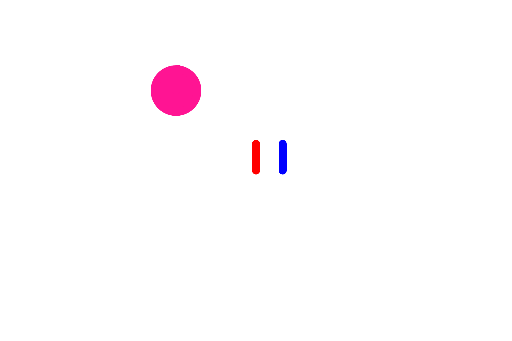

The way of the program
======================

The goal of this book is to teach you to think like a computer scientist. This
way of thinking combines some of the best features of mathematics, engineering,
and natural science. Like mathematicians, computer scientists use formal
languages to denote ideas (specifically computations). Like engineers, they
design things, assembling components into systems and evaluating tradeoffs
among alternatives.  Like scientists, they observe the behavior of complex
systems, form hypotheses, and test predictions.

The single most important skill for a computer scientist is **problem
solving**. Problem solving means the ability to formulate problems, think
creatively about solutions, and express a solution clearly and accurately. As
it turns out, the process of learning to program is an excellent opportunity to
practice problem-solving skills. That's why this chapter is called, The way of
the program.

On one level, you will be learning to program, a useful skill by itself. On
another level, you will use programming as a means to an end. As we go along,
that end will become clearer.

The Javascript programming language
-----------------------------------

The programming language you will be learning is Javascript. Javascript is an example
of a **high-level language**; other high-level languages you might have heard
of are Python, C++, PHP, Pascal, C#, and Java. It's important to point out that
Java and Javascript are two different programming languages with different
syntax, styles, purposes, and histories. They unfortunately, share a very close name!

As you might infer from the name high-level language, there are also
**low-level languages**, sometimes referred to as machine languages or assembly
languages. Loosely speaking, computers can only execute programs written in
low-level languages. Thus, programs written in a high-level language have to be
translated into something more suitable before they can run.

Almost all programs are written in high-level languages because of their advantages.
It is much easier to program in a
high-level language so programs take less time
to write, they are shorter and easier to read, and they are more likely to be
correct. Second, high-level languages are **portable**, meaning that they can
run on different kinds of computers with few or no modifications.  

The engine that translates and runs Javascript is called the **Javascript Interpreter**.
All modern web browser (Firefox, Chrome, Safari, MS Edge/IE, etc) ship with a Javascript
interpreter. You can also install a stand-alone interpreter on your computer.

The longer code examples in this book will use [Repl.it](https://repl.it), an online
programming platform and community. Code listings include links to the "repl" that you can
copy ("fork") and experiment with.

There are two ways to use the interpreter: *interactive or immediate mode* and *script
mode*. In immediate mode, you type Javascript expressions into the interpreter's console,
and the interpreter immediately shows the result. This is the an example of the repl.it
interpreter's console:

~~~~~~~~~~~~~~~~~~~~~~~~~~~~{.bash}
Babel Compiler v6.4.4
Copyright (c) 2014-2015 Sebastian McKenzie

⠕ 2+2
=> 4

~~~~~~~~~~~~~~~~~~~~~~~~~~~~

The ``2+2`` is entered at the **Javascript prompt**. The ``⠕`` token indicates a statement entered at the prompt.
The interpreter uses the prompt to indicate that it is ready for
instructions. We typed ``2 + 2`` and hit ``enter`` the interpreter evaluated our expression, and replied ``4``,
and on the next line it gave a new prompt. In this case, ``4`` is the **output** and it is indicated as output
in our console by the ``=>`` token.

Alternatively, you can write a program in a file and use the interpreter to
execute the contents of the file. Such a file is called a **script**. Scripts have the
advantage that they can be saved to disk, printed, shared, and so on.

For example, we created a file named ``main.js`` using our text editor.
By convention, files that contain Javascript programs have names that end with
``.js``, but they are just plain-text files.

To execute the program in repl.it, we simply click the "run" button. The output is shown in the console.

Working directly in the interpreter is convenient for testing short bits of code because you
get immediate feedback. Think of it as scratch paper used to help you work out
problems. Anything longer than a few lines should be put into a script.

What is a program?
------------------

A **program** is a sequence of instructions that specifies how to perform a
computation. The computation might be something mathematical, such as solving a
system of equations or finding the roots of a polynomial, but it can also be a
symbolic computation, such as searching and replacing text in a document or
(strangely enough) compiling a program.

The details look different in different languages, but a few basic instructions
appear in just about every language:

input

:    Get data from the keyboard, a file, or some other device.

output

:    Display data on the screen or send data to a file or other device.

math

:    Perform basic mathematical operations like addition and multiplication.

conditional execution

:    Check for certain conditions and execute the appropriate sequence of
    statements.

repetition

:    Perform some action repeatedly, usually with some variation.

Believe it or not, that's pretty much all there is to it. Every program you've
ever used, no matter how complicated, is made up of instructions that look more
or less like these. Thus, we can describe programming as the process of
breaking a large, complex task into smaller and smaller subtasks until the
subtasks are simple enough to be performed with sequences of these basic
instructions.

That may be a little vague, but we will come back to this topic later when we
talk about **algorithms**.

What is debugging?
------------------

Programming is a complex process, and because it is done by human beings, it
often leads to errors. Programming errors are called
**bugs** and the process of tracking them down and correcting them is called
**debugging**.  Use of the term *bug* to describe small engineering difficulties
dates back to at least 1889, when Thomas Edison had a bug with his phonograph.

Three kinds of errors can occur in a program: [syntax errors](http://en.wikipedia.org/wiki/Syntax_error),
[runtime errors](http://en.wikipedia.org/wiki/Runtime_error),
and [semantic errors](http://en.wikipedia.org/wiki/Logic_error). It is useful to
distinguish between them in order to track them down more quickly.

Syntax errors
-------------

Javascript can only execute a program if the program is syntactically correct;
otherwise, the process fails and returns an error message. **Syntax** refers
to the structure of a program and the rules about that structure. For example,
in English, a sentence must begin with a capital letter and end with a period.
this sentence contains a **syntax error**. So does this one  

For most readers, a few syntax errors are not a significant problem, which is
why we can read the poetry of E. E. Cummings without (too many) problems.
Javascript is not so forgiving. If there is a single syntax error anywhere in your
program, Javascript will display an error message and quit, and you will not be able
to run your program. During the first few weeks of your programming career, you
will probably spend a lot of time tracking down syntax errors. As you gain
experience, though, you will make fewer errors and find them faster.

Runtime errors
--------------

The second type of error is a runtime error, so called because the error does
not appear until you run the program. These errors are also called
**exceptions** because they usually indicate that something exceptional (and
bad) has happened.

Runtime errors are rare in the simple programs you will see in the first few
chapters, so it might be a while before you encounter one.

Semantic errors
---------------

The third type of error is the **semantic error**. If there is a semantic error
in your program, it will run successfully, in the sense that the computer will
not generate any error messages, but it will not do the right thing. It will do
something else. Specifically, it will do what you told it to do.

The problem is that the program you wrote is not the program you wanted to
write. The meaning of the program (its semantics) is wrong.  Identifying
semantic errors can be tricky because it requires you to work backward by
looking at the output of the program and trying to figure out what it is doing.

Experimental debugging
----------------------

One of the most important skills you will acquire is debugging.  Although it
can be frustrating, debugging is one of the most intellectually rich,
challenging, and interesting parts of programming.

In some ways, debugging is like detective work. You are confronted with clues,
and you have to infer the processes and events that led to the results you see.

Debugging is also like an experimental science. Once you have an idea what is
going wrong, you modify your program and try again. If your hypothesis was
correct, then you can predict the result of the modification, and you take a
step closer to a working program. If your hypothesis was wrong, you have to
come up with a new one. As Sherlock Holmes pointed out, When you have
eliminated the impossible, whatever remains, however improbable, must be the
truth. (A. Conan Doyle, *The Sign of Four*)

For some people, programming and debugging are the same thing. That is,
programming is the process of gradually debugging a program until it does what
you want. The idea is that you should start with a program that does
*something* and make small modifications, debugging them as you go, so that you
always have a working program.

For example, Linux is an operating system kernel that contains millions of
lines of code, but it started out as a simple program Linus Torvalds used to
explore the Intel 80386 chip. According to Larry Greenfield, one of Linus's
earlier projects was a program that would switch between displaying AAAA and
BBBB. This later evolved to Linux (*The Linux Users' Guide* Beta Version 1).

Later chapters will make more suggestions about debugging and other programming
practices.

Formal and natural languages
----------------------------

**Natural languages** are the languages that people speak, such as English,
Spanish, and French. They were not designed by people (although people try to
impose some order on them); they evolved naturally.

**Formal languages** are languages that are designed by people for specific
applications. For example, the notation that mathematicians use is a formal
language that is particularly good at denoting relationships among numbers and
symbols. Chemists use a formal language to represent the chemical structure of
molecules. And most importantly:

> *Programming languages are formal languages that have been designed to
> express computations.*

Formal languages tend to have strict rules about syntax. For example, ``3+3=6``
is a syntactically correct mathematical statement, but ``3=+6$`` is not.
H2O is a syntactically correct chemical name, but 2Zz is
not.

Syntax rules come in two flavors, pertaining to **tokens** and structure.
Tokens are the basic elements of the language, such as words, numbers, parentheses,
commas, and so on. In Javascript, a statement like ``console.log("Happy New Year for ", 2013)``
has 6 tokens: a function name, an open parenthesis (round bracket), a string, a comma, a number, and a close parenthesis.

It is possible to make errors in the way one constructs tokens.  
One of the problems with ``3=+6$`` is that ``$`` is not a
legal token in mathematics (at least as far as we know). Similarly,
2Zz is not a legal token in chemistry notation because there is no element with the abbreviation
``Zz``.

The second type of syntax rule pertains to the **structure** of a statement—that
is, the way the tokens are arranged. The statement ``3=+6$`` is structurally
illegal because you can't place a plus sign immediately after an equal sign.
Similarly, molecular formulas have to have subscripts _after_ the element name,
not before. And in our Javascript example, if we omitted the comma, or if we changed the two
parentheses around to say  ``console.log)"Happy New Year for ",2013(`` our statement would still
have six legal and valid tokens, but the structure is illegal.

When you read a sentence in English or a statement in a formal language, you
have to figure out what the structure of the sentence is (although in a natural
language you do this subconsciously). This process is called **parsing**.

For example, when you hear the sentence, "The other shoe fell", you understand
that the other shoe is the subject and fell is the verb. Once you have parsed
a sentence, you can figure out what it means, or the **semantics** of the sentence.
Assuming that you know what a shoe is and what it means to fall, you will
understand the general implication of this sentence.

Although formal and natural languages have many features in common—tokens,
structure, syntax, and semantics—there are many differences:

Glossary
---------

ambiguity

:    Natural languages are full of ambiguity, which people deal with by
     using contextual clues and other information. Formal languages are
     designed to be nearly or completely unambiguous, which means that any
     statement has exactly one meaning, regardless of context.

redundancy

:   In order to make up for ambiguity and reduce misunderstandings, natural
    languages employ lots of redundancy. As a result, they are often
    verbose.  Formal languages are less redundant and more concise.

literalness

:   Formal languages mean exactly what they say.  On the other hand, natural languages
    are full of idiom and metaphor. If someone says, "The
    other shoe fell", there is probably no shoe and nothing falling.  
    You'll need to find the
    original joke to understand the idiomatic meaning of the other shoe falling.
    *Yahoo! Answers* thinks it knows!  

People who grow up speaking a natural language—everyone—often have a hard
time adjusting to formal languages. In some ways, the difference between formal
and natural language is like the difference between poetry and prose, but more
so:

poetry

:   Words are used for their sounds as well as for their meaning, and the
    whole poem together creates an effect or emotional response. Ambiguity
    is not only common but often deliberate.

prose

:   The literal meaning of words is more important, and the structure
    contributes more meaning. Prose is more amenable to analysis than
    poetry but still often ambiguous.

program

:   The meaning of a computer program is unambiguous and literal, and can
    be understood entirely by analysis of the tokens and structure.

Here are some suggestions for reading programs (and other formal languages).
First, remember that formal languages are much more dense than natural
languages, so it takes longer to read them. Also, the structure is very
important, so it is usually not a good idea to read from top to bottom, left to
right. Instead, learn to parse the program in your head, identifying the tokens
and interpreting the structure.  Finally, the details matter. Little things
like spelling errors and bad punctuation, which you can get away with in
natural languages, can make a big difference in a formal language.

The first program
-----------------

Traditionally, the first program written in a new language is called *Hello,
World!* because all it does is display the words, Hello, World!  In Javascript, the script
looks like this: (For scripts, we'll show line numbers to the left of the Javascript statements.)

~~~~~~~~~~~~~~~~~~~~~~~~~~~~{.javascript .numberLines}
console.log("Hello, World!");
~~~~~~~~~~~~~~~~~~~~~~~~~~~~
This is an example of using ``console.log``, Javascript's **print function**, which doesn't actually print
anything on paper. It displays a value on the screen's console. In this case, the result shown
is

~~~~~~~~~~~~~~~~~~~~~~~~~~~~{.bash}
Hello, World!
~~~~~~~~~~~~~~~~~~~~~~~~~~~~
The quotation marks in the program mark the beginning and end of the value;
they don't appear in the result.

Some people judge the quality of a programming language by the simplicity of
the Hello, World! program. By this standard, Javascript does about as well as
possible.

Comments
--------

As programs get bigger and more complicated, they get more difficult to read.
Formal languages are dense, and it is often difficult to look at a piece of
code and figure out what it is doing, or why.

For this reason, it is a good idea to add notes to your programs to explain in
natural language what the program is doing.  

A **comment** in a computer program is text that is intended
only for the human reader --- it is completely ignored by the interpreter.

In Javascript, the ` \\ ` token starts a comment.  The rest of the line
is ignored. Here is a new version of *Hello, World!*.

~~~~~~~~~~~~~~~~~~~~~~~~~~~~{.javascript .numberLines}
//---------------------------------------------------
// This demo program shows off how elegant Javascript is!
// Based on the Python program by Joe Soap, December 2010.
// Anyone may freely copy or modify this program.
//---------------------------------------------------

console.log("Hello, World!");     // Isn't this easy!

~~~~~~~~~~~~~~~~~~~~~~~~~~~~
You'll also notice that we've left a blank line in the program. Blank lines
are also ignored by the interpreter, but comments and blank lines can make your
programs much easier for humans to parse. Use them liberally!

Javascript also supports multiline comments with the ``/* */`` style.

~~~~~~~~~~~~~~~~~~~~~~~~~~~~{.javascript .numberLines}
/*
---------------------------------------------------
  This demo program shows off how elegant Javascript is!
  Based on the Python program by Joe Soap, December 2010.
  Anyone may freely copy or modify this program.
---------------------------------------------------
*/

console.log("Hello, World!");     // Isn't this easy!

~~~~~~~~~~~~~~~~~~~~~~~~~~~~
In addition to adding hints and suggestions for human readers,
comments play an important role in debugging. Because the
Javascript interpreter doesn't try to run commented lines,
you can "comment out" sections of your code to isolate errors.

~~~~~~~~~~~~~~~~~~~~~~~~~~~~{.javascript .numberLines}
console.log("Hello, World!");
// console.log("I am trying to find");
// console.log("out which line");
// console.log("of my code isn't");
// console.log("working the way I expect it to.);
~~~~~~~~~~~~~~~~~~~~~~~~~~~~

In the above code, only line 1 is interpreted and run as Javascript.
The other lines are ignored. To debug this program, we can uncomment
one line at a time until we find out which line has the buggy code.

It is so common for programmers to comment out large blocks of code
when they are testing their programs, that programmer's text editors
support quickly commenting out sections of code. In repl.it, our online
editor for this book, you can simply highlight the lines you want to
comment or uncomment and use the <kbd>Ctrl</kbd> + <kbd>/</kbd>
keyboard shortcut. You will see us using this technique in our example
videos.

Turtle Graphics
---------------

In the late 1960s, Seymor Papert's group at MIT introduced [LOGO Turtle](https://en.wikipedia.org/wiki/Turtle_graphics)
as a way to teach computer programming to kids. After learning the basic turtle commands (also called an API), you can make surprising computer graphics programs with only a little bit of code.

We're using a version of Turtle that has been written for Javascript. [Thanks to Morgan McGuire at Casual Effects for the code.](https://casual-effects.com/codeheart/turtle/index.html).

As we've seen, a program and algorithms consist of a number of commands or statements
that execute in an order described by the program. There are many libraries
or APIs (application programming interface) that help you useful do things in Javascript.
Some APIsread files over a network, others choose random numbers, while others might
encrypt data to make it more secure. The `turtle` API
has a number of commands that you can use to move a turtle around a screen
and to draw shapes and patterns.

Here's a short turtle graphics program.

~~~~~~~~~~~~~~~~~~~~~~~~~~~~{.javascript .numberLines}
// set up the "pen" color and width
setWidth(30);
setColor("red");

// move forward 100px to draw a red line
fd(100);

wait(1);

// raise the pen "pen up -- pu()", then return the turtle
// to Y coordinate 0 and move it to X coordinate 100
pu();
setY(0);
setX(100)
pd();

wait(1);

// draw a blue line
setColor("blue");
fd(100);

wait(1);

// move turtle to the top left quadrant
pu();
setY(300);
setX(-300)
pd();

// draw a "DeepPink" circle
setColor("DeepPink");
startFill("DeepPink");
arc(360, 80);
endFill();

// hide the turtle
ht();
~~~~~~~~~~~~~~~~~~~~~~~~~~~~

When we run this program, we draw this image:
<figure class="border">

<figcaption class="figure-caption border-top">
The picture drawn by this program. 
**[Run and remix this code on repl.it](https://repl.it/@mcuringa/turtle)**
</figcaption>
</figure>

Turtle programs use the metaphor of a turtle moving around drawing with a pen.
To move the turtle without drawing, you call the "pen up" method, or `pu()`,
as we do on lines 12 and 26. The turtle is plotted on an x,y plane
(also called a [Cartesian Plane](https://en.wikipedia.org/wiki/Cartesian_coordinate_system)). The `x` coordinate specifies the horizontal
position of the turtle and the `y` coordinate specifies the vertical position
of the turtle. In this plane, (0, 0) is in the middle of the window. Negative
`x` coordinates are to the left of the center, and negative `y` coordinates
are below the center. We call the `setX()` and `setY()` methods to move
the turtle's position. If the pen is down, it draws while we move. If it's up,
turtle moves without a trace. Notice how we draw a "DeepPink" circle, starting
on line 32? Because our Javascript program executes in a web browser, we can
use any of the "named colors" that are part of the web development standard.
[You can find all of the name colors here.](https://www.w3schools.com/colors/colors_names.asp)

Turtle documentation
--------------------
To fully use the turtle API, you will need to read and understand the documentation.
Part of becoming a programmer and thinking like a computer scientist includes
the ability to read (and write!) technical documentation. No programmer remembers
every possible language feature or available commands. Before you begin the exercises
and lab for this chapter, review the full

`fd(distance)`

:   Move forward the given distance.

`bk(distance)`

:   Move backward the given distance.

`rt(angle)`

:   Turn right (clockwise) in place.

`rt(angle, radius)`

:   Turn right (clockwise) in an arc of the given radius.

`lt(angle)`

:   Turn left (counterclockwise) in place.

`lt(angle, radius)`

:   Turn left (counterclockwise) in an arc of the given radius.

`arc(angle, radius)`

:   Draw an arc around the turtle, without moving the turtle. The angle is relative to the current heading.

`pu()`

:   Pick the pen up to temporarily move without drawing.

`pd()`

:   Put the pen down to resume drawing.

`setColor(color)`

:   Set the pen color by name such as RED or CSS color string such as "#FF0041".

`setColor(r, g, b)`

:   Set the pen color based on three RGB values each between zero and one.

`setColor(r, g, b, a)`

:   Set the pen color based on three RGB values and an opacity value, each between zero and one.

`startFill(color)`

:   Start drawing a filled region of the given color. Must end with `endFill()`

`startFill(r, g, b)`

:   Start drawing a filled region with color given by three RGB values, each between zero and one.

`setColor(r, g, b, a)`

:   Start drawing a region filled by three RGB values and an opacity value, each between zero and one.

`endFill()`

:   End drawing a filled region and actually fill it. If the pen is down, then the outline will also be stroked.

`setPosition(x, y)`

:   Sets the absolute position. If the pen is down, draws a line to that position.

`setX(x)`

:   Sets the absolute x-axis position. If the pen is down, draws a line to that position.

`getX()`

:   Returns the absolute x-axis position.

`setY(x)`

:   Sets the absolute y-axis position. If the pen is down, draws a line to that position.

`getY()`

:   Returns the absolute y-axis position.

`setWidth(width)`

:   Sets the pen width.

`setHeading(degrees)`

:   Sets the current heading in degrees measured clockwise from the upwards vertical axis. North = 0, East = 90, South = 180, West = 270.

`getHeading()`

:   Returns the current heading in degrees measured clockwise from the upwards vertical axis. North = 0, East = 90, South = 180, West = 270.

`setScale(s)`

:   Scales all distances (but not x and y coordinates or pen width) by this factor. Useful for reusing drawing commands for different size objects. 1.0 is the default scale.

`getScale()`

:   Returns the current drawing scale.

`setSpeed(speed)`

:   Sets the number of commands executed before showing the next frame of animation. Defaults to 1. Can be set to Infinity to draw the entire image at once. Does not affect wait times.

`clear(color)`

:   Clears the screen to the specified color

`clear(r, g, b)`

:   Clears the screen to the specified color

`wait(seconds)`

:   Pauses drawing for approximately this many seconds. Useful for creating animations. Not affected by setSpeed.

Turtle Exercises 1
------------------
[Turtle Exercises 1 Repl](https://repl.it/@mcuringa/turtle-exercises)

1. Use `turtle` to draw a red square with a pink border
2. Draw three circles, side-by-side. The first one should be blue, the second green, the third red.
3. Draw a triangle.
4. (bonus) Draw a 5-pointed star. _Hint:_ draw this on a piece of paper first

First Turtle Lab
----------------
[First Turtle Lab Repl](https://repl.it/@mcuringa/csc-602-lab1)

Our first lab presents an open-ended exercise, just to get you started.
Use turtle graphics to draw a picture. We suggest you spend about
one hour working on this lab. Make sure that you includes some commands
from the documentation that are not in the example program. Other than that,
the content of your drawing is up to you.

Glossary
--------

algorithm

:   A set of specific steps for solving a category of problems.

bug

:   An error in a program.

comment

:   Information in a program that is meant for other programmers (or anyone
    reading the source code) and has no effect on the execution of the
    program.    

debugging

:   The process of finding and removing any of the three kinds of
    programming errors.

exception

:   Another name for a runtime error.

formal language

:   Any one of the languages that people have designed for specific
    purposes, such as representing mathematical ideas or computer programs;
    all programming languages are formal languages.

high-level language

:   A programming language like Javascript that is designed to be easy for
    humans to read and write.

immediate mode

:   A style of using Javascript where we type expressions at the command prompt, and
    the results are shown immediately.  Contrast with **script**, and see the
    entry under **Javascript shell**.

interpreter

:   The engine that executes your Javascript scripts or expressions.

low-level language

:   A programming language that is designed to be easy for a computer to
    execute; also called machine language or assembly language.

natural language

:   Any one of the languages that people speak that evolved naturally.

object code

:   The output of the compiler after it translates the program.

parse

:   To examine a program and analyze the syntactic structure.

portability

:   A property of a program that can run on more than one kind of computer.

print function

:   A function used in a program or script that causes the Javascript interpreter to
    display a value on its output device.

problem solving

:   The process of formulating a problem, finding a solution, and
    expressing the solution.

program

:   a sequence of instructions that specifies to a computer actions and
    computations to be performed.

Javascript console

:   An interactive user interface to the Javascript interpreter. The user of a
    Javascript shell types commands at the prompt, and presses the return
    key to send these commands immediately to the interpreter for
    processing.

runtime error

:   An error that does not occur until the program has started to execute
    but that prevents the program from continuing.

script

:   A program stored in a file (usually one that will be interpreted).

semantic error

:   An error in a program that makes it do something other than what the
    programmer intended.

semantics

:   The meaning of a program.

source code

:   A program in a high-level language before being compiled.

syntax

:   The structure of a program.

syntax error

:   An error in a program that makes it impossible to parse --- and
    therefore impossible to interpret.

token

:   One of the basic elements of the syntactic structure of a program,
    analogous to a word in a natural language.
